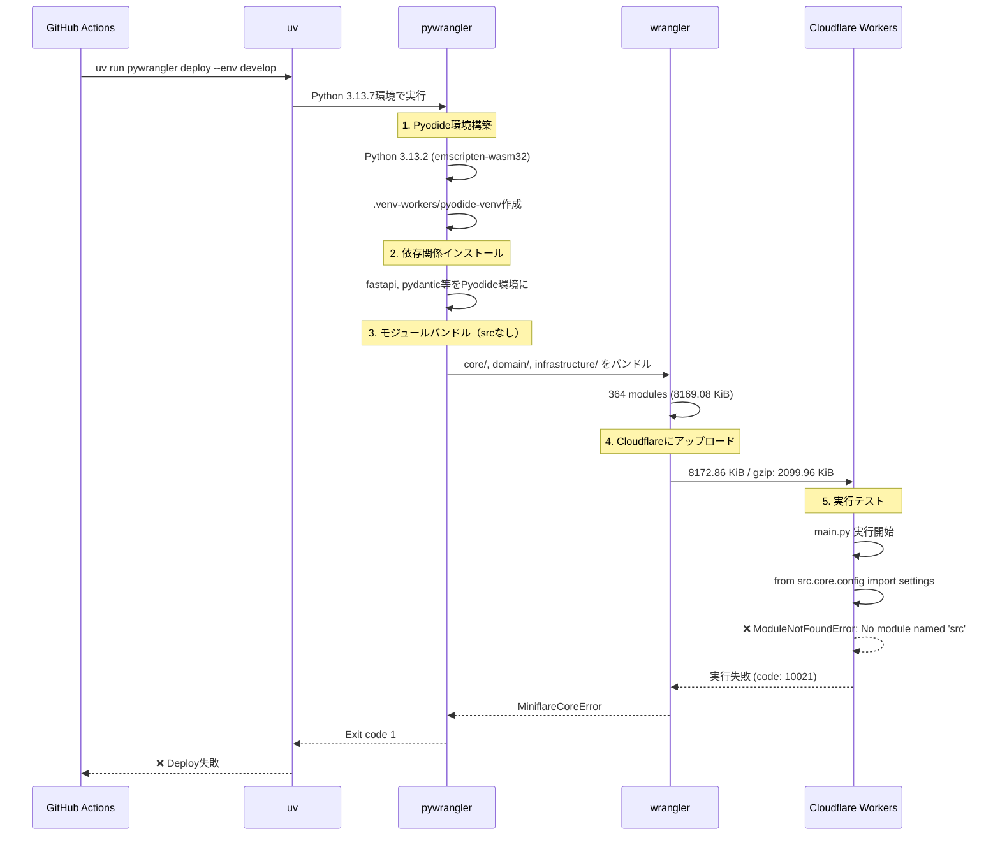

# Step 1: GitHub Actions ログ分析結果

## 実行概要

**実行ID**: 18444656432
**ワークフロー**: CD Pipeline
**ブランチ**: develop
**コミット**: 02d58676a75ad714558917e19931048985887d32
**実行時刻**: 2025-10-12T13:31:13Z
**結果**: ❌ 失敗 (ModuleNotFoundError)

## 1. デプロイメントフロー全体

### 1.1 初期段階（成功）

```
13:31:13 - Check Project Structure ✅
  → backend/frontend ディレクトリ存在確認
  → backend-exists=true, frontend-exists=true

13:31:18 - Deployment Decision ✅
  → environment=develop
  → should_deploy=true
```

### 1.2 環境構築（成功）

```
13:31:30 - Checkout code ✅
  → Git 2.51.0
  → commit 02d58676a75ad714558917e19931048985887d32

13:31:32 - Install pnpm ✅
  → pnpm 9.15.9

13:31:32 - Setup Node.js 22 ✅
  → Node.js v22.20.0
  → npm 10.9.3

13:31:38 - Setup Python 3.13 ✅
  → Python 3.13.7
  → CPython /opt/hostedtoolcache/Python/3.13.7/x64/bin/python3

13:31:39 - Install uv ✅
  → uv 0.9.2

13:31:47 - Install pywrangler ✅
  → workers-py 1.5.0
  → pyodide-cli 0.4.0
  → pyodide-py 0.28.3
```

### 1.3 バンドル作成（成功）

```
13:31:49 - uv run pywrangler deploy --env develop 開始

13:31:51 - Pyodide環境構築 ✅
  → Python 3.13.2 (Pyodide)
  → .venv-workers/pyodide-venv 作成

13:31:54 - 依存関係インストール ✅
  Pyodide環境:
    + fastapi==0.119.0
    + pydantic==2.10.6
    + pydantic-core==2.27.2
    + anyio==4.11.0
    + starlette==0.48.0
    + typing-extensions==4.15.0
    + sniffio==1.3.1
    + idna==3.10

  .venv-workers（ホスト環境）:
    + fastapi==0.119.0
    + pydantic==2.12.0
    + pydantic-core==2.41.1
    + pyodide-py==0.28.3
    + typing-inspection==0.4.2

13:32:00 - パッケージ同期完了 ✅
  → SUCCESS: Sync process completed successfully.

13:32:12 - wrangler deploy 実行開始 ✅
  → wrangler 4.42.2
```

### 1.4 モジュールバンドル（重要：srcプレフィックスなし）

```
13:32:13 - Attaching additional modules

⚠️ 重要な観察: すべてのモジュールがsrcプレフィックスなしでバンドル

┌─────────────────────────────────────────────────────┬────────┬─────────────┐
│ Name                                                │ Type   │ Size        │
├─────────────────────────────────────────────────────┼────────┼─────────────┤
│ __init__.py                                         │ python │ 0.04 KiB    │
│ core/__init__.py                                    │ python │ 0.04 KiB    │
│ core/config/__init__.py                             │ python │ 0.09 KiB    │
│ core/config/settings.py                             │ python │ 9.05 KiB    │
│ domain/prompt/__init__.py                           │ python │ 0.58 KiB    │
│ domain/prompt/entities/prompt.py                    │ python │ 5.55 KiB    │
│ infrastructure/shared/database/turso_connection.py  │ python │ 8.59 KiB    │
│ presentation/api/shared/health.py                   │ python │ 3.25 KiB    │
│ ... (364 modules total)                             │        │             │
│ Vendored Modules                                    │        │ 8011.41 KiB │
├─────────────────────────────────────────────────────┼────────┼─────────────┤
│ Total (364 modules)                                 │        │ 8169.08 KiB │
└─────────────────────────────────────────────────────┴────────┴─────────────┘

Total Upload: 8172.86 KiB / gzip: 2099.96 KiB
```

**分析結果**:
- ✅ すべてのモジュールは `core/`, `domain/`, `infrastructure/` などの **相対パスで登録**
- ❌ `src/core/`, `src/domain/` のような **srcプレフィックスは一切なし**
- ✅ 合計364モジュール、8.17MBのアップロード成功
- ✅ gzip圧縮後は2.10MBに削減

### 1.5 実行時エラー（失敗）

```
13:32:19 - 実行テスト失敗 ❌

✖ [ERROR] MiniflareCoreError [ERR_RUNTIME_FAILURE]: The Workers runtime failed to start.

  ModuleNotFoundError: No module named 'src'

  at null.<anonymous> (pyodide-internal:generated/emscriptenSetup:19366:14) in new_error
  at [object Object] in $wrap_exception
  at [object Object] in $pythonexc2js
  [code: 10021]
```

## 2. 根本原因分析

### 2.1 バンドルとインポートの不整合

**バンドルされたモジュール構造**:
```
/ (root)
├── __init__.py
├── core/
│   ├── __init__.py
│   ├── config/settings.py
│   └── ...
├── domain/
│   ├── prompt/entities/prompt.py
│   └── ...
└── infrastructure/
    └── ...
```

**main.pyのインポート文（推定）**:
```python
from src.core.config.settings import settings
from src.domain.prompt.entities.prompt import Prompt
from src.infrastructure.shared.database.turso_connection import TursoConnection
```

### 2.2 エラー発生メカニズム

1. **wranglerがmain.pyをロード**
   - エントリーポイント: `src/main.py`

2. **Pyodide（Python 3.13.2）が実行開始**
   - 初期sys.path: `['.', '/lib/python313.zip', ...]`

3. **インポート文実行**
   - `import src.core.config.settings` を試行

4. **モジュール検索失敗**
   - sys.pathに`src/`ディレクトリが存在しない
   - バンドルには`core/config/settings.py`として登録
   - ❌ `ModuleNotFoundError: No module named 'src'`

### 2.3 期待値 vs 実際

| 項目 | 期待される構造 | 実際のバンドル |
|------|---------------|---------------|
| モジュールパス | `src/core/config/settings.py` | `core/config/settings.py` |
| インポート文 | `from src.core.config import settings` | 動作しない |
| sys.path | `['/', '/src', ...]` | `['/', ...]` |

## 3. 時系列フロー図



## 4. 重要な観察事項

### 4.1 pywranglerのバンドル動作

```bash
# wrangler.tomlの設定から推測
[python]
dir = "backend"  # または "backend/src"

# pywranglerの実際の動作
1. backend/src/ 配下のPythonファイルをスキャン
2. 各ファイルを相対パスでバンドルに登録
3. 結果: core/config/settings.py として登録
   （src/core/config/settings.py ではない）
```

### 4.2 wranglerログの重要部分

```
2025-10-12T13:32:12.3289073Z [WARNING] The entrypoint src/main.py defines
a Python worker, support for Python workers is currently experimental.

→ エントリーポイントは正しく src/main.py として認識
→ しかし、他のモジュールは srcプレフィックスなし
```

### 4.3 バンドルされたモジュール一覧（抜粋）

```
✅ バンドル成功:
- core/config/settings.py (9.05 KiB)
- domain/prompt/entities/prompt.py (5.55 KiB)
- infrastructure/shared/database/turso_connection.py (8.59 KiB)
- presentation/api/shared/health.py (3.25 KiB)

❌ 存在しないパス:
- src/core/config/settings.py
- src/domain/prompt/entities/prompt.py
- src/infrastructure/shared/database/turso_connection.py
```

## 5. 次のステップ（Step 2への引き継ぎ）

### 5.1 確認が必要な設定ファイル

1. **wrangler.toml**: `[python]` セクションの `dir` 設定
2. **backend/src/main.py**: 実際のインポート文
3. **pywranglerの設定**: モジュールパス解決ロジック

### 5.2 検証すべき仮説

**仮説1**: wrangler.toml の `dir` 設定が `backend` になっている
- 結果: `backend/src/core/` → `src/core/` でバンドルされるべき
- 実際: `core/` でバンドルされている
- 結論: `dir` が `backend/src` になっている可能性

**仮説2**: pywranglerが自動的にsrcディレクトリをrootとして処理
- 期待: `src/` 内のファイルを相対パスで処理
- 実際: `src/` プレフィックスを削除してバンドル
- 影響: インポート文と不整合

**仮説3**: main.pyのsys.path初期化が必要
- 現状: sys.pathに `/src` が含まれていない
- 必要: `sys.path.insert(0, '/src')` などの初期化
- 代替: インポート文を修正 (`src.core` → `core`)

## 6. 解決策の方向性

### Option A: インポート文修正
```python
# Before
from src.core.config.settings import settings

# After
from core.config.settings import settings
```

### Option B: wrangler.toml修正
```toml
# Before (推測)
[python]
dir = "backend/src"

# After
[python]
dir = "backend"
```

### Option C: sys.path初期化
```python
# main.py の先頭に追加
import sys
sys.path.insert(0, '/src')
```

## 7. 収集済み情報

✅ **成功した情報収集**:
- [x] GitHub Actionsログ全体の取得
- [x] pywrangler deployの標準出力
- [x] バンドルされたモジュール一覧（364ファイル）
- [x] ModuleNotFoundErrorの詳細スタックトレース
- [x] 依存関係のインストール履歴
- [x] Pyodide環境構築ログ

📋 **次のステップで必要な情報**:
- [ ] wrangler.tomlの実際の設定
- [ ] backend/src/main.pyのインポート文
- [ ] backend/pyproject.tomlのパッケージ設定
- [ ] ローカル環境でのインポートパス確認
