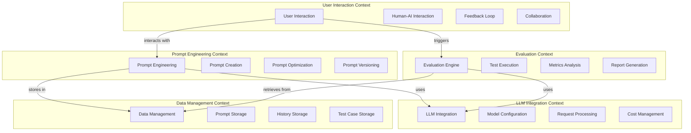
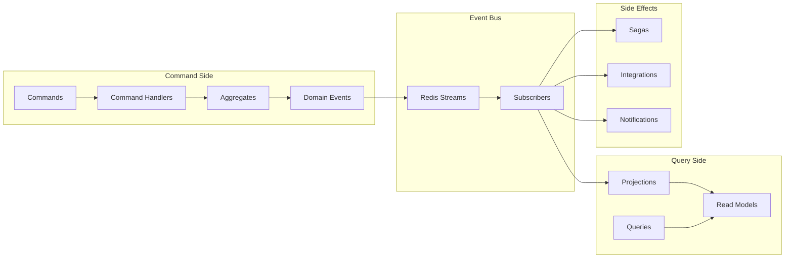

# AutoForgeNexus バックエンドアーキテクチャ設計書

## 🎯 はじめに - このドキュメントの目的

このドキュメントは、**プロンプト最適化システム**のバックエンド設計を説明します。
**DDD（ドメイン駆動設計）やクリーンアーキテクチャを知らない方でも理解できる**ように、各概念を丁寧に説明しています。

### 🔰 初心者向けガイド

- **青い囲み（💡）**: 初心者向けの解説
- **実例**: 具体的な使用例で理解を助けます
- **なぜ必要か**: 各設計の理由を説明します

---

## 1. エグゼクティブサマリー

### 📌 このシステムが実現すること

AutoForgeNexusは、**AIへの指示（プロンプト）を誰でも簡単に作成・改善できるシステム**です。

#### 主な機能

1. **プロンプト作成支援**: ユーザーとの対話でプロンプトを作成
2. **自動最適化**: AIが改善案を提案
3. **品質評価**: 複数のテストでプロンプトの品質を測定
4. **改善サイクル**: 評価結果を基に継続的改善

### 1.1 主要設計原則

💡 **初心者向け解説 - なぜこれらの設計原則を使うのか？**

| 設計原則                       | 簡単な説明                                   | なぜ必要？                               | 実例                                             |
| ------------------------------ | -------------------------------------------- | ---------------------------------------- | ------------------------------------------------ |
| **ドメイン駆動設計（DDD）**    | ビジネスのルールをコードの中心に置く設計     | プログラマーでない人でも理解しやすくなる | 「プロンプト」「評価」など業務用語をそのまま使う |
| **クリーンアーキテクチャ**     | 機能を層（レイヤー）に分けて整理する方法     | 変更に強く、テストしやすいコードになる   | データベースを変えてもビジネスロジックは変更不要 |
| **イベント駆動アーキテクチャ** | 「何かが起きた」ことを通知して処理する仕組み | 大量の処理を効率的に実行できる           | プロンプト作成完了 → 自動で評価開始              |
| **CQRS**                       | データの「書き込み」と「読み込み」を分ける   | それぞれを最適化できて高速になる         | 保存は確実に、表示は高速に                       |
| **マイクロサービス対応**       | 将来システムを分割できる設計                 | システムが大きくなっても管理しやすい     | 評価機能だけ別サーバーに移動可能                 |

## 2. ドメイン駆動設計（DDD）

### 2.1 境界づけられたコンテキスト（Bounded Contexts）



💡 **初心者向け説明：このコンテキストマップ図の読み方**

この図は、システムを5つの「境界づけられたコンテキスト（独立した専門領域）」に分けた全体像を示しています。

**📦 各コンテキスト（領域）の役割：**

1. **Prompt Engineering Context（プロンプト設計領域）**

   - PE: プロンプトエンジニアリングの全体管理
   - PC: 新しいプロンプトを作る機能
   - PO: プロンプトを改善・最適化する機能
   - PV: プロンプトのバージョン管理（Gitのような履歴管理）
   - 🎯 **例**: 「画像生成AIに渡すプロンプトを作成→改善→保存」する領域

2. **Evaluation Context（評価領域）**

   - EV: 評価処理全体を管理するエンジン
   - TE: 実際にテストを実行する機能
   - ME: テスト結果を数値で分析する機能
   - RE: 分析結果をレポートにまとめる機能
   - 🎯
     **例**: 「作ったプロンプトが本当に良いか10個のテストケースで検証」する領域

3. **LLM Integration Context（AI連携領域）**

   - LI: 様々なAI（ChatGPT、Claude等）との接続管理
   - MC: どのAIモデルを使うか設定
   - RP: AIへのリクエスト処理
   - CM: API利用料金の管理
   - 🎯 **例**: 「100種類以上のAIサービスと接続して使い分ける」領域

4. **User Interaction Context（ユーザー操作領域）**

   - UI: ユーザーインターフェース全般
   - HI: 人間とAIの対話管理
   - FB: ユーザーからのフィードバック収集
   - CL: 複数人での協働作業サポート
   - 🎯 **例**: 「ユーザーがブラウザで操作する画面」の領域

5. **Data Management Context（データ管理領域）**
   - DM: データ管理全般
   - PS: プロンプトをデータベースに保存
   - HS: 会話履歴の保存
   - TC: テストケース（入力と期待出力）の保存
   - 🎯 **例**: 「すべてのデータを安全に保存・取り出し」する領域

**🔄 矢印の意味（コンテキスト間の関係）：**

- `PE -->|uses| LI`: プロンプト設計がAI連携を「使う」

  - 💡 プロンプトを作る時、実際にAIを呼び出してテストする

- `PE -->|stores in| DM`: プロンプト設計がデータ管理に「保存する」

  - 💡 作ったプロンプトをデータベースに保存

- `EV -->|uses| LI`: 評価エンジンがAI連携を「使う」

  - 💡 評価する時に様々なAIを呼び出して比較

- `EV -->|retrieves from| DM`: 評価エンジンがデータ管理から「取得する」

  - 💡 保存されたテストケースを読み込んで実行

- `UI -->|interacts with| PE`: ユーザー操作がプロンプト設計と「やり取りする」

  - 💡 ユーザーが画面でプロンプトを作成・編集

- `UI -->|triggers| EV`: ユーザー操作が評価を「実行開始する」
  - 💡 ユーザーが「評価開始」ボタンを押すと評価が始まる

**🎯 なぜこのように分けるのか？**

- 各領域が独立 → 一つを変更しても他に影響しない
- 専門性を保つ → 各チームが自分の領域に集中できる
- 拡張しやすい → 新機能を適切な領域に追加するだけ
- 理解しやすい → 全体を5つの箱として把握できる

### 2.2 ユビキタス言語（Ubiquitous Language）

💡 **初心者向け説明：ユビキタス言語とは？**

> ユビキタス言語とは、開発チーム全員（エンジニア、デザイナー、ビジネス側）が共通して使う「専門用語集」のことです。
>
> **なぜ必要？**
>
> - 「プロンプト」という言葉が人によって違う意味だと混乱する
> - 全員が同じ言葉を使うことで、誤解を防ぎコミュニケーションがスムーズになる
>
> **例：**
> ❌ 悪い例：「あれをあそこに保存して、それを評価する」✅ 良い例：「プロンプトをデータベースに保存して、評価を実行する」

#### コア概念

| 用語                            | 定義                                      | 責務                                   |
| ------------------------------- | ----------------------------------------- | -------------------------------------- |
| **Prompt（プロンプト）**        | LLMへの入力として設計された構造化テキスト | 意図を明確に伝え、期待される出力を導く |
| **Template（テンプレート）**    | 再利用可能なプロンプトの骨格              | 共通パターンの標準化と効率化           |
| **Iteration（イテレーション）** | プロンプト改善の1サイクル                 | 評価→分析→改善提案→実装                |
| **Evaluation（評価）**          | プロンプトの品質測定プロセス              | 定量的・定性的指標による品質判定       |
| **Test Case（テストケース）**   | 入力と期待出力のペア                      | プロンプトの一貫性と品質の検証         |
| **Conversation（会話）**        | ユーザーとAI間の対話セッション            | プロンプト改善のための協調的やり取り   |
| **Version（バージョン）**       | プロンプトの特定時点のスナップショット    | 変更履歴の管理とロールバック           |
| **Branch（ブランチ）**          | プロンプトの独立した開発ライン            | 並行実験と安全な改善                   |

#### ドメインイベント

| イベント            | 説明                 | トリガー                       |
| ------------------- | -------------------- | ------------------------------ |
| PromptCreated       | 新規プロンプト作成   | ユーザーがプロンプトを初期作成 |
| PromptOptimized     | プロンプト最適化完了 | AI/ユーザーによる改善          |
| EvaluationCompleted | 評価完了             | テスト実行と分析完了           |
| TestExecuted        | テスト実行完了       | 個別テストケース実行           |
| ReportGenerated     | レポート生成完了     | 評価結果の集計完了             |
| VersionCreated      | 新バージョン作成     | プロンプト変更の確定           |
| BranchMerged        | ブランチマージ完了   | 実験結果の本流統合             |

## 3. クリーンアーキテクチャ設計

💡 **初心者向け説明：クリーンアーキテクチャとは？**

> クリーンアーキテクチャは、システムを「層（レイヤー）」に分けて整理する設計手法です。
>
> **たとえ話：** 会社組織のように階層があります：
>
> - **社長（ドメイン層）**：ビジネスの核心的な判断をする
> - **部長（アプリケーション層）**：社長の方針を具体的な業務に落とし込む
> - **現場スタッフ（インフラ層）**：実際の作業（データベース操作など）を行う
> - **受付（プレゼンテーション層）**：外部（ユーザー）とやり取りする
>
> **重要なルール：**
>
> - 下の階層は上の階層を知らない（現場は社長の詳細を知らなくても仕事できる）
> - これにより、各層を独立して変更・テストできる

### 3.1 レイヤー構造

```
┌─────────────────────────────────────────────────────┐
│                 Presentation Layer                   │
│  (REST API, WebSocket, GraphQL, Event Handlers)     │
├─────────────────────────────────────────────────────┤
│                 Application Layer                    │
│   (Use Cases, Application Services, DTOs, CQRS)     │
├─────────────────────────────────────────────────────┤
│                    Domain Layer                      │
│  (Entities, Value Objects, Domain Services, Events) │
│            ⚠️ 外部依存なし - Pure Business Logic     │
├─────────────────────────────────────────────────────┤
│                Infrastructure Layer                  │
│  (Database, Cache, LLM Providers, Message Queue)    │
└─────────────────────────────────────────────────────┘

依存方向: ↓ (外側から内側へのみ)
```

### 3.2 各レイヤーの詳細設計

#### 3.2.1 Domain Layer（ドメイン層）

💡 **初心者向け説明：ドメイン層とは？**

> ビジネスロジック（業務の本質的なルール）を書く場所です。
>
> **具体例：**
>
> - 「プロンプトは最低10文字必要」というルール
> - 「評価スコアは0〜100の範囲」という制約
> - 「テストケースは最低3つ必要」というビジネス要件
>
> **特徴：**
>
> - データベースやWebAPIなど、技術的な詳細には一切触れない
> - 純粋にビジネスルールだけを表現
> - これにより、データベースをMySQLからPostgreSQLに変えても、この層は変更不要

**エンティティ（Entities）**

📚 **エンティティとは？**

> 「ID」を持ち、ライフサイクルがあるビジネスオブジェクトです。
>
> **例：**
>
> - **プロンプト**：ID「prompt_123」を持ち、作成→編集→評価→改善という流れがある
> - **評価**：ID「eval_456」を持ち、実行→分析→レポート生成という流れがある
>
> **値オブジェクトとの違い：**
>
> - エンティティ：「山田太郎さん（ID: user_123）」← 同姓同名でもIDで区別
> - 値オブジェクト：「1000円」← どの1000円でも同じ

```python
# 主要エンティティの構造
class Prompt:
    - id: PromptId
    - content: PromptContent
    - template: Template
    - metadata: PromptMetadata
    - version: Version
    - status: PromptStatus
    - created_by: UserId
    - conversations: List[Conversation]
    - test_cases: List[TestCase]
    - evaluations: List[Evaluation]

class Evaluation:
    - id: EvaluationId
    - prompt_id: PromptId
    - metrics: EvaluationMetrics
    - test_results: List[TestResult]
    - report: EvaluationReport
    - recommendations: List[Recommendation]
    - executed_at: DateTime
    - configuration: EvaluationConfig

class TestCase:
    - id: TestCaseId
    - input: TestInput
    - expected_output: ExpectedOutput
    - tags: List[Tag]
    - weight: Float
    - validation_rules: List[ValidationRule]
```

**値オブジェクト（Value Objects）**

📚 **値オブジェクトとは？**

> IDを持たず、値そのものを表現する不変のオブジェクトです。
>
> **例：**
>
> - **金額**：1000円は誰が持っていても1000円
> - **評価スコア**：85点は常に85点
> - **メールアドレス**：test@example.comは同じ文字列なら同じ
>
> **なぜ使う？**
>
> - 「accuracy: 150」のような不正な値を防げる（0-100に制限）
> - ビジネスルールをコードで表現できる
> - テストがしやすくなる

```python
# 不変の値を表現
class PromptContent:
    - text: str
    - variables: Dict[str, Any]
    - formatting: PromptFormatting

class EvaluationMetrics:
    - accuracy: Float
    - relevance: Float
    - coherence: Float
    - token_efficiency: Float
    - cost_efficiency: Float
    - custom_metrics: Dict[str, Float]

class LLMConfiguration:
    - provider: LLMProvider
    - model: ModelInfo
    - parameters: ModelParameters
    - cost_config: CostConfiguration
```

**集約（Aggregates）**

💡 **初心者向け説明：集約とは？**

> 集約（しゅうやく）とは、「一緒に扱うべきデータのグループ」です。
>
> **🏠 家族に例えると：**
>
> - 家族全体 = 集約
> - 父親 = 集約ルート（家族の代表）
> - 母親、子供 = 集約に含まれるメンバー
> - 家族のルール = 不変条件（例：子供は必ず保護者が必要）
>
> **なぜ集約が必要？**
>
> - データの整合性を保つ（家族の住所は全員同じにする）
> - 変更の単位を明確にする（家族単位で引っ越しする）
> - 複雑な関係を管理しやすくする

```python
# 集約ルートと境界
PromptAggregate:
    - Root: Prompt
    - Includes: Template, Version, Conversation
    - Invariants:
        - プロンプトは必ず1つ以上のバージョンを持つ
        - アクティブバージョンは1つのみ

EvaluationAggregate:
    - Root: Evaluation
    - Includes: TestResult, Report, Metrics
    - Invariants:
        - 評価は完了後変更不可
        - すべてのテストケースは実行される

TestSuiteAggregate:
    - Root: TestSuite
    - Includes: TestCase, ValidationRule
    - Invariants:
        - テストケースは少なくとも1つ必要
        - 重複する入力は許可されない
```

📦 **各集約の詳細説明：**

**1. PromptAggregate（プロンプト集約）**

- **Root（ルート）**: Prompt = 集約の代表者
- **含まれるもの**:
  - Template（テンプレート）: プロンプトのひな形
  - Version（バージョン）: 改善の履歴
  - Conversation（会話）: AIとのやり取り履歴
- **不変条件（守るべきルール）**:
  - ✅ プロンプトは必ず1つ以上のバージョンを持つ
  - ✅ アクティブなバージョンは常に1つだけ
- 🎯 **実例**: Gitのようにプロンプトの変更履歴を管理

**2. EvaluationAggregate（評価集約）**

- **Root**: Evaluation = 評価全体の管理者
- **含まれるもの**:
  - TestResult（テスト結果）: 個々のテストの結果
  - Report（レポート）: 評価結果の報告書
  - Metrics（メトリクス）: 品質指標（点数など）
- **不変条件**:
  - ✅ 一度完了した評価は変更できない（公正性を保つため）
  - ✅ すべてのテストケースを実行する（抜けがないように）
- 🎯 **実例**: テストの成績表のように、すべての結果をまとめて管理

**3. TestSuiteAggregate（テストスイート集約）**

- **Root**: TestSuite = テストセット全体
- **含まれるもの**:
  - TestCase（テストケース）: 個々のテスト項目
  - ValidationRule（検証ルール）: 合格基準
- **不変条件**:
  - ✅ 最低1つはテストケースが必要（空のテストは意味がない）
  - ✅ 同じ入力のテストは作れない（重複防止）
- 🎯 **実例**: 期末試験のように、複数の問題をセットで管理

#### 3.2.2 Application Layer（アプリケーション層）

💡 **初心者向け説明：アプリケーション層とは？**

> ビジネスの「作業手順」を定義する層です。料理で言えば「レシピ」のような役割です。
>
> **具体例：** 「プロンプトを作成する」という作業の手順：
>
> 1. 入力内容をチェックする
> 2. テンプレートを確認する
> 3. 初期バージョンを作成する
> 4. データベースに保存する
> 5. 「作成完了」のイベントを発行する
>
> **ドメイン層との違い：**
>
> - ドメイン層：「プロンプトは10文字以上」というルール
> - アプリケーション層：「プロンプトを作成する手順」
>
> **なぜ分ける？**
>
> - 手順は変わりやすいが、ビジネスルールは変わりにくい
> - 同じルールを異なる手順で使い回せる（WebからもAPIからもプロンプト作成可能）

**ユースケース（Use Cases）**

📚 **ユースケースとは？**

> システムができること（機能）を表現したものです。ユーザーが「〜したい」という要求に対して、システムが「〜する」という応答を定義します。
>
> **例：**
>
> - ユーザー：「プロンプトを作成したい」→ ユースケース：CreatePromptUseCase
> - ユーザー：「評価を実行したい」→ ユースケース：ExecuteEvaluationUseCase

💡 **初心者向け説明：CQRS（コマンド・クエリ責任分離）とは？**

> CQRSは「データの書き込み（コマンド）」と「データの読み取り（クエリ）」を別々に扱うパターンです。
>
> **🏪 コンビニに例えると：**
>
> - **コマンド側** = レジでの商品購入（在庫が変わる）
> - **クエリ側** = 商品の値段を見る（在庫は変わらない）
>
> **なぜ分けるの？**
>
> - 書き込みは「正確性」重視（レジで間違えたら大変）
> - 読み取りは「速度」重視（値段はすぐ知りたい）
> - それぞれ最適化できる（レジは1台でも、値札は商品全部に付けられる）

```python
# コマンド側（CQRS - Command）
class CreatePromptUseCase:
    - execute(command: CreatePromptCommand) -> PromptId
    - validate_template()
    - initialize_version()
    - publish_event(PromptCreatedEvent)

class OptimizePromptUseCase:
    - execute(command: OptimizePromptCommand) -> OptimizationResult
    - analyze_current_prompt()
    - generate_suggestions()
    - apply_improvements()
    - create_new_version()
    - publish_event(PromptOptimizedEvent)

class ExecuteEvaluationUseCase:
    - execute(command: ExecuteEvaluationCommand) -> EvaluationId
    - prepare_test_suite()
    - run_parallel_tests()
    - collect_results()
    - calculate_metrics()
    - generate_report()
    - publish_event(EvaluationCompletedEvent)

# クエリ側（CQRS - Query）
class GetPromptDetailsQuery:
    - execute(query: PromptDetailsQuery) -> PromptDetailsDTO

class GetEvaluationReportQuery:
    - execute(query: EvaluationReportQuery) -> EvaluationReportDTO

class ListPromptVersionsQuery:
    - execute(query: PromptVersionsQuery) -> List[VersionDTO]
```

📝 **コマンド側の詳細説明（データを変更する操作）**

**1. CreatePromptUseCase（プロンプト作成）**

- **役割**: 新しいプロンプトを作成する
- **処理の流れ**:
  1. `validate_template()`: テンプレートが正しいか確認
  2. `initialize_version()`: 最初のバージョン（v1.0）を作成
  3. `publish_event()`: 「プロンプトが作成されました」と通知
- 🎯 **実例**: Wordで新しい文書を作成するような操作

**2. OptimizePromptUseCase（プロンプト最適化）**

- **役割**: 既存のプロンプトを改善する
- **処理の流れ**:
  1. `analyze_current_prompt()`: 現在のプロンプトの弱点を分析
  2. `generate_suggestions()`: AIが改善案を提案
  3. `apply_improvements()`: 改善を適用
  4. `create_new_version()`: 新しいバージョン（v1.1など）を作成
  5. `publish_event()`: 「プロンプトが改善されました」と通知
- 🎯 **実例**: 文章の推敲や校正のような作業

**3. ExecuteEvaluationUseCase（評価実行）**

- **役割**: プロンプトの品質を評価する
- **処理の流れ**:
  1. `prepare_test_suite()`: テストの準備
  2. `run_parallel_tests()`: 複数のテストを同時実行（高速化）
  3. `collect_results()`: 結果を集計
  4. `calculate_metrics()`: 点数を計算
  5. `generate_report()`: レポート作成
  6. `publish_event()`: 「評価が完了しました」と通知
- 🎯 **実例**: 学校のテスト採点システム

📖 **クエリ側の詳細説明（データを読み取る操作）**

**1. GetPromptDetailsQuery（プロンプト詳細取得）**

- **役割**: プロンプトの詳細情報を表示用に取得
- **特徴**: データは変更しない、高速に取得
- 🎯 **実例**: 商品の詳細ページを見る

**2. GetEvaluationReportQuery（評価レポート取得）**

- **役割**: 評価結果のレポートを取得
- **特徴**: 見やすい形式に整形済み（DTO = Data Transfer Object）
- 🎯 **実例**: 成績表を見る

**3. ListPromptVersionsQuery（バージョン一覧取得）**

- **役割**: プロンプトの全バージョンをリスト表示
- **特徴**: 履歴を時系列で表示
- 🎯 **実例**: Gitのコミット履歴を見る

⚡ **コマンドとクエリの違い**

| 項目             | コマンド（書き込み）     | クエリ（読み取り）    |
| ---------------- | ------------------------ | --------------------- |
| **目的**         | データを変更する         | データを取得する      |
| **例**           | プロンプト作成、評価実行 | 詳細表示、一覧表示    |
| **重視する点**   | 正確性、整合性           | 速度、使いやすさ      |
| **イベント発行** | する（変更を通知）       | しない                |
| **キャッシュ**   | 使わない（最新を保証）   | 使う（高速化）        |
| **結果**         | ID返却が多い             | 整形済みデータ（DTO） |

**アプリケーションサービス**

💡 **初心者向け説明：アプリケーションサービスとは？**

> アプリケーションサービスは、複数のユースケースを組み合わせて「大きな仕事」を実行する調整役です。
>
> **🎭 オーケストラに例えると：**
>
> - ユースケース = 個々の楽器奏者
> - アプリケーションサービス = 指揮者
> - 指揮者が各楽器のタイミングを調整して美しい音楽を作る
>
> **なぜ必要？**
>
> - 複雑な処理を整理整頓
> - 複数の処理を適切な順番で実行
> - エラーが起きても全体をコントロール

```python
class PromptOrchestrationService:
    - create_optimization_workflow()
    - coordinate_human_ai_interaction()
    - manage_iterative_improvements()

class EvaluationPipelineService:
    - setup_parallel_execution()
    - coordinate_multi_llm_testing()
    - aggregate_cross_model_results()

class ReportingService:
    - generate_comprehensive_report()
    - create_improvement_recommendations()
    - track_progress_metrics()
```

🎯 **各サービスの詳細説明**

**1. PromptOrchestrationService（プロンプト調整サービス）**

- **役割**: プロンプトの作成から最適化まで全体を管理
- **主な機能**:
  - `create_optimization_workflow()`: 改善の作業フローを作成
    - 💡 例：「作成→評価→改善→再評価」の流れを自動化
  - `coordinate_human_ai_interaction()`: 人間とAIの対話を調整
    - 💡 例：AIの提案→人間の確認→AIの再提案のサイクル
  - `manage_iterative_improvements()`: 繰り返し改善を管理
    - 💡 例：5回改善して最も良いバージョンを選ぶ
- 🎯 **実例**: 文章を何度も推敲して完成させるプロセスの自動化

**2. EvaluationPipelineService（評価パイプラインサービス）**

- **役割**: 複数のAIを使った大規模な評価テストを管理
- **主な機能**:
  - `setup_parallel_execution()`: 並列実行の準備
    - 💡 例：10個のテストを同時に実行できるよう準備
  - `coordinate_multi_llm_testing()`: 複数AIでのテスト調整
    - 💡 例：ChatGPT、Claude、Geminiで同時にテスト
  - `aggregate_cross_model_results()`: 異なるAIの結果を統合
    - 💡 例：各AIの評価を平均して総合評価を出す
- 🎯 **実例**: 複数の採点者が同時にテストを採点し、結果をまとめる

**3. ReportingService（レポートサービス）**

- **役割**: 評価結果の分析とレポート作成を管理
- **主な機能**:
  - `generate_comprehensive_report()`: 総合レポート生成
    - 💡 例：グラフ、表、コメント付きの詳細レポート
  - `create_improvement_recommendations()`: 改善提案を作成
    - 💡 例：「この部分を変えると20%改善する」という提案
  - `track_progress_metrics()`: 進捗指標を追跡
    - 💡 例：改善率、成功率、コスト削減率などの推移
- 🎯 **実例**: 成績表と今後の学習アドバイスをセットで作成

📊 **サービス間の連携例**

```
1. ユーザーがプロンプト改善を依頼
   ↓
2. PromptOrchestrationService が全体を調整
   ├── 現状分析
   ├── AI提案を取得
   └── 人間の確認待ち
   ↓
3. EvaluationPipelineService が評価実行
   ├── 5つのAIで並列テスト
   ├── 10個のテストケース実行
   └── 結果を集計
   ↓
4. ReportingService がレポート作成
   ├── 詳細レポート生成
   ├── 改善ポイント明示
   └── 次のアクション提案
```

**🔑 ポイント：サービスとユースケースの違い**

| 項目         | ユースケース        | アプリケーションサービス             |
| ------------ | ------------------- | ------------------------------------ |
| **粒度**     | 小さい（1つの機能） | 大きい（複数の機能の組み合わせ）     |
| **例**       | プロンプト作成      | プロンプト作成→評価→改善の全体フロー |
| **責任**     | 1つのことだけ       | 全体の調整と管理                     |
| **実行時間** | 短い（秒〜分）      | 長い（分〜時間）                     |

#### 3.2.3 Infrastructure Layer（インフラストラクチャ層）

💡 **初心者向け説明：インフラストラクチャ層とは？**

> 実際の技術的な処理を担当する層です。データベース操作、外部API呼び出し、ファイル保存などを行います。
>
> **たとえ話：** レストランで言えば：
>
> - ドメイン層：料理の味付けルール（塩分3%など）
> - アプリケーション層：調理手順（材料を切る→炒める→味付け）
> - **インフラ層：実際の調理器具（包丁、フライパン、コンロ）**
>
> **具体例：**
>
> - データベース：Turso（SQLiteベース）にプロンプトを保存
> - キャッシュ：Redis で評価結果を高速取得
> - LLM呼び出し：LiteLLM経由で100+のAIプロバイダーと通信
>
> **なぜ分ける？**
>
> - データベースをTursoからPostgreSQLに変えても、ビジネスロジックは変更不要
> - テスト時は本物のデータベースではなく、モック（偽物）を使える
> - 各技術の専門家が独立して作業できる

**リポジトリ実装**

📚 **リポジトリパターンとは？**

> データの保存・取得を抽象化するパターンです。「どうやって保存するか」の詳細を隠して、「保存する」「取得する」という操作だけを提供します。
>
> **メリット：**
>
> - ビジネスロジックがデータベースの詳細を知らなくて良い
> - データベースを変更してもビジネスロジックは変更不要
> - テストが簡単（メモリ上の偽データベースを使える）

```python
class TursoPromptRepository(IPromptRepository):
    - save(prompt: Prompt) -> None
    - find_by_id(id: PromptId) -> Optional[Prompt]
    - find_by_user(user_id: UserId) -> List[Prompt]
    - update(prompt: Prompt) -> None

class RedisEvaluationCacheRepository:
    - cache_result(evaluation: Evaluation) -> None
    - get_cached(prompt_id: PromptId) -> Optional[Evaluation]
    - invalidate(prompt_id: PromptId) -> None
```

**LLM統合アダプター**

📚 **アダプターパターンとは？**

> 異なるインターフェース（接続方法）を持つ外部サービスを、統一的に扱えるようにするパターンです。
>
> **たとえ話：** 各国の電源プラグの違いを変換アダプターで統一するのと同じです：
>
> - OpenAI、Claude、Geminiなど、各社のAPIは異なる
> - LiteLLMアダプターが共通インターフェースに変換
> - アプリケーションは1つの方法で全てのLLMを使える

```python
class LiteLLMAdapter(ILLMProvider):
    - execute_prompt(prompt: str, config: LLMConfiguration) -> LLMResponse
    - estimate_cost(prompt: str, config: LLMConfiguration) -> CostEstimate
    - validate_configuration(config: LLMConfiguration) -> bool

class LangChainOrchestrator:
    - create_chain(steps: List[ChainStep]) -> Chain
    - execute_workflow(workflow: Workflow) -> WorkflowResult
```

**イベントバス実装**

📚 **イベントバスとは？**

> システム内で発生した「出来事（イベント）」を他のコンポーネントに伝える仕組みです。
>
> **たとえ話：** 郵便システムのようなものです：
>
> - 「プロンプトが作成された」という手紙（イベント）を投函
> - 郵便ポスト（イベントバス）が中継
> - 関心のある人（サブスクライバー）が受け取って処理
>
> **メリット：**
>
> - 送り手と受け手が直接知らなくて良い（疎結合）
> - 非同期処理が可能（後でまとめて処理できる）
> - 新しい受け手を簡単に追加できる

```python
class RedisEventBus(IEventBus):
    - publish(event: DomainEvent) -> None
    - subscribe(event_type: Type[DomainEvent], handler: EventHandler) -> None
    - process_events() -> None
```

#### 3.2.4 Presentation Layer（プレゼンテーション層）

💡 **初心者向け説明：プレゼンテーション層とは？**

> ユーザーや外部システムとの「窓口」となる層です。Web
> API、WebSocket、コマンドラインなどが含まれます。
>
> **たとえ話：** お店の「レジ」や「受付」のような役割です：
>
> - お客様（ユーザー）の注文を受け取る
> - 注文内容をキッチン（ビジネスロジック）に伝える
> - 完成品をお客様に渡す
>
> **この層がやること：**
>
> - HTTPリクエストの受け取り
> - 入力データの検証（文字数、形式チェック）
> - 認証・認可（ログインしているか、権限があるか）
> - レスポンスの整形（JSONやHTMLに変換）

**REST API エンドポイント**

```python
# FastAPI Controllers
@router.post("/api/v1/prompts")
async def create_prompt(request: CreatePromptRequest) -> PromptResponse

@router.put("/api/v1/prompts/{id}/optimize")
async def optimize_prompt(id: str, request: OptimizeRequest) -> OptimizationResponse

@router.post("/api/v1/evaluations")
async def execute_evaluation(request: EvaluationRequest) -> EvaluationResponse

@router.get("/api/v1/reports/{evaluation_id}")
async def get_report(evaluation_id: str) -> ReportResponse
```

**WebSocket リアルタイム通信**

```python
@websocket("/ws/optimization/{session_id}")
async def optimization_session(websocket: WebSocket, session_id: str):
    - handle_human_ai_interaction()
    - stream_optimization_progress()
    - broadcast_evaluation_updates()
```

## 4. イベント駆動アーキテクチャ

💡 **初心者向け説明：イベント駆動アーキテクチャとは？**

> システム内の「出来事」を中心に設計する手法です。
>
> **日常生活の例：** Amazonで買い物をすると：
>
> 1. 「注文が入った」→ 在庫確認が動く
> 2. 「決済が完了した」→ 配送準備が始まる
> 3. 「発送された」→ 通知メールが送られる
>
> **本システムでの例：**
>
> - 「プロンプトが作成された」→ 自動で初期評価を開始
> - 「評価が完了した」→ 改善提案を生成
> - 「改善が適用された」→ 新バージョンを作成
>
> **メリット：**
>
> - 各機能が独立して動く（評価機能が止まってもプロンプト作成は可能）
> - 新機能を追加しやすい（新しいイベントを聴くだけ）
> - 処理が遅れても問題ない（非同期処理）

### 4.1 イベントフロー設計



### 4.2 主要イベントとハンドラー

| イベント          | ハンドラー           | 処理内容             |
| ----------------- | -------------------- | -------------------- |
| PromptCreated     | VersionProjection    | バージョン履歴更新   |
|                   | NotificationHandler  | ユーザー通知送信     |
| PromptOptimized   | MetricsCalculator    | 改善メトリクス計算   |
|                   | CacheInvalidator     | キャッシュ無効化     |
| EvaluationStarted | TestOrchestrator     | 並列テスト開始       |
|                   | ProgressTracker      | 進捗状況追跡         |
| TestCompleted     | ResultAggregator     | 結果集計             |
|                   | CostCalculator       | コスト計算           |
| ReportGenerated   | RecommendationEngine | 改善提案生成         |
|                   | WorkflowTrigger      | 次イテレーション開始 |

## 5. CQRS（コマンドクエリ責任分離）

💡 **初心者向け説明：CQRSとは？**

> 「書き込み」と「読み取り」を別々のモデルで処理するパターンです。
>
> **日常生活の例：** 銀行のATMシステムで考えると：
>
> - **書き込み（Command）**：送金、引き出し → 厳密なチェック、遅くても正確
> - **読み取り（Query）**：残高照会 → 簡単な処理、高速表示
>
> 書き込みと読み取りでは要求が違うため、それぞれに最適化した仕組みを作ることがポイントです。
>
> **本システムでの使い方：**
>
> - **Command例**：「プロンプトを作成」「評価を実行」→ ビジネスルールを守る
> - **Query例**：「プロンプト一覧を表示」「レポートを取得」→ 高速に返す
>
> **メリット：**
>
> - 読み取りを高速化できる（専用のキャッシュやDBを使える）
> - 書き込みを安全にできる（厳密なチェックが可能）
> - スケールしやすい（読み込みと書き込みを別々にスケール）

### 5.1 コマンドモデル

```python
# Write Model (Turso - Primary DB)
PromptWriteModel:
    - Normalized tables
    - Strong consistency
    - Transactional integrity
    - Audit logging

Tables:
    - prompts
    - prompt_versions
    - conversations
    - test_cases
    - evaluations
    - test_results
```

### 5.2 クエリモデル

```python
# Read Model (Redis + Turso Read Replicas)
PromptReadModel:
    - Denormalized views
    - Optimized for queries
    - Cached aggregations
    - Real-time updates

Views:
    - prompt_details_view
    - evaluation_summary_view
    - user_prompts_view
    - trending_templates_view
    - performance_metrics_view
```

### 5.3 同期メカニズム

```python
class ProjectionManager:
    async def handle_event(event: DomainEvent):
        match event:
            case PromptCreated():
                await update_prompt_list_projection(event)
                await update_user_stats_projection(event)
            case EvaluationCompleted():
                await update_evaluation_projection(event)
                await update_metrics_projection(event)
                await invalidate_cache(event.prompt_id)
```

## 6. セキュリティアーキテクチャ

💡 **初心者向け説明：セキュリティアーキテクチャとは？**

> システムを守るための「防御仕組み」全体の設計です。
>
> **ビルのセキュリティに例えると：**
>
> - **認証（Authentication）**：社員証で「誰か」を確認
> - **認可（Authorization）**：フロア権限で「どこに入れるか」を判断
> - **暗号化（Encryption）**：重要書類を金庫に保管
> - **レート制限（Rate Limiting）**：エレベーターの定員制限
>
> **本システムでの実装：**
>
> - ClerkでGoogle/Discordログイン（認証）
> - 役割ベースで機能制限（認可）
> - APIキーや個人情報を暗号化
> - 1分に60回までのAPI呼び出し制限

### 6.1 認証・認可

```python
# Clerk統合による認証
class AuthenticationMiddleware:
    - verify_jwt_token()
    - extract_user_context()
    - validate_permissions()

# RBAC（Role-Based Access Control）
Roles:
    - Admin: Full system access
    - Developer: Prompt CRUD, evaluation
    - Viewer: Read-only access
    - Collaborator: Limited write access

# Row-Level Security
class PromptAuthorization:
    - can_read(user: User, prompt: Prompt) -> bool
    - can_write(user: User, prompt: Prompt) -> bool
    - can_delete(user: User, prompt: Prompt) -> bool
```

### 6.2 データ保護

```python
# 暗号化戦略
class DataProtection:
    - encrypt_sensitive_data()  # API keys, credentials
    - hash_pii_data()           # Personal information
    - secure_prompt_content()    # Proprietary prompts

# API セキュリティ
class APISecurityLayer:
    - rate_limiting()           # 60 req/min per user
    - input_validation()        # Pydantic strict mode
    - output_sanitization()     # XSS prevention
    - api_key_management()      # Secure key rotation
```

## 7. スケーラビリティ設計

💡 **初心者向け説明：スケーラビリティとは？**

> ユーザーが増えてもシステムが落ちないように、「拡張できる」設計をすることです。
>
> **レストランの例：**
>
> - **少人数時**：シェフ1人で対応
> - **混雑時**：シェフを増やす（水平スケール）
> - **大規模店**：大きなキッチン（垂直スケール）
>
> **本システムのスケール戦略：**
>
> - **初期（1-100ユーザー）**：サーバー1台で対応
> - **成長期（100-10,000ユーザー）**：Workerを増やして対応
> - **大規模（10,000+ユーザー）**：マイクロサービス化
>
> **具体的な対策：**
>
> - テスト実行を並列化（10-100 Workerで同時実行）
> - キャッシュで高速化（Redisで頻繁にアクセスされるデータを保存）
> - CDNで静的ファイル配信（Cloudflareで世界中に分散）

### 7.1 水平スケーリング戦略

```yaml
# 並列処理対応
ParallelExecution:
  TestExecution:
    - Worker pool: 10-100 workers
    - Queue: Redis Streams
    - Timeout: 30s per test

  EvaluationPipeline:
    - Batch size: 10-50 prompts
    - Concurrent LLM calls: 5-20
    - Result aggregation: Async

# キャッシング戦略
CachingLayers:
  L1_Cache:
    - Location: Application memory
    - TTL: 5 minutes
    - Size: 100MB

  L2_Cache:
    - Location: Redis
    - TTL: 1 hour
    - Size: 1GB

  L3_Cache:
    - Location: CDN (Cloudflare)
    - TTL: 24 hours
    - Size: Unlimited
```

### 7.2 データベース最適化

```sql
-- Turso (libSQL) 最適化
-- インデックス戦略
CREATE INDEX idx_prompts_user_status ON prompts(user_id, status);
CREATE INDEX idx_evaluations_prompt_date ON evaluations(prompt_id, executed_at);
CREATE INDEX idx_test_results_evaluation ON test_results(evaluation_id);

-- パーティショニング
-- 時系列データの月次パーティション
CREATE TABLE evaluations_2025_01 PARTITION OF evaluations
    FOR VALUES FROM ('2025-01-01') TO ('2025-02-01');
```

## 8. 統合ポイント

### 8.1 外部システム統合

```python
# LLM プロバイダー統合（100+対応）
class LLMIntegrationLayer:
    providers = {
        "openai": OpenAIAdapter,
        "anthropic": AnthropicAdapter,
        "google": GoogleAIAdapter,
        "mistral": MistralAdapter,
        # ... 100+ providers via LiteLLM
    }

# 観測性統合
class ObservabilityIntegration:
    - langfuse: LLMトレーシング
    - prometheus: メトリクス収集
    - grafana: ダッシュボード
    - sentry: エラートラッキング
```

### 8.2 将来の拡張性

```python
# マルチモーダル対応準備
class MultiModalSupport:
    """将来の画像・動画プロンプト対応"""
    - ImagePromptHandler
    - VideoPromptHandler
    - AudioPromptHandler
    - CrossModalEvaluation

# プラグインアーキテクチャ
class PluginSystem:
    """サードパーティ拡張対応"""
    - CustomEvaluators
    - CustomOptimizers
    - CustomReporters
    - WebhookIntegrations
```

## 9. 非機能要件（NFR）対応

### 9.1 パフォーマンス要件

| メトリクス           | 目標値        | 測定方法             |
| -------------------- | ------------- | -------------------- |
| API レスポンス時間   | P95 < 200ms   | Prometheus + Grafana |
| 並列テスト実行       | 100 tests/sec | Custom metrics       |
| WebSocket レイテンシ | < 50ms        | Real User Monitoring |
| データベースクエリ   | P99 < 100ms   | Turso analytics      |

### 9.2 可用性要件

```yaml
SLA Targets:
  Availability: 99.9% (43.2 min/month)
  RTO: 1 hour
  RPO: 5 minutes

Resilience Patterns:
  - Circuit Breaker: LLM calls
  - Retry with Backoff: API requests
  - Fallback: Cache on failure
  - Bulkhead: Resource isolation
```

### 9.3 保守性要件

```python
# ログ戦略
class StructuredLogging:
    - Correlation ID tracking
    - Request/Response logging
    - Error context capture
    - Performance metrics

# モニタリング
class Monitoring:
    - Health checks: /health, /ready
    - Metrics endpoint: /metrics
    - Distributed tracing: OpenTelemetry
    - Alert rules: Prometheus
```

## 10. 技術的決定記録（ADR）

### ADR-001: イベント駆動アーキテクチャの採用

**Status**: Accepted **Context**: 非同期処理、スケーラビリティ、疎結合が必要
**Decision**: Redis Streamsベースのイベントバスを採用 **Consequences**:

- ✅ 高スループット達成
- ✅ コンポーネント間の疎結合
- ⚠️ 結果整合性の管理が必要

### ADR-002: CQRS パターンの実装

**Status**: Accepted **Context**: 読み書きの負荷特性が大きく異なる
**Decision**: コマンドとクエリを完全分離 **Consequences**:

- ✅ 読み取り性能の最適化
- ✅ スケーラビリティの向上
- ⚠️ データ同期の複雑性

### ADR-003: マルチLLMプロバイダー対応

**Status**: Accepted **Context**: ベンダーロックイン回避とコスト最適化
**Decision**: LiteLLMによる統一インターフェース **Consequences**:

- ✅ 100+プロバイダー対応
- ✅ 簡単な切り替え
- ⚠️ 抽象化レイヤーのオーバーヘッド

## 11. 実装ロードマップ

### Phase 1: 基盤構築（Sprint 1-2）

- [ ] ドメインモデル実装
- [ ] 基本的なCRUD API
- [ ] Turso データベース設定
- [ ] 認証・認可基盤

### Phase 2: コア機能（Sprint 3-4）

- [ ] プロンプト作成・編集
- [ ] LLM統合（OpenAI, Anthropic）
- [ ] 基本的な評価機能
- [ ] シンプルなレポート生成

### Phase 3: 高度な機能（Sprint 5-6）

- [ ] CQRS実装
- [ ] イベント駆動処理
- [ ] 並列テスト実行
- [ ] 高度な評価メトリクス

### Phase 4: 最適化（Sprint 7-8）

- [ ] パフォーマンスチューニング
- [ ] キャッシング戦略実装
- [ ] スケーラビリティテスト
- [ ] 監視・観測性強化

## 12. まとめ

本アーキテクチャ設計は、AutoForgeNexusの要件を満たす堅牢でスケーラブルなシステムを実現します：

✅ **DDD原則**による明確なビジネスロジックの分離✅
**クリーンアーキテクチャ**による保守性の確保✅
**イベント駆動**による高い拡張性とスケーラビリティ✅
**CQRS**による読み書きの最適化✅ **セキュリティファースト**の設計✅
**将来の拡張**を考慮した柔軟な構造

次のステップとして、この設計に基づいた詳細な実装計画とコーディング規約の策定を推奨します。

---

## 📖 初心者向け用語集

### アーキテクチャ関連

| 用語               | 読み方               | 簡単な説明                                                                     | 例                                                           |
| ------------------ | -------------------- | ------------------------------------------------------------------------------ | ------------------------------------------------------------ |
| **DDD**            | ディーディーディー   | Domain-Driven Designの略。ビジネスの「専門知識」を中心にシステムを設計する手法 | 「プロンプト」や「評価」という業務用語をそのままコードに使う |
| **エンティティ**   | -                    | IDを持ち、ライフサイクルがあるデータ                                           | ユーザー、プロンプト、評価                                   |
| **値オブジェクト** | -                    | IDを持たない、値そのものを表現するデータ                                       | 金額、1000円、メールアドレス                                 |
| **レイヤー**       | -                    | システムを階層に分けたもの                                                     | プレゼンテーション層、ドメイン層など                         |
| **CQRS**           | シーキューアールエス | 書き込みと読み取りを別の仕組みで処理するパターン                               | データ保存はTurso、表示はRedisキャッシュから                 |
| **イベント駆動**   | -                    | 「出来事」を中心にシステムを動かす設計                                         | 「プロンプトが作成された」→「評価を開始」                    |
| **リポジトリ**     | -                    | データの保存・取得を担当するクラス                                             | PromptRepositoryでプロンプトを保存                           |
| **ユースケース**   | -                    | システムができること（機能）を表現                                             | CreatePromptUseCase（プロンプト作成機能）                    |

### 技術スタック

| 用語          | 読み方               | 何をするもの？                  | なぜ使う？                           |
| ------------- | -------------------- | ------------------------------- | ------------------------------------ |
| **FastAPI**   | ファストエーピーアイ | PythonのWebフレームワーク       | 高速で、型チェックがしっかりできる   |
| **Turso**     | ターソ               | SQLiteベースの分散DB            | 高速で、世界中にデータを分散できる   |
| **Redis**     | レディス             | メモリ上の高速データベース      | キャッシュやイベントバスに使う       |
| **LiteLLM**   | ライトエルエルエム   | 100+のLLMを統一的に使えるツール | OpenAIもClaudeも同じ方法で使える     |
| **Clerk**     | クラーク             | 認証サービス                    | Google/GitHubログインを簡単に実装    |
| **Pydantic**  | パイダンティック     | データ検証ライブラリ            | 入力データを自動でチェック           |
| **WebSocket** | ウェブソケット       | リアルタイム通信技術            | チャットのように即座にデータを送受信 |

### パターン・原則

| 用語                 | 意味                             | メリット                     |
| -------------------- | -------------------------------- | ---------------------------- |
| **依存性逆転**       | 上の層が下の層に依存しない       | テストしやすい、変更しやすい |
| **疎結合**           | コンポーネントがお互いを知らない | 独立して開発・テストできる   |
| **スケーラビリティ** | ユーザーが増えても対応できる     | システムが落ちない           |
| **レート制限**       | API呼び出し回数を制限            | サーバーを守る、攻撃を防ぐ   |
| **キャッシュ**       | よく使うデータを一時保存         | 高速化、DB負荷軽減           |
| **非同期処理**       | 待たずに次の処理に進む           | ユーザー体験向上             |
| **並列処理**         | 複数の処理を同時実行             | 処理時間短縮                 |
