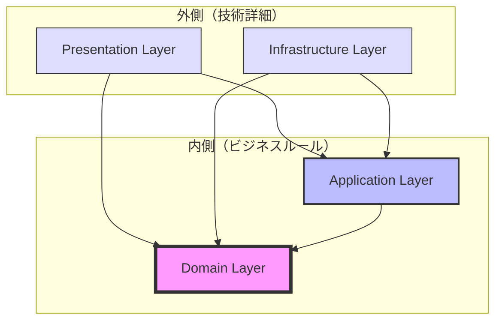

# AutoForgeNexus レイヤー依存関係設計書

💡 **初心者向けガイド**

> この文書は、システムの各「層（レイヤー）」がどのように関係し合うかを説明しています。レゴブロックのように、各パーツがどう組み合わさるかのルールがあり、このルールを守ると、変更しやすくテストしやすいシステムが作れます。

## 1. 依存関係の基本原則

### 1.1 依存性逆転の原則（DIP）

💡 **初心者向け説明：依存性逆転の原則とは？**

> 「重要なもの」が「詳細なもの」に依存しないようにする設計原則です。
>
> **日常生活の例：** スマホの充電で考えると：
>
> - ❌ 悪い例：スマホが特定の充電器しか使えない
> - ✅ 良い例：USB-C規格（インターフェース）に対応し、どの充電器でもOK
>
> **プログラムでの例：**
>
> - ビジネスロジックは「プロンプトを保存する」ことだけ知っている
> - MySQLかPostgreSQLかは知らない（知る必要がない）
> - これにより、データベースを変えてもビジネスロジックは変更不要

```
高レベルモジュール（ビジネスロジック）は低レベルモジュール（技術詳細）に依存してはならない。
両者は抽象（インターフェース）に依存すべきである。
```

### 1.2 レイヤー間の依存方向

💡 **初心者向け説明：依存方向のルール**

> レイヤー間の「知っている」「知らない」の関係を示します。矢印の方向は「知っている」方向を表します。
>
> **覚え方：**
>
> - 内側（ドメイン層）：会社の社長のようなもの
> - 外側（インフラ層）：会社の現場スタッフのようなもの
> - 現場は社長を知っているが、社長は現場の詳細を知らない



**重要**: 矢印は依存の方向を示す。内側のレイヤーは外側を一切知らない。

## 2. レイヤー別詳細設計

### 2.1 Domain Layer（ドメイン層）

💡 **初心者向け説明：ドメイン層の役割**

> ビジネスの「核心」となるルールを書く場所です。ここにはデータベースやWebなどの技術的な話は一切書きません。
>
> **この層がやること：**
>
> - 「プロンプトは10文字以上必要」というルール
> - 「評価スコアは0-100の範囲」という制約
> - 「テストケースは最低3つ必要」というビジネス要件
>
> **この層がやらないこと：**
>
> - データベースに保存する方法
> - APIを呼び出す方法
> - 画面に表示する方法

#### 責務と特徴

```python
# ドメイン層は純粋なビジネスロジックのみ
class PromptOptimizationDomain:
    """
    責務:
    - ビジネスルールの表現
    - ドメイン知識のカプセル化
    - ビジネス不変条件の保証

    禁止事項:
    - フレームワーク依存 ❌
    - データベース知識 ❌
    - 外部API知識 ❌
    - UI/プレゼンテーション知識 ❌
    """
```

#### 依存関係

📚 **依存関係のルール説明**

> ドメイン層が使っても良いもの、使ってはいけないものがあります。
>
> **ルールの理由：**
>
> - ビジネスロジックが技術に縛られないようにする
> - テストが簡単にできるようにする
> - データベースを変えてもロジックが変わらないようにする

```python
# ✅ 許可される依存
- Python標準ライブラリ
- ドメイン層内の他のクラス
- 純粋な値オブジェクト

# ❌ 禁止される依存
- FastAPI
- SQLAlchemy
- Pydantic（ドメインモデルでの使用禁止）
- 外部ライブラリ
```

#### インターフェース定義

```python
# domain/interfaces/repositories.py
from abc import ABC, abstractmethod
from typing import Optional, List
from domain.entities import Prompt, PromptId

class IPromptRepository(ABC):
    """ドメインが要求するリポジトリインターフェース"""

    @abstractmethod
    async def find_by_id(self, prompt_id: PromptId) -> Optional[Prompt]:
        """IDによるプロンプト取得"""
        pass

    @abstractmethod
    async def save(self, prompt: Prompt) -> None:
        """プロンプトの永続化"""
        pass

    @abstractmethod
    async def find_by_user(self, user_id: str) -> List[Prompt]:
        """ユーザーのプロンプト一覧取得"""
        pass

# domain/interfaces/llm_provider.py
class ILLMProvider(ABC):
    """LLMプロバイダーインターフェース"""

    @abstractmethod
    async def execute(self, prompt: str, config: LLMConfig) -> LLMResponse:
        """プロンプト実行"""
        pass

    @abstractmethod
    async def estimate_cost(self, prompt: str, config: LLMConfig) -> Cost:
        """コスト見積もり"""
        pass
```

### 2.2 Application Layer（アプリケーション層）

💡 **初心者向け説明：アプリケーション層の役割**

> ビジネスの「手順書」を書く場所です。ドメイン層のルールを使って、実際の作業手順を定義します。
>
> **レストランのキッチンに例えると：**
>
> - ドメイン層：「パスタは8分で7dで」というレシピ
> - **アプリケーション層：「注文を受ける→材料を確認→調理→提供」の流れ**
> - インフラ層：実際のコンロや鍋
>
> **この層がやること：**
>
> - 複数のドメインオブジェクトを組み合わせる
> - トランザクションの管理
> - 外部サービスとの調整（ただしインターフェース経由）

#### 責務と特徴

```python
# アプリケーション層はユースケースの調整役
class ApplicationLayerResponsibilities:
    """
    責務:
    - ユースケースの実装
    - ドメインオブジェクトの調整
    - トランザクション管理
    - 外部サービスとの調整

    許可事項:
    - ドメイン層の使用 ✅
    - インターフェース経由での外部サービス利用 ✅
    - DTO（Data Transfer Object）の定義 ✅

    禁止事項:
    - ビジネスルールの実装 ❌
    - 技術詳細への直接依存 ❌
    """
```

#### 依存注入パターン

📚 **依存注入（DI）とは？**

> 必要なパーツを「外から渡す」パターンです。
>
> **日常生活の例：**
>
> - ❌ 悪い例：電動ドリルに特定のバッテリーが固定
> - ✅ 良い例：バッテリーを交換可能にする
>
> **プログラムでの利点：**
>
> - テスト時は偽のデータベースを渡す
> - 本番時は本物のデータベースを渡す
> - ロジックは変えずに、部品だけ交換できる

```python
# application/use_cases/optimize_prompt.py
from domain.interfaces import IPromptRepository, ILLMProvider
from domain.services import PromptOptimizationService

class OptimizePromptUseCase:
    """プロンプト最適化ユースケース"""

    def __init__(
        self,
        prompt_repository: IPromptRepository,  # インターフェース依存
        llm_provider: ILLMProvider,           # インターフェース依存
        optimization_service: PromptOptimizationService  # ドメインサービス
    ):
        self._prompt_repo = prompt_repository
        self._llm_provider = llm_provider
        self._optimization_service = optimization_service

    async def execute(self, command: OptimizePromptCommand) -> OptimizePromptResult:
        # 1. ドメインオブジェクト取得
        prompt = await self._prompt_repo.find_by_id(command.prompt_id)

        # 2. ドメインサービス呼び出し
        suggestions = await self._optimization_service.analyze(prompt)

        # 3. 外部サービス調整
        llm_result = await self._llm_provider.execute(
            prompt.content,
            command.llm_config
        )

        # 4. 結果の組み立てと返却
        return OptimizePromptResult(
            prompt_id=prompt.id,
            suggestions=suggestions,
            llm_response=llm_result
        )
```

#### DTOとドメインモデルの変換

📚 **DTO（Data Transfer Object）とは？**

> データを運ぶための「入れ物」です。
>
> **宅配便の箱に例えると：**
>
> - ドメインモデル：実際の商品（壊れやすい、高価など）
> - **DTO：配送用の箱（丈夫、簡素、安価）**
> - 変換：商品を箱に詰めたり、箱から出したり
>
> **なぜ必要？**
>
> - ドメインモデルはビジネスルールを守るため複雑
> - 外部（APIや画面）とのやり取りはシンプルなデータが良い
> - DTOを使って必要な情報だけを送受信

```python
# application/dto/prompt_dto.py
from dataclasses import dataclass
from typing import Optional
from datetime import datetime

@dataclass
class PromptDTO:
    """外部とのデータ交換用DTO"""
    id: str
    content: str
    template_id: Optional[str]
    created_at: datetime
    updated_at: datetime

    @classmethod
    def from_domain(cls, prompt: Prompt) -> 'PromptDTO':
        """ドメインオブジェクトからDTOへ変換"""
        return cls(
            id=str(prompt.id),
            content=prompt.content.value,
            template_id=str(prompt.template_id) if prompt.template_id else None,
            created_at=prompt.created_at,
            updated_at=prompt.updated_at
        )

    def to_domain(self) -> Prompt:
        """DTOからドメインオブジェクトへ変換"""
        return Prompt(
            id=PromptId(self.id),
            content=PromptContent(self.content),
            template_id=TemplateId(self.template_id) if self.template_id else None,
            created_at=self.created_at,
            updated_at=self.updated_at
        )
```

### 2.3 Infrastructure Layer（インフラストラクチャ層）

💡 **初心者向け説明：インフラ層の役割**

> 実際の技術的な処理をすべて担当する層です。
>
> **家の設備に例えると：**
>
> - ドメイン層：「暖かくしたい」という要求
> - アプリケーション層：「温度を見て暖房をつける」という手順
> - **インフラ層：実際のエアコン、ストーブ、電気配線**
>
> **この層がやること：**
>
> - Tursoデータベースへの接続・操作
> - Redisキャッシュの管理
> - OpenAI、ClaudeなどのLLM API呼び出し
> - ファイルの読み書き
> - ネットワーク通信

#### 責務と特徴

```python
# インフラ層は技術的詳細の実装
class InfrastructureLayerResponsibilities:
    """
    責務:
    - インターフェースの具体実装
    - 外部システムとの統合
    - データベースアクセス
    - 外部API呼び出し

    許可事項:
    - フレームワーク使用 ✅
    - ライブラリ使用 ✅
    - 技術固有の最適化 ✅

    重要:
    - ドメインインターフェースを実装する
    - ドメインモデルを技術モデルに変換する
    """
```

#### リポジトリ実装例

```python
# infrastructure/repositories/turso_prompt_repository.py
from sqlalchemy.ext.asyncio import AsyncSession
from sqlalchemy import select
from domain.interfaces import IPromptRepository
from domain.entities import Prompt, PromptId
from infrastructure.models import PromptModel  # SQLAlchemyモデル

class TursoPromptRepository(IPromptRepository):
    """Turso用リポジトリ実装"""

    def __init__(self, session: AsyncSession):
        self._session = session

    async def find_by_id(self, prompt_id: PromptId) -> Optional[Prompt]:
        # SQLAlchemyを使った実装
        result = await self._session.execute(
            select(PromptModel).where(PromptModel.id == str(prompt_id))
        )
        model = result.scalar_one_or_none()

        if model:
            # インフラモデル → ドメインモデル変換
            return self._to_domain(model)
        return None

    async def save(self, prompt: Prompt) -> None:
        # ドメインモデル → インフラモデル変換
        model = self._to_infrastructure(prompt)

        # マージ（存在すれば更新、なければ挿入）
        await self._session.merge(model)
        await self._session.commit()

    def _to_domain(self, model: PromptModel) -> Prompt:
        """インフラモデルからドメインモデルへ変換"""
        return Prompt(
            id=PromptId(model.id),
            content=PromptContent(model.content),
            # ... その他のマッピング
        )

    def _to_infrastructure(self, prompt: Prompt) -> PromptModel:
        """ドメインモデルからインフラモデルへ変換"""
        return PromptModel(
            id=str(prompt.id),
            content=prompt.content.value,
            # ... その他のマッピング
        )
```

#### LLMプロバイダー実装例

```python
# infrastructure/llm/litellm_provider.py
from litellm import acompletion
from domain.interfaces import ILLMProvider
from domain.value_objects import LLMConfig, LLMResponse, Cost

class LiteLLMProvider(ILLMProvider):
    """LiteLLM統合実装"""

    async def execute(self, prompt: str, config: LLMConfig) -> LLMResponse:
        # LiteLLM APIの呼び出し
        response = await acompletion(
            model=config.model_name,
            messages=[{"role": "user", "content": prompt}],
            temperature=config.temperature,
            max_tokens=config.max_tokens,
            # ... その他のパラメータ
        )

        # APIレスポンス → ドメインモデル変換
        return LLMResponse(
            content=response.choices[0].message.content,
            tokens_used=response.usage.total_tokens,
            model=config.model_name,
            # ... その他のマッピング
        )

    async def estimate_cost(self, prompt: str, config: LLMConfig) -> Cost:
        # トークン数推定とコスト計算
        estimated_tokens = len(prompt) / 4  # 簡略化された推定
        price_per_token = self._get_price(config.model_name)

        return Cost(
            estimated_tokens=estimated_tokens,
            estimated_cost=estimated_tokens * price_per_token,
            currency="USD"
        )
```

### 2.4 Presentation Layer（プレゼンテーション層）

💡 **初心者向け説明：プレゼンテーション層の役割**

> ユーザーや外部システムとの「窓口」になる層です。
>
> **お店のレジに例えると：**
>
> - **プレゼンテーション層：レジ係**
>   - お客様の注文を受け付ける
>   - 注文内容を確認する（「コーヒー？お茶？」）
>   - キッチンにオーダーを伝える
>   - 商品をお客様に渡す
>   - お釣りを返す
>
> **この層がやること：**
>
> - HTTPリクエストを受け取る（「POST /api/v1/prompts」など）
> - 入力値の簡単なチェック（文字数、形式）
> - ユーザー認証（ログインしているか？）
> - エラーメッセージの整形

#### 責務と特徴

```python
# プレゼンテーション層はユーザーインターフェース
class PresentationLayerResponsibilities:
    """
    責務:
    - HTTPリクエスト/レスポンス処理
    - 入力検証（形式的な検証のみ）
    - 認証・認可
    - エラーハンドリング
    - レスポンス整形

    禁止事項:
    - ビジネスロジック実装 ❌
    - 直接的なデータベースアクセス ❌
    - 複雑な計算処理 ❌
    """
```

#### FastAPIコントローラー実装

```python
# presentation/api/v1/prompt_controller.py
from fastapi import APIRouter, Depends, HTTPException
from presentation.dependencies import get_optimize_use_case
from presentation.schemas import OptimizePromptRequest, OptimizePromptResponse
from application.use_cases import OptimizePromptUseCase
from application.dto import OptimizePromptCommand

router = APIRouter(prefix="/api/v1/prompts", tags=["prompts"])

@router.post("/{prompt_id}/optimize", response_model=OptimizePromptResponse)
async def optimize_prompt(
    prompt_id: str,
    request: OptimizePromptRequest,
    use_case: OptimizePromptUseCase = Depends(get_optimize_use_case)
):
    """プロンプト最適化エンドポイント"""
    try:
        # リクエスト → コマンド変換
        command = OptimizePromptCommand(
            prompt_id=prompt_id,
            optimization_params=request.optimization_params,
            llm_config=request.llm_config
        )

        # ユースケース実行
        result = await use_case.execute(command)

        # 結果 → レスポンス変換
        return OptimizePromptResponse.from_result(result)

    except PromptNotFoundError as e:
        raise HTTPException(status_code=404, detail=str(e))
    except ValidationError as e:
        raise HTTPException(status_code=400, detail=str(e))
    except Exception as e:
        # ログ記録
        logger.error(f"Optimization failed: {e}")
        raise HTTPException(status_code=500, detail="Internal server error")
```

#### 依存注入コンテナ

📚 **DIコンテナとは？**

> 必要な部品を管理・配給する「倉庫」のようなものです。
>
> **レストランの厨房に例えると：**
>
> - シェフが「包丁が必要」と言う
> - DIコンテナが適切な包丁を渡す
> - シェフは包丁がどこから来たか知らなくてよい
>
> **メリット：**
>
> - テスト時と本番時で部品を簡単に切り替えられる
> - 各クラスが依存関係を管理しなくてよい
> - シングルトン（同じインスタンスを使い回す）が簡単

```python
# presentation/dependencies.py
from functools import lru_cache
from infrastructure.repositories import TursoPromptRepository
from infrastructure.llm import LiteLLMProvider
from infrastructure.database import get_session
from application.use_cases import OptimizePromptUseCase
from domain.services import PromptOptimizationService

@lru_cache()
def get_prompt_repository():
    """プロンプトリポジトリの取得"""
    session = get_session()
    return TursoPromptRepository(session)

@lru_cache()
def get_llm_provider():
    """LLMプロバイダーの取得"""
    return LiteLLMProvider()

@lru_cache()
def get_optimization_service():
    """最適化サービスの取得"""
    return PromptOptimizationService()

def get_optimize_use_case():
    """最適化ユースケースの取得（リクエスト毎）"""
    return OptimizePromptUseCase(
        prompt_repository=get_prompt_repository(),
        llm_provider=get_llm_provider(),
        optimization_service=get_optimization_service()
    )
```

## 3. レイヤー間通信パターン

💡 **初心者向け説明：レイヤー間の通信とは？**

> 各層がどのように情報をやり取りするかのパターンです。
>
> **会社の連絡方法に例えると：**
>
> - **直接呼び出し**：直接電話をかける（同期通信）
> - **イベント駆動**：メールを送る（非同期通信）
> - **CQRS**：報告用と指示用で窓口を分ける
>
> それぞれに適した場面があり、組み合わせて使います。

### 3.1 イベント駆動通信

```python
# domain/events/prompt_events.py
from dataclasses import dataclass
from datetime import datetime
from domain.value_objects import PromptId, UserId

@dataclass
class PromptOptimizedEvent:
    """プロンプト最適化イベント"""
    prompt_id: PromptId
    user_id: UserId
    optimized_at: datetime
    improvements: List[str]

# application/event_handlers/prompt_event_handler.py
class PromptEventHandler:
    """イベントハンドラー"""

    async def handle_prompt_optimized(self, event: PromptOptimizedEvent):
        # 1. キャッシュ無効化
        await self._cache.invalidate(str(event.prompt_id))

        # 2. メトリクス更新
        await self._metrics.record_optimization(event)

        # 3. 通知送信
        await self._notifier.send_optimization_complete(event.user_id)
```

### 3.2 クロスカッティング関心事

```python
# infrastructure/cross_cutting/logging.py
from functools import wraps
import logging

def log_execution(level=logging.INFO):
    """実行ログデコレータ"""
    def decorator(func):
        @wraps(func)
        async def wrapper(*args, **kwargs):
            logger = logging.getLogger(func.__module__)
            logger.log(level, f"Starting {func.__name__}")
            try:
                result = await func(*args, **kwargs)
                logger.log(level, f"Completed {func.__name__}")
                return result
            except Exception as e:
                logger.error(f"Error in {func.__name__}: {e}")
                raise
        return wrapper
    return decorator

# infrastructure/cross_cutting/transaction.py
from contextlib import asynccontextmanager

@asynccontextmanager
async def transaction():
    """トランザクション管理"""
    session = get_session()
    try:
        yield session
        await session.commit()
    except Exception:
        await session.rollback()
        raise
    finally:
        await session.close()
```

## 4. 依存関係の検証

### 4.1 アーキテクチャテスト

```python
# tests/architecture/test_dependencies.py
import ast
import pytest
from pathlib import Path

class TestLayerDependencies:
    """レイヤー依存関係のテスト"""

    def test_domain_has_no_external_dependencies(self):
        """ドメイン層が外部依存を持たないことを確認"""
        domain_files = Path("src/domain").rglob("*.py")

        for file in domain_files:
            tree = ast.parse(file.read_text())
            imports = [node for node in ast.walk(tree)
                      if isinstance(node, (ast.Import, ast.ImportFrom))]

            for imp in imports:
                if isinstance(imp, ast.ImportFrom):
                    module = imp.module or ""
                    # ドメイン層以外からのインポートを禁止
                    assert not module.startswith("infrastructure"), \
                        f"Domain layer imports from infrastructure: {module}"
                    assert not module.startswith("application"), \
                        f"Domain layer imports from application: {module}"
                    assert not module.startswith("presentation"), \
                        f"Domain layer imports from presentation: {module}"
                    assert not module.startswith("fastapi"), \
                        f"Domain layer imports FastAPI: {module}"

    def test_application_depends_only_on_domain(self):
        """アプリケーション層がドメイン層のみに依存することを確認"""
        app_files = Path("src/application").rglob("*.py")

        for file in app_files:
            tree = ast.parse(file.read_text())
            imports = [node for node in ast.walk(tree)
                      if isinstance(node, (ast.Import, ast.ImportFrom))]

            for imp in imports:
                if isinstance(imp, ast.ImportFrom):
                    module = imp.module or ""
                    # 技術的詳細への直接依存を禁止
                    assert not module.startswith("sqlalchemy"), \
                        f"Application layer directly imports SQLAlchemy: {module}"
                    assert not module.startswith("litellm"), \
                        f"Application layer directly imports LiteLLM: {module}"
```

### 4.2 循環依存の検出

```python
# tools/check_circular_dependencies.py
import networkx as nx
from pathlib import Path
import ast

def build_dependency_graph():
    """依存関係グラフの構築"""
    graph = nx.DiGraph()

    for py_file in Path("src").rglob("*.py"):
        module = str(py_file).replace("/", ".").replace(".py", "")
        graph.add_node(module)

        tree = ast.parse(py_file.read_text())
        for node in ast.walk(tree):
            if isinstance(node, ast.ImportFrom):
                if node.module:
                    imported = node.module
                    if imported.startswith("src"):
                        graph.add_edge(module, imported)

    return graph

def check_circular_dependencies():
    """循環依存のチェック"""
    graph = build_dependency_graph()
    cycles = list(nx.simple_cycles(graph))

    if cycles:
        print("❌ Circular dependencies detected:")
        for cycle in cycles:
            print(f"  {' -> '.join(cycle)}")
        return False

    print("✅ No circular dependencies found")
    return True

if __name__ == "__main__":
    check_circular_dependencies()
```

## 5. 依存関係管理のベストプラクティス

### 5.1 インターフェース分離の原則（ISP）

```python
# ❌ 悪い例：大きすぎるインターフェース
class IPromptService(ABC):
    @abstractmethod
    async def create_prompt(self, ...): pass

    @abstractmethod
    async def optimize_prompt(self, ...): pass

    @abstractmethod
    async def evaluate_prompt(self, ...): pass

    @abstractmethod
    async def generate_report(self, ...): pass

    # ... 20個以上のメソッド

# ✅ 良い例：分離されたインターフェース
class IPromptCreator(ABC):
    @abstractmethod
    async def create(self, content: str) -> Prompt: pass

class IPromptOptimizer(ABC):
    @abstractmethod
    async def optimize(self, prompt: Prompt) -> OptimizationResult: pass

class IPromptEvaluator(ABC):
    @abstractmethod
    async def evaluate(self, prompt: Prompt) -> EvaluationResult: pass
```

### 5.2 依存性注入の実装パターン

```python
# ✅ コンストラクタインジェクション（推奨）
class OptimizePromptUseCase:
    def __init__(self, repo: IPromptRepository, llm: ILLMProvider):
        self._repo = repo
        self._llm = llm

# ⚠️ セッターインジェクション（条件付き使用）
class OptimizePromptUseCase:
    def set_repository(self, repo: IPromptRepository):
        self._repo = repo

# ❌ サービスロケータ（アンチパターン）
class OptimizePromptUseCase:
    def __init__(self):
        self._repo = ServiceLocator.get(IPromptRepository)  # 隠れた依存
```

### 5.3 パッケージ構造による依存管理

```
src/
├── domain/                # 内側（ビジネスロジック）
│   ├── __init__.py
│   ├── entities/
│   ├── value_objects/
│   ├── services/
│   ├── events/
│   └── interfaces/        # 抽象定義
│
├── application/           # ユースケース層
│   ├── __init__.py
│   ├── use_cases/
│   ├── dto/
│   ├── commands/
│   ├── queries/
│   └── services/
│
├── infrastructure/        # 技術的実装
│   ├── __init__.py
│   ├── repositories/     # IRepository実装
│   ├── llm/              # ILLMProvider実装
│   ├── cache/
│   ├── database/
│   └── messaging/
│
└── presentation/          # ユーザーインターフェース
    ├── __init__.py
    ├── api/              # REST API
    ├── websocket/        # WebSocket
    ├── graphql/          # GraphQL
    ├── schemas/          # Pydantic schemas
    └── dependencies/     # DI設定
```

## 6. まとめ

### レイヤー依存の黄金律

1. **ドメイン層は完全に独立** - 外部を一切知らない
2. **依存は内向き** - 外側から内側への依存のみ
3. **インターフェース経由** - 具象ではなく抽象に依存
4. **単一責任** - 各レイヤーは明確な責務を持つ
5. **テスト可能性** - すべての依存は注入可能

### チェックリスト

- [ ] ドメイン層が外部ライブラリに依存していない
- [ ] すべての外部サービスがインターフェース経由でアクセスされている
- [ ] 循環依存が存在しない
- [ ] 各レイヤーの責務が明確に定義されている
- [ ] 依存性注入が適切に実装されている
- [ ] アーキテクチャテストが実装されている

この設計により、変更に強く、テスタブルで、保守性の高いシステムが実現されます。

---

## 📖 初心者向けレイヤー依存の総まとめ

### 🎯 この設計で得られるメリット

| メリット             | 具体例                                  | 効果                           |
| -------------------- | --------------------------------------- | ------------------------------ |
| **変更が簡単**       | データベースをMySQLからPostgreSQLに変更 | ドメイン層は一切変更不要       |
| **テストが簡単**     | ビジネスロジックのテスト                | DBなしでメモリ上でテスト可能   |
| **開発が並行できる** | フロントとバックエンドを別チームで      | インターフェースさえ決めればOK |
| **バグが減る**       | 各層の責任が明確                        | どこで問題が起きたかすぐ分かる |
| **再利用できる**     | ビジネスロジック                        | 他のプロジェクトでも使える     |

### 🏫 層の役割を学校に例えると

| レイヤー       | 学校の役割         | やること                    | やらないこと     |
| -------------- | ------------------ | --------------------------- | ---------------- |
| **ドメイン層** | 校則・カリキュラム | 「遅刻は3回で欠席」のルール | 具体的な実施方法 |
| **アプリ層**   | 先生               | 授業の進め方を決める        | 教室の掜除など   |
| **インフラ層** | 用務員             | 教室、機材、設備の管理      | 授業内容の決定   |
| **プレゼン層** | 事務室             | 外部との窓口                | 授業の実施       |

### 💡 覚えておくべき3つのポイント

1. **下の層は上を知らない**

   - ドメイン層（ビジネスルール）は最も重要で独立
   - データベースやWebのことは一切知らない

2. **インターフェースを使う**

   - 具体的な実装ではなく「約束」に依存
   - USB-C規格のように、どの実装でも交換可能

3. **依存性注入を使う**
   - 必要なパーツは外から渡す
   - テスト時と本番で簡単に切り替え可能

### 🎯 最終チェック

この設計を正しく実装できれば：

- ✅ データベースを変えてもビジネスロジックは変更不要
- ✅ テストが高速で簡単に書ける
- ✅ 複数人で同時開発しても衝突しない
- ✅ バグが発生しても影響範囲が限定される
- ✅ 新機能を追加しやすい
