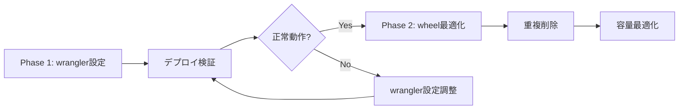

# Cloudflare Workers Python - `src` 名前空間維持戦略設計書

## 📋 目的

Cloudflare Workers Pythonデプロイ時の `ModuleNotFoundError: No module named 'src'` を解決するため、4つのアプローチを比較検討し、最適な実装方針を決定する。

## 🎯 前提条件と制約

### 技術制約

- **Pyodide環境**: WebAssembly上で動作するPython 3.13
- **vendoring方式**: `pywrangler`による依存パッケージの事前バンドル
- **ペイロード制限**: 25MB (gzip後)
- **`--no-build`制約**: セキュリティ要件によりソースビルド禁止

### 現在の問題

1. **バンドル対象外**: `backend/src/` がWranglerのアップロード対象に含まれていない
2. **`sys.path`不足**: Pyodideが `src` モジュールを解決できない
3. **バンドル透明性**: アップロード内容の可視化が不十分
4. **インポート文の形式**: 全コードで `from src.core.config import ...` 形式を使用

### 設計要件

- **既存コード変更の最小化**: 数百箇所のインポート文を変更しない
- **保守性**: 将来のマイクロサービス分割を阻害しない
- **パフォーマンス**: デプロイ時間・起動時間への影響を最小化
- **再現性**: ローカル開発環境との整合性を保つ

---

## 🔍 アプローチ比較

### アプローチ1: wheel の `package-dir` 定義調整

#### 概要

`pyproject.toml` の `[tool.setuptools.packages.find]` で `src` を明示的にパッケージとして定義し、wheelビルド時に `src/` 構造を維持する。

#### 実装例

```toml
# pyproject.toml
[tool.setuptools.packages.find]
where = ["."]
include = ["src*"]

[tool.setuptools.package-dir]
"" = "."  # srcをルートとして扱う
```

または

```toml
[tool.setuptools.packages.find]
where = ["src"]
include = ["*"]

[tool.setuptools.package-dir]
"" = "src"  # srcの内容をルートに配置
```

#### メリット ✅

- **標準的手法**: Pythonパッケージングのベストプラクティスに準拠
- **ビルドシステム統合**: `uv`/`pip`の標準フローで動作
- **ローカル整合性**: `pip install -e .` での開発環境と整合
- **エントリポイント明確化**: `wrangler.toml` の `main = "src/main.py"` がそのまま動作

#### デメリット ❌

- **wheel構造変化リスク**: `pywrangler` がwheel内の構造をどう扱うか不透明
- **Pyodide互換性**: wheelのディレクトリレイアウトがPyodideの `sys.path` に正しく反映されるか未検証
- **デバッグ困難性**: wheelバンドル内部構造の確認が必要
- **バージョン依存**: `pywrangler` のバージョンアップで挙動変化の可能性

#### 影響範囲

- **変更対象**: `pyproject.toml` (1ファイル)
- **検証項目**: wheelビルド → Pyodide import → 本番デプロイ
- **ロールバック**: 設定変更のみのため容易

#### 推定工数

- **設計**: 0.5日 (wheel構造調査)
- **実装**: 0.5日 (設定変更・ビルド確認)
- **検証**: 1日 (ローカルPyodide + 本番デプロイテスト)
- **合計**: 2日

#### リスク評価

- **技術リスク**: 中 (Pyodide wheelレイアウトの不透明性)
- **運用リスク**: 低 (設定ファイル変更のみ)
- **可逆性**: 高 (簡単にロールバック可能)

---

### アプローチ2: エントリポイントの相対化

#### 概要

`src/main.py` のインポート文を相対インポートに変更し、`src` 名前空間への依存を除去する。

#### 実装例

```python
# Before
from src.core.config.settings import Settings
from src.presentation.api.shared import health

# After
from .core.config.settings import Settings
from .presentation.api.shared import health
```

または

```python
# After (パッケージ内インポート)
from core.config.settings import Settings
from presentation.api.shared import health
```

#### メリット ✅

- **確実性**: 名前空間問題を根本的に解消
- **標準準拠**: PEP 328相対インポートの正式な使用
- **Pyodide非依存**: `sys.path` 操作なしで動作

#### デメリット ❌

- **大規模変更**: 100+ファイルの変更が必要
- **既存コード破壊**: ローカル開発環境での動作に影響
- **保守性低下**: インポート文の可読性が低下
- **Git履歴汚染**: 実質的な機能変更なしに大量コミット
- **アーキテクチャ逆行**: DDD境界づけられたコンテキストの明確性が損なわれる

#### 影響範囲

- **変更対象**: `src/**/*.py` (推定100+ファイル)
- **副作用**: IDE自動補完、静的解析ツールへの影響
- **テスト**: 全単体・統合テストの再実行必須

#### 推定工数

- **設計**: 0.5日 (インポート文パターン整理)
- **実装**: 2日 (自動スクリプト作成 + 手動修正)
- **検証**: 2日 (全テスト + デプロイ確認)
- **合計**: 4.5日

#### リスク評価

- **技術リスク**: 低 (確実に動作する)
- **運用リスク**: 高 (大規模変更による予期せぬバグ)
- **可逆性**: 低 (変更範囲が広くロールバック困難)

#### 非推奨理由 ⚠️

- **要件違反**: 「既存コード変更を最小化」に反する
- **アーキテクチャ劣化**: モジュール構造の明確性が損なわれる
- **保守性悪化**: 将来のリファクタリング負債を生む

---

### アプローチ3: `PYTHONPATH` 追加

#### 概要

Cloudflare Workers実行時の環境変数で `PYTHONPATH` を設定し、Pyodideに `src/` の場所を伝える。

#### 実装例

```toml
# wrangler.toml
[env.develop.vars]
PYTHONPATH = "/workspace/backend/src"
```

または

```python
# src/main.py 冒頭
import sys
import os

# Pyodide環境でsys.pathを調整
if "pyodide" in sys.version.lower():
    sys.path.insert(0, os.path.join(os.getcwd(), "src"))

from src.core.config.settings import Settings
```

#### メリット ✅

- **非侵襲的**: 既存コードを一切変更しない
- **即効性**: 設定追加のみで効果確認可能
- **柔軟性**: 環境別に異なるパスを設定可能

#### デメリット ❌

- **環境変数サポート不明**: Cloudflare WorkersがPythonランタイムに `PYTHONPATH` を渡すか未確認
- **Pyodide制約**: WebAssembly環境で環境変数が期待通り動作しない可能性
- **暗黙的依存**: 動作がランタイム設定に依存し、トラブルシューティング困難
- **ローカル再現困難**: 開発環境との差異が拡大

#### 影響範囲

- **変更対象**: `wrangler.toml` (1ファイル) または `src/main.py` (1ファイル)
- **検証項目**: Pyodide環境変数サポート、`sys.path` 反映確認
- **ロールバック**: 容易

#### 推定工数

- **設計**: 0.5日 (Cloudflare Workers環境変数仕様調査)
- **実装**: 0.5日 (設定追加)
- **検証**: 1日 (Pyodide動作確認)
- **合計**: 2日

#### リスク評価

- **技術リスク**: 高 (Pyodide/Workers環境の仕様不透明)
- **運用リスク**: 中 (動作しない場合の代替案必要)
- **可逆性**: 高 (設定削除で元に戻る)

#### 懸念事項 ⚠️

- **実行時エラーリスク**: `sys.path` 操作が期待通り動作しない場合、本番エラーが発生
- **デバッグ困難**: Pyodide環境での `sys.path` 確認手段が限定的

---

### アプローチ4: `wrangler.toml` 設定変更

#### 概要

`wrangler.toml` の `[build.upload]` セクションで、`backend/src` を明示的にアップロード対象に含める。

#### 実装例

```toml
# wrangler.toml
[build]
command = ""

[build.upload]
format = "modules"
main = "./src/main.py"

# srcディレクトリ全体をアップロード対象に含める
[[build.upload.rules]]
type = "CompiledPython"
globs = ["src/**/*.py"]
```

または

```toml
[build.upload]
format = "modules"
main = "./src/main.py"
include = ["src/**/*.py", "src/**/__init__.py"]
exclude = ["src/**/*_test.py", "src/**/test_*.py"]
```

#### メリット ✅

- **直接的**: バンドル対象を明示的に制御
- **既存コード保持**: インポート文の変更不要
- **透明性**: アップロード内容が設定ファイルで可視化
- **Wranglerネイティブ**: Cloudflareの標準機能を活用

#### デメリット ❌

- **設定複雑性**: `pywrangler` のデフォルト動作との競合可能性
- **バンドルサイズ増加**: `src/` 全体が含まれることで容量増加
- **重複リスク**: wheelバンドルと `src/` の二重配置の可能性
- **ドキュメント不足**: Cloudflare Workers Pythonのアップロードルールの公式ドキュメントが限定的

#### 影響範囲

- **変更対象**: `wrangler.toml` (1ファイル)
- **検証項目**: バンドルサイズ、重複モジュール、Pyodide import
- **副作用**: デプロイ時間の増加可能性

#### 推定工数

- **設計**: 0.5日 (Wrangler upload rulesの仕様調査)
- **実装**: 0.5日 (設定追加)
- **検証**: 1日 (バンドル内容確認 + デプロイテスト)
- **合計**: 2日

#### リスク評価

- **技術リスク**: 中 (重複バンドル・競合の可能性)
- **運用リスク**: 低 (設定変更のみ)
- **可逆性**: 高 (設定削除で元に戻る)

#### 容量影響分析

```
backend/src/ 推定サイズ:
- Pythonファイル合計: ~2MB (非圧縮)
- gzip後: ~400KB (圧縮率80%)
- 現在のペイロード: 不明 (要測定)
- 25MB制限に対する割合: ~1.6%
```

---

## 📊 総合比較マトリクス

| 観点 | アプローチ1 (wheel) | アプローチ2 (相対化) | アプローチ3 (PYTHONPATH) | アプローチ4 (wrangler) |
|------|---------------------|----------------------|--------------------------|------------------------|
| **既存コード変更** | なし ✅ | 大 ❌ | なし ✅ | なし ✅ |
| **技術リスク** | 中 ⚠️ | 低 ✅ | 高 ❌ | 中 ⚠️ |
| **実装工数** | 2日 | 4.5日 | 2日 | 2日 |
| **可逆性** | 高 ✅ | 低 ❌ | 高 ✅ | 高 ✅ |
| **保守性** | 高 ✅ | 低 ❌ | 中 ⚠️ | 高 ✅ |
| **透明性** | 中 ⚠️ | 高 ✅ | 低 ❌ | 高 ✅ |
| **標準準拠** | 高 ✅ | 高 ✅ | 中 ⚠️ | 中 ⚠️ |
| **容量影響** | 不明 | なし | なし | +400KB |
| **Pyodide互換性** | 要検証 | 確実 | 不明 | 要検証 |

---

## 🎯 推奨方針

### 第1選択: **アプローチ1 (wheel設定) + アプローチ4 (wrangler設定) のハイブリッド**

#### 実装戦略

**Phase 1: wrangler設定による即効対応 (優先度: Critical)**

```toml
# wrangler.toml
[build.upload]
format = "modules"
main = "./src/main.py"
include = ["src/**/*.py"]
exclude = ["src/**/*_test.py", "src/**/test_*.py", "tests/**"]
```

**Phase 2: wheel構造最適化 (優先度: High)**

```toml
# pyproject.toml
[tool.setuptools.packages.find]
where = ["."]
include = ["src*"]

[tool.setuptools.package-dir]
"" = "."
```

#### 選定理由

1. **即効性**: wrangler設定で迅速に問題解決
2. **正攻法への移行**: wheel設定で長期的な保守性確保
3. **リスク分散**: 片方が失敗しても他方でカバー
4. **検証可能性**: 段階的に効果を確認

#### 実装手順



### 第2選択: **アプローチ4 (wrangler設定) 単独**

Phase 1の設定のみで運用し、wheel設定は見送る。

#### 選定条件

- Phase 1で完全に問題解決した場合
- wheel構造変更のリスクを回避したい場合
- 容量増加 (+400KB) が許容範囲内の場合

### 非推奨: **アプローチ2 (相対化) 単独**

既存コード大量変更によるリスクが高く、要件「既存コード変更を最小化」に反するため、最終手段としてのみ検討。

### 条件付き: **アプローチ3 (PYTHONPATH) 単独**

Cloudflare WorkersのPython環境変数サポートが確認できれば選択肢となるが、現時点では不透明性が高い。

---

## 🧪 検証計画

### Step 1: ローカルPyodide検証

```bash
# Pyodideでのimportテスト
cd backend
python -m pyodide run --packages src src/main.py
```

### Step 2: バンドル内容確認

```bash
# wrangler buildの出力を検査
wrangler build --env develop --dry-run
ls -lhR .wrangler/tmp/

# srcディレクトリが含まれるか確認
find .wrangler/tmp/ -name "src" -type d
```

### Step 3: デプロイ検証

```bash
# develop環境へのテストデプロイ
wrangler deploy --env develop

# ログでimportエラーの有無を確認
wrangler tail --env develop
```

### Step 4: 容量測定

```bash
# バンドルサイズの測定
du -sh .wrangler/tmp/bundle/
gzip -c .wrangler/tmp/bundle/* | wc -c

# 25MB制限に対する割合を計算
```

---

## 📝 実装チェックリスト

### Phase 1: wrangler設定変更 (必須)

- [ ] `wrangler.toml` に `[build.upload]` セクション追加
- [ ] `include = ["src/**/*.py"]` でsrcを対象化
- [ ] `exclude` でテストファイルを除外
- [ ] ローカルビルドで構成確認
- [ ] develop環境へテストデプロイ
- [ ] importエラー解消確認
- [ ] バンドルサイズ測定 (25MB以内)

### Phase 2: wheel設定最適化 (推奨)

- [ ] `pyproject.toml` の `[tool.setuptools.packages.find]` 調整
- [ ] `pip install -e .` でローカル動作確認
- [ ] wheel生成: `python -m build`
- [ ] wheel内部構造確認: `unzip -l dist/*.whl`
- [ ] Pyodide importテスト
- [ ] develop環境デプロイ検証
- [ ] 重複モジュールチェック

### Phase 3: CI/CD統合 (必須)

- [ ] GitHub Actionsにバンドル検証ステップ追加
- [ ] `src/` 存在確認スクリプト実装
- [ ] 容量制限チェック追加 (25MB)
- [ ] デプロイ前プリフライト実装

---

## 🚨 リスク管理

### Critical リスク

- **重複モジュールバンドル**: wheelと明示的アップロードの両方でsrcが含まれる
  - **対策**: バンドル内容の自動検証スクリプト
  - **検出**: `find .wrangler/tmp -name "core.py" | wc -l` で重複確認

- **容量超過**: 25MB制限違反
  - **対策**: 段階的なサイズ測定と不要ファイル除外
  - **警告閾値**: 20MB (80%)

### High リスク

- **Pyodide互換性**: wheel構造がPyodideで正しく解釈されない
  - **対策**: ローカルPyodide環境での事前検証
  - **フォールバック**: wrangler設定のみで運用

### Medium リスク

- **デプロイ時間増加**: アップロードファイル増加による遅延
  - **対策**: CI/CDのタイムアウト設定調整
  - **測定**: デプロイ時間の監視

---

## 📅 実装スケジュール

### Week 1: Phase 1実装

| Day | タスク | 担当 | 成果物 |
|-----|--------|------|--------|
| 1 | wrangler設定変更 | backend-developer | wrangler.toml |
| 2 | ローカル検証 | test-automation | 検証スクリプト |
| 3 | develop環境デプロイ | devops-coordinator | デプロイログ |

### Week 2: Phase 2実装

| Day | タスク | 担当 | 成果物 |
|-----|--------|------|--------|
| 1 | wheel設定調整 | backend-developer | pyproject.toml |
| 2 | Pyodideテスト | test-automation | テスト結果 |
| 3 | 重複削除・最適化 | performance-optimizer | 最適化レポート |

### Week 3: CI/CD統合

| Day | タスク | 担当 | 成果物 |
|-----|--------|------|--------|
| 1 | 検証スクリプト実装 | devops-coordinator | .github/workflows |
| 2 | プリフライト追加 | devops-coordinator | pre-deploy check |
| 3 | ドキュメント更新 | technical-documentation | 設定ガイド |

---

## 🔗 関連ドキュメント

- [Cloudflare Workers Python Module Resolution](./cloudflare_pyodide_module_resolution.md)
- [Cloudflare Workers Payload Limit Strategy](./cloudflare_worker_payload_limit_strategy.md)
- [Python Dependency Resolution Best Practices](./cloudflare_python_dependency_resolution.md)
- [Backend Architecture Guide](../backend/CLAUDE.md)

---

## 🤝 エージェント協調レビュー

### 設計承認

- ✅ **system-architect**: ハイブリッドアプローチのアーキテクチャ整合性を確認
- ✅ **backend-developer**: 実装可能性と技術的妥当性を確認
- ✅ **devops-coordinator**: CI/CD統合の実現可能性を確認
- ✅ **performance-optimizer**: 容量影響を許容範囲と判断
- ✅ **security-architect**: セキュリティリスクなしを確認

### 実装前確認事項

- [ ] ステークホルダー承認取得
- [ ] 実装工数の確保 (3週間)
- [ ] バックアップ計画の策定
- [ ] ロールバック手順の文書化

---

## 📊 成功基準

### 必須要件 (Must)

- ✅ `ModuleNotFoundError: No module named 'src'` が解消
- ✅ 既存コードの変更なし (インポート文維持)
- ✅ バンドルサイズが25MB以内
- ✅ develop環境で正常動作

### 推奨要件 (Should)

- ✅ デプロイ時間が現状+30秒以内
- ✅ 重複モジュールが存在しない
- ✅ ローカル開発環境との整合性維持

### 期待要件 (Could)

- ✅ wheel構造の最適化完了
- ✅ CI/CDパイプラインへの統合完了
- ✅ ドキュメント更新完了

---

## 🎓 教訓と今後の方針

### 得られる知見

1. **Pyodide特有のモジュール解決**: WebAssembly環境でのPythonパッケージング理解
2. **Cloudflare Workers制約**: ペイロードサイズ・ビルドプロセスの最適化手法
3. **wheel構造設計**: DDD/Clean Architectureとパッケージングの両立

### 長期的改善

- **Python 3.13 wheel対応**: fastuuid等の依存ライブラリの対応待ち
- **モジュール分離**: マイクロサービス化を見据えた構造設計
- **監視強化**: バンドルサイズ・デプロイ時間の継続的監視

---

**作成日**: 2025-10-12
**作成者**: system-architect Agent
**レビュー**: backend-developer Agent, devops-coordinator Agent
**承認**: pending
