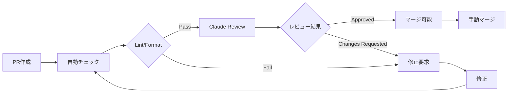

# Branch Protection Rules

## 概要

AutoForgeNexusプロジェクトのブランチ保護ルール設定です。
個人開発プロジェクトのため、Claude Codeによる自動レビューを活用し、品質を保ちながら効率的な開発を実現します。

## ブランチ保護設定

### main ブランチ

**保護レベル**: 🔴 最高

| 設定項目 | 値 | 説明 |
|---------|-----|------|
| 直接プッシュ | ❌ 禁止 | すべての変更はPR経由 |
| プルリクエスト必須 | ✅ | feature/release/hotfixブランチからのみ |
| レビュー必須 | ✅ | Claude Codeによる自動レビュー |
| ステータスチェック | ✅ | CI/CDパイプラインすべてパス必須 |
| 会話の解決 | ✅ | すべてのコメント解決必須 |
| 強制プッシュ | ❌ 禁止 | 履歴の書き換え禁止 |
| ブランチ削除 | ❌ 禁止 | mainブランチは削除不可 |

### develop ブランチ

**保護レベル**: 🟡 中

| 設定項目 | 値 | 説明 |
|---------|-----|------|
| 直接プッシュ | ⚠️ 警告 | 緊急時のみ許可（pre-push hookで警告） |
| プルリクエスト | 推奨 | featureブランチからのPR推奨 |
| レビュー | オプション | Claude Codeレビュー推奨 |
| ステータスチェック | ✅ | テスト必須 |
| 強制プッシュ | ❌ 禁止 | 履歴の保護 |
| ブランチ削除 | ❌ 禁止 | developブランチは削除不可 |

## Claude Code レビュー設定

### 自動レビュー項目

1. **コード品質**
   - SOLID原則遵守
   - クリーンコード原則
   - 適切な抽象化レベル
   - 命名規則の一貫性

2. **セキュリティ**
   - 秘密情報の検出
   - 脆弱性パターン検出
   - 認証・認可の適切性
   - 入力検証

3. **パフォーマンス**
   - アルゴリズム複雑度
   - データベースクエリ最適化
   - メモリ使用効率
   - 非同期処理の適切性

4. **テスト**
   - カバレッジ基準（Backend: 80%+, Frontend: 75%+）
   - エッジケーステスト
   - 統合テスト
   - E2Eテスト

5. **ドキュメント**
   - APIドキュメント更新
   - コメントの適切性
   - README更新
   - 変更履歴

### レビューワークフロー



## セットアップ手順

### 1. ローカル設定

```bash
# ブランチ保護スクリプト実行
./scripts/setup-branch-protection.sh

# Git hooks有効化（実施済み）
git config core.hooksPath .githooks
```

### 2. GitHub設定

自動スクリプトで設定されない項目は手動設定：

1. Settings → Branches
2. Add rule → main/develop
3. Required status checks設定
4. Save changes

### 3. Claude Code統合

```bash
# Claude Codeでプロジェクトを開く
# Serenaを有効化
# プロジェクトをアクティベート
serena activate .

# レビュー設定確認
cat .github/claude-review.yml
```

## 緊急時の対応

### ホットフィックス

```bash
# ホットフィックスブランチ作成
git flow hotfix start v1.0.1

# 修正実施
# ...

# 完了（main/developに自動マージ）
git flow hotfix finish v1.0.1
```

### 保護ルール一時解除

```bash
# 管理者権限で実行（非推奨）
gh api \
  --method DELETE \
  "/repos/daishiman/AutoForgeNexus/branches/main/protection"

# 作業後、必ず再設定
./scripts/setup-branch-protection.sh
```

## 個人開発の利点

1. **品質保証**: Claude Codeによる客観的レビュー
2. **学習機会**: AIからのベストプラクティス提案
3. **効率性**: 自動化による開発速度向上
4. **一貫性**: 統一されたコード品質基準
5. **安全性**: 人的ミス防止機構

## トラブルシューティング

### PR作成できない

```bash
# ブランチ確認
git branch

# 正しいブランチから作成
git checkout -b feature/new-feature develop
```

### マージできない

```bash
# ステータス確認
gh pr status

# チェック状態確認
gh pr checks

# 手動マージ（緊急時）
gh pr merge --admin
```

### レビューが実行されない

```bash
# Claude Code再起動
# Serena再アクティベート
serena activate .

# 手動レビュー依頼
/ai:quality:analyze --full
```

## 関連ドキュメント

- [GitFlow Configuration](./GITFLOW_CONFIGURATION.md)
- [Git Hooks Configuration](./GIT_HOOKS_CONFIGURATION.md)
- [CI/CD Pipeline](../ci/PIPELINE_CONFIGURATION.md)

---

**設定日**: 2025-09-27
**最終更新**: 2025-09-27
**レビュー方式**: Claude Code (AI自動レビュー)