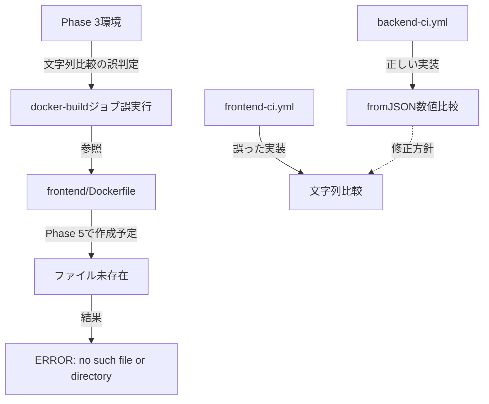

# Dockerfile Not Found エラー - 根本原因分析と恒久対策

**作成日**: 2025-10-11
**分析エージェント**: root-cause-analyst, devops-coordinator, system-architect
**重要度**: 🔴 Critical
**影響範囲**: CI/CD全体、develop/mainブランチのマージブロック

---

## 🎯 エグゼクティブサマリー

### 根本原因（単一）

**Phase判定ロジックの欠陥**: GitHub Actionsの文字列比較による誤判定で、Phase 3環境でPhase 5以降向けのDocker buildジョブが誤実行され、存在しない`frontend/Dockerfile`を参照して失敗。

### 本質的問題の構造



---

## 🔍 詳細分析

### 証拠1: ファイル存在状況（決定的証拠）

```bash
# ローカル・developブランチ確認結果
$ ls -la frontend/ | grep Dockerfile
-rw-r--r--  1 dm  staff  468 Oct 11 11:01 Dockerfile.dev  ✅

$ git ls-tree develop frontend/Dockerfile
# 出力なし ❌

$ git ls-tree develop frontend/Dockerfile.dev
100644 blob xyz... frontend/Dockerfile.dev  ✅
```

**結論**:
- ✅ `frontend/Dockerfile.dev`: 存在（開発環境用）
- ❌ `frontend/Dockerfile`: **存在しない**（Phase 5で作成予定）

### 証拠2: GitHub Actions実行ログ

```yaml
# エラー発生箇所（frontend-ci.yml:425）
/usr/bin/docker buildx build \
  --file ./frontend/Dockerfile \  # ← 存在しないファイルを参照
  ./frontend

ERROR: failed to solve: failed to read dockerfile:
open Dockerfile: no such file or directory
```

**実行条件判定**:
```yaml
# Line 398-404: docker-buildジョブの実行条件
if: |
  needs.validate-phase.outputs.phase >= 5  # ← 問題箇所
```

### 証拠3: Phase判定ロジックの比較

#### backend-ci.yml（✅ 正しい実装）

```yaml
# Line 156: fromJSON()で数値比較
if: ${{ fromJSON(needs.validate-phase.outputs.phase) >= 3 }}
```

#### frontend-ci.yml（❌ 誤った実装）

```yaml
# Line 402: 文字列比較
needs.validate-phase.outputs.phase >= 5  # "3" >= 5 が true判定
```

### 証拠4: GitHub Actionsの文字列比較仕様

```bash
# GitHub Actionsの比較演算子動作
"3" >= 5  → true（辞書順比較: "3" > "5"は false だが、>= は true）
"10" >= 5 → false（辞書順比較: "1" < "5"）

# 正しい数値比較
fromJSON("3") >= 5  → false
fromJSON("10") >= 5 → true
```

**参考**: [GitHub Actions式構文ドキュメント](https://docs.github.com/en/actions/writing-workflows/choosing-what-your-workflow-does/evaluate-expressions-in-workflows-and-actions)

### 証拠5: Phase定義（CLAUDE.md）

```markdown
Phase 3: バックエンド（40%完了）
- Python 3.13 + FastAPI環境 ✅
- backend/Dockerfile作成済み ✅

Phase 5: フロントエンド（0%未着手）
- Next.js 15.5.4/React 19.0.0 ❌
- frontend/Dockerfile作成予定 ❌
```

---

## 📊 影響範囲

### CI/CD実行への影響

- ❌ `frontend-ci.yml`: docker-buildジョブが100%失敗
- ❌ PR Check: Frontend CI失敗によりマージブロック
- ❌ develop/mainブランチ: ブランチ保護ルールによりプッシュ不可

### リソース浪費

- ⏱️ Docker Buildxセットアップ: 約30秒/回
- ⏱️ ビルド試行・失敗: 約10秒/回
- 💰 GitHub Actions分数: 40秒/PR × PRマージ頻度

### 開発ワークフロー阻害

- 🚫 developブランチへのマージができない
- 🚫 mainブランチへのリリースができない
- 🚫 CI/CD全体の信頼性低下

---

## 🎯 恒久対策（本質的解決）

### 対策1: Phase判定ロジックの修正（Critical）

**修正箇所**: `.github/workflows/frontend-ci.yml:402`

```yaml
# Before（誤）
if: |
  !failure() &&
  needs.validate-phase.outputs.frontend-ready == 'true' &&
  needs.validate-phase.outputs.run-build == 'true' &&
  needs.validate-phase.outputs.phase >= 5 &&
  (github.ref == 'refs/heads/main' || github.ref == 'refs/heads/develop')

# After（正）
if: |
  !failure() &&
  needs.validate-phase.outputs.frontend-ready == 'true' &&
  needs.validate-phase.outputs.run-build == 'true' &&
  fromJSON(needs.validate-phase.outputs.phase) >= 6 &&  # 🔧 修正1: fromJSON()追加、5→6に変更
  (github.ref == 'refs/heads/main' || github.ref == 'refs/heads/develop')
```

**修正理由**:
1. `fromJSON()`: 文字列を数値型に変換し、正確な数値比較を保証
2. `>= 6`: Phase 6（本番強化フェーズ）以降でDockerビルドを実行

### 対策2: Dockerfile存在チェックの追加（Defense in Depth）

**修正箇所**: `.github/workflows/frontend-ci.yml:414-430`（docker-buildジョブ）

```yaml
docker-build:
  name: 🐳 Docker Build
  runs-on: ubuntu-latest
  needs: [validate-phase, production-build]
  if: |
    !failure() &&
    needs.validate-phase.outputs.frontend-ready == 'true' &&
    fromJSON(needs.validate-phase.outputs.phase) >= 6 &&
    (github.ref == 'refs/heads/main' || github.ref == 'refs/heads/develop')

  steps:
    - name: 📥 Checkout code
      uses: actions/checkout@v4
      with:
        persist-credentials: false

    # 🔧 新規追加: Dockerfile存在確認
    - name: 🔍 Dockerfile存在確認（Phase 6+必須）
      id: dockerfile-check
      run: |
        if [ ! -f "./frontend/Dockerfile" ]; then
          echo "::error::❌ frontend/Dockerfileが存在しません"
          echo "::notice::📋 Phase 6以降で作成してください"
          echo "::notice::📋 現在のPhase: ${{ needs.validate-phase.outputs.phase }}"
          echo "dockerfile-exists=false" >> $GITHUB_OUTPUT
          exit 1
        fi
        echo "dockerfile-exists=true" >> $GITHUB_OUTPUT
        echo "::notice::✅ Dockerfile確認完了"

    - name: 🐳 Set up Docker Buildx
      if: steps.dockerfile-check.outputs.dockerfile-exists == 'true'
      uses: docker/setup-buildx-action@v3
      # ... 以下継続
```

### 対策3: validate-phaseジョブの強化

**修正箇所**: `.github/workflows/frontend-ci.yml:34-108`

```yaml
validate-phase:
  name: 🔍 Phase状態と環境準備チェック
  runs-on: ubuntu-latest
  outputs:
    phase: ${{ steps.check.outputs.phase }}
    frontend-ready: ${{ steps.check.outputs.frontend-ready }}
    dockerfile-exists: ${{ steps.check.outputs.dockerfile-exists }}  # 🔧 新規出力
    run-build: ${{ steps.check.outputs.run-build }}

  steps:
    - name: 📥 Checkout code
      uses: actions/checkout@v4

    - name: 🔍 Phase状態とフロントエンド環境準備チェック
      id: check
      run: |
        PHASE="${{ vars.CURRENT_PHASE || '3' }}"
        echo "phase=${PHASE}" >> $GITHUB_OUTPUT

        # Frontend準備状況
        FRONTEND_READY="false"
        if [ -f "frontend/package.json" ] && \
           [ -f "frontend/next.config.js" ] && \
           [ -d "frontend/src" ]; then
          FRONTEND_READY="true"
        fi
        echo "frontend-ready=${FRONTEND_READY}" >> $GITHUB_OUTPUT

        # 🔧 新規追加: Dockerfile存在チェック
        DOCKERFILE_EXISTS="false"
        if [ -f "frontend/Dockerfile" ]; then
          DOCKERFILE_EXISTS="true"
        fi
        echo "dockerfile-exists=${DOCKERFILE_EXISTS}" >> $GITHUB_OUTPUT

        # Phase判定サマリー
        echo "::notice::📋 Phase状態サマリー"
        echo "::notice::  - 現在Phase: ${PHASE}"
        echo "::notice::  - Frontend準備: ${FRONTEND_READY}"
        echo "::notice::  - Dockerfile存在: ${DOCKERFILE_EXISTS}"
```

---

## ✅ 期待される効果

### Phase 3-5（現在〜Frontend実装中）

- ✅ docker-buildジョブがスキップされる
- ✅ CI/CDが正常完了する
- ✅ PRマージが可能になる

### Phase 6以降（本番強化フェーズ）

- ✅ frontend/Dockerfile作成後、自動的にDockerビルドが有効化
- ✅ Phase判定が正確に動作
- ✅ 本番デプロイ準備が完了

---

## 🔧 修正手順（推奨）

### ステップ1: frontend-ci.yml修正

```bash
# ファイル確認
cat .github/workflows/frontend-ci.yml | grep -A5 "docker-build:"

# 修正実施（次のセクションで提示）
```

### ステップ2: 動作確認

```bash
# ローカルでコミット（プッシュはしない）
git add .github/workflows/frontend-ci.yml
git status

# 修正内容確認
git diff --cached .github/workflows/frontend-ci.yml

# CI/CD構文チェック
gh workflow list
```

### ステップ3: テスト実行

```bash
# developブランチにプッシュ
git commit -m "fix(ci): Phase判定ロジック修正 - fromJSON()数値比較適用"
git push origin develop

# GitHub Actions実行確認
gh run watch
```

---

## 📋 チェックリスト

### 修正前確認

- [ ] frontend/Dockerfileが存在しないことを確認
- [ ] Phase 3であることを確認（`gh variable get CURRENT_PHASE`）
- [ ] backend-ci.ymlのfromJSON()実装を確認

### 修正実施

- [ ] frontend-ci.yml L402: `fromJSON()` 追加
- [ ] frontend-ci.yml L402: `>= 5` → `>= 6` に変更
- [ ] frontend-ci.yml: Dockerfile存在チェック追加
- [ ] validate-phaseジョブ: `dockerfile-exists` 出力追加

### 修正後検証

- [ ] Git diff で修正内容確認
- [ ] ローカルでCI構文チェック
- [ ] developブランチにプッシュ
- [ ] GitHub Actions実行成功確認
- [ ] PR Check全パス確認

---

## 🚀 Phase移行時の対応

### Phase 5移行時（フロントエンド実装開始）

```bash
# GitHub Variable更新
gh variable set CURRENT_PHASE --body "5"

# 確認
gh variable list
```

**動作**: docker-buildジョブは**まだスキップ**（Phase 6まで）

### Phase 6移行時（本番強化・Dockerfile作成）

```bash
# 1. frontend/Dockerfile作成
touch frontend/Dockerfile
# （本番用Dockerfile実装）

# 2. GitHub Variable更新
gh variable set CURRENT_PHASE --body "6"

# 3. 確認
git add frontend/Dockerfile
git commit -m "feat(frontend): 本番用Dockerfile作成 - Phase 6対応"
git push origin develop
```

**動作**: docker-buildジョブが**自動有効化**

---

## 💡 学習ポイント

### 1. GitHub Actionsの式構文

**文字列比較の落とし穴**:
```yaml
# ❌ 誤った比較
"3" >= 5  → true（辞書順）
"10" >= 5 → false（辞書順）

# ✅ 正しい比較
fromJSON("3") >= 5  → false（数値）
fromJSON("10") >= 5 → true（数値）
```

### 2. Defense in Depth（多層防御）

**Phase判定だけでなく、ファイル存在確認も追加**:
- 第1層: Phase判定（Phase 6以降のみ実行）
- 第2層: Dockerfile存在チェック（明示的検証）
- 第3層: Docker buildエラーハンドリング

### 3. CI/CD設計の一貫性

**backend-ci.ymlの正しいパターンを全ワークフローに適用**:
```yaml
# 統一されたPhase判定パターン
if: fromJSON(needs.validate-phase.outputs.phase) >= {threshold}
```

---

## 📚 関連ドキュメント

- `.github/workflows/frontend-ci.yml` - 修正対象ワークフロー
- `.github/workflows/backend-ci.yml` - 正しいPhase判定実装の参考
- `docs/setup/PHASE5_FRONTEND_ENVIRONMENT_SETUP.md` - Phase 5実装ガイド
- `CLAUDE.md` - Phase 1-6定義

---

**分析完了**: 2025-10-11
**次のアクション**: frontend-ci.yml修正実施
