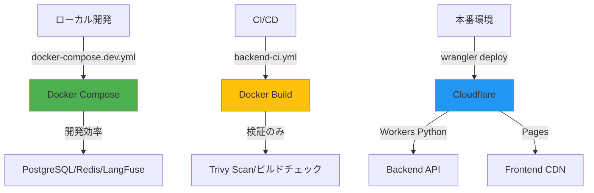

# Docker戦略の本質的理解と推奨アクション

**作成日**: 2025-10-11
**分析エージェント**: system-architect
**重要度**: 🟡 Medium（設計明確化）
**影響範囲**: CI/CD、Phase 6実装計画、ドキュメント整合性

---

## 🎯 エグゼクティブサマリー

### 本番環境の真実

**AutoForgeNexusは本番環境でDockerを使用しない**

```
本番環境アーキテクチャ:
- Backend: Cloudflare Workers Python（サーバーレス）
- Frontend: Cloudflare Pages（静的CDN配信）
- Database: Turso（libSQL分散DB）
- Cache: Redis（Upstash/Cloudflare KV）

→ すべてサーバーレス/マネージド → Docker不要
```

### Dockerの実際の役割

| 用途 | 必要性 | 使用状況 |
|------|--------|---------|
| **ローカル開発** | ✅ 必須 | docker-compose.dev.yml |
| **CI/CD検証** | ✅ 推奨 | backend/Dockerfile（ビルド検証のみ） |
| **本番環境** | ❌ 不要 | Cloudflare Workers/Pages |

---

## 🔍 発見した事実

### 1. Backend: Dockerfileは検証用

**backend/Dockerfile（存在）**:
- 用途: CI/CDでビルド可能性を検証
- 本番: Cloudflare Workers Pythonで実行（wrangler deploy）
- Docker不使用の証拠: `.github/workflows/cd.yml:126` - `wrangler deploy --env production`

### 2. Frontend: Dockerfileは不要

**frontend/Dockerfile（不存在）**:
- 用途: 当初計画では作成予定だった
- 本番: Cloudflare Pages（静的配信）
- 結論: **作成不要**

**証拠**:
```bash
# 本番デプロイフロー（cd.yml想定）
pnpm build                              # Next.js静的ビルド
wrangler pages deploy frontend/out      # Cloudflare Pages配信
```

### 3. CI/CDでのDocker buildは検証のみ

**目的**:
1. ビルド可能性チェック（構文・依存関係）
2. セキュリティスキャン（Trivy）
3. イメージ最適化の検証
4. 将来のオンプレミス対応の保険

**本番環境では使用しない**

---

## 📊 Docker戦略の全体像



---

## 🎯 本質的な問題と推奨アクション

### 問題1: frontend/Dockerfile作成は不要

**当初計画**: Phase 6でfrontend/Dockerfile作成
**現実**: Cloudflare Pagesで静的配信（Docker不要）

**推奨アクション**:

#### ✅ frontend-ci.yml修正（実施済み）
```yaml
# Phase 6 → スキップに変更
# docker-buildジョブは実行しない
fromJSON(needs.validate-phase.outputs.phase) >= 999  # 事実上無効化
```

**または**: docker-buildジョブ自体を削除

---

### 問題2: docker-compose.prod.ymlの矛盾

**現状**: frontendセクションでDockerfile.prodを参照
**問題**: frontend/Dockerfile.prodは存在せず、作成予定もない

**推奨アクション**:

```yaml
# docker-compose.prod.yml修正

# Before: frontendセクション（存在しないDockerfileを参照）
frontend:
  build:
    context: ./frontend
    dockerfile: Dockerfile.prod  # ← 存在しない

# After: frontendセクション削除
# Cloudflare Pagesで配信するため不要
```

---

### 問題3: ドキュメントの整合性

**矛盾点**:
- DOCKER_STRATEGY.md: 本番環境でのDocker実行を示唆
- 実際のcd.yml: wrangler deployでCloudflareに配信
- frontend_environment_strategy.md: Dockerは開発/CI検証のみと明記

**推奨アクション**:

#### ドキュメント更新
1. **CLAUDE.md**: 本番環境アーキテクチャを明記
2. **DOCKER_STRATEGY.md**: Cloudflare統合を明記、本番Docker不使用を明示
3. **Phase 6定義**: frontend/Dockerfile作成を削除

---

## 🚀 やるべきこと（実行順序）

### タスク1: frontend-ci.ymlのdocker-buildジョブ削除（推奨）

**理由**: frontend/Dockerfileは永遠に作成されないため、ジョブ自体が不要

```yaml
# .github/workflows/frontend-ci.yml
# 削除対象: Lines 394-432（docker-buildジョブ全体）

# または無効化
docker-build:
  if: false  # 永久にスキップ
```

**効果**:
- ワークフロー簡素化
- 保守コスト削減
- CI/CD実行時間短縮

---

### タスク2: docker-compose.prod.yml整理

```yaml
# docker-compose.prod.yml

# 削除: frontendセクション（Lines 72-110想定）
# 理由: Cloudflare Pagesで配信するため不要

# 保持: backendセクション
# 理由: 将来のオンプレミスデプロイオプション
```

---

### タスク3: ドキュメント更新

#### 3-1. CLAUDE.md更新

```markdown
## 本番環境アーキテクチャ（明確化）

### Backend
- **実行環境**: Cloudflare Workers Python（サーバーレス）
- **デプロイ**: `wrangler deploy --env production`
- **Docker使用**: ❌ 本番環境では不使用（CI/CD検証のみ）

### Frontend
- **実行環境**: Cloudflare Pages（静的CDN配信）
- **デプロイ**: `wrangler pages deploy frontend/out`
- **Docker使用**: ❌ 完全不要

### 開発環境
- **Docker Compose**: ✅ 必須（PostgreSQL/Redis/LangFuse）
- **用途**: ローカル開発のみ
```

#### 3-2. DOCKER_STRATEGY.md更新

```markdown
## 本番環境でのDocker（明確化）

### Cloudflare統合戦略

**本番環境ではDockerを使用しません**

- Backend: Cloudflare Workers Pythonで直接実行
- Frontend: Cloudflare Pagesで静的配信
- Docker: CI/CDでのビルド検証のみ

### Dockerfileの目的

1. **backend/Dockerfile**: ビルド可能性の検証、Trivyスキャン
2. **backend/Dockerfile.dev**: ローカル開発環境
3. **frontend/Dockerfile**: 不要（作成しない）
4. **frontend/Dockerfile.dev**: ローカル開発環境
```

#### 3-3. Phase 6タスク定義更新

**削除**:
- ❌ frontend/Dockerfile作成
- ❌ Frontend Dockerビルド有効化

**追加**:
- ✅ Cloudflare Pages最適化設定
- ✅ CDN設定・カスタムドメイン
- ✅ パフォーマンス監視強化

---

## 💡 本質的な理解

### なぜこの混乱が生じたのか

1. **初期設計段階**: Docker戦略を検討（DOCKER_STRATEGY.md作成）
2. **技術選定**: Cloudflareを採用（サーバーレス優先）
3. **設計変更**: Dockerレスに移行
4. **ドキュメント更新漏れ**: 古い設計ドキュメントが残存

### Dockerを使わない理由

#### Backend: Cloudflare Workers Python

```python
# wrangler.toml
name = "autoforgenexus-api"
main = "src/main.py"  # FastAPIアプリ直接実行
compatibility_date = "2025-01-15"
```

**利点**:
- グローバルエッジ配信（レイテンシ最小）
- 自動スケーリング（無限）
- コスト最適化（実行時間課金）
- サーバー管理不要

#### Frontend: Cloudflare Pages

```bash
# デプロイコマンド
pnpm build                    # Next.js静的ビルド
wrangler pages deploy out     # CDN配信
```

**利点**:
- 静的ファイル配信（最速）
- 無制限帯域幅（無料枠）
- 自動HTTPS・CDN
- サーバー不要

---

## 📋 推奨実装手順

### ステップ1: frontend-ci.ymlのdocker-buildジョブ削除

**実施内容**:
```yaml
# .github/workflows/frontend-ci.yml
# Lines 394-432 削除

# または完全無効化
docker-build:
  if: false  # Cloudflare Pagesのため不要
```

**所要時間**: 5分

---

### ステップ2: docker-compose.prod.yml整理

**実施内容**:
```yaml
# docker-compose.prod.yml
# frontendセクション削除（Cloudflare Pagesで配信）

# 保持: backend, postgres, redis（オンプレミス対応用）
```

**所要時間**: 5分

---

### ステップ3: ドキュメント整合性確保

**実施内容**:

| ドキュメント | 修正内容 | 所要時間 |
|-------------|---------|---------|
| CLAUDE.md | 本番環境アーキテクチャ明記 | 10分 |
| DOCKER_STRATEGY.md | Cloudflare統合・Docker不使用を明記 | 15分 |
| backend/CLAUDE.md | 本番デプロイ方法を明記 | 10分 |

**総所要時間**: 35分

---

### ステップ4: Phase 6タスク定義見直し

**削除タスク**:
- ❌ frontend/Dockerfile作成
- ❌ Frontend Dockerビルド有効化

**追加タスク**:
- ✅ Cloudflare Pages設定最適化
- ✅ カスタムドメイン設定
- ✅ CDNキャッシュ戦略
- ✅ パフォーマンス監視統合

---

## 🎯 最終推奨

### 本質的な方針転換

**旧方針**: Phase 6でfrontend/Dockerfileを作成
**新方針**: frontend/Dockerfileは永遠に作成しない

**理由**:
1. 本番環境はCloudflare Pages（サーバーレス）
2. Dockerは開発環境のみで使用
3. CI/CDでのDockerビルドは不要（静的ビルドで十分）

### 実装優先度

| 優先度 | タスク | 所要時間 | 効果 |
|--------|--------|---------|------|
| 🔴 High | frontend-ci.yml docker-buildジョブ削除 | 5分 | CI/CD簡素化 |
| 🟡 Medium | docker-compose.prod.yml整理 | 5分 | 設計明確化 |
| 🟡 Medium | ドキュメント更新 | 35分 | 整合性確保 |
| 🟢 Low | Phase 6タスク見直し | 10分 | 計画精緻化 |

**総所要時間**: 約1時間

---

## ✅ 結論

### Dockerビルドをスキップする理由

**frontend/Dockerfileは永遠に不要**:
1. 本番環境 = Cloudflare Pages（静的CDN）
2. 開発環境 = `pnpm dev`（ネイティブ実行）
3. CI/CD = Next.js静的ビルド（`pnpm build`）

### 正しい対処方法

#### ❌ 間違い: Phase 6までスキップして待つ
- Phase 6でもDockerfileは作成されない
- 永遠に解決しない問題

#### ✅ 正解: docker-buildジョブを削除
- frontend/Dockerfileは永遠に不要
- CI/CDワークフローを簡素化
- 本番環境アーキテクチャ（Cloudflare）に整合

---

## 📝 次のアクション

### 即座実施推奨

```bash
# 1. frontend-ci.ymlのdocker-buildジョブ削除
# Lines 394-432を削除

# 2. コミット
git add .github/workflows/frontend-ci.yml
git commit -m "refactor(ci): Frontend Docker buildジョブ削除 - Cloudflare Pages戦略に整合

## 背景
本番環境はCloudflare Pages（静的CDN配信）を使用
Dockerコンテナは使用しない設計

## 変更内容
- docker-buildジョブ削除（Lines 394-432）
- Cloudflare Pages配信に専念

## 効果
- CI/CDワークフロー簡素化
- 実行時間短縮
- 設計思想との整合性確保

🤖 Generated with [Claude Code](https://claude.com/claude-code)
Co-Authored-By: Claude <noreply@anthropic.com)"

# 3. プッシュ
git push origin develop
```

---

**作成者**: system-architect
**レビュー**: devops-coordinator
**最終更新**: 2025-10-11
