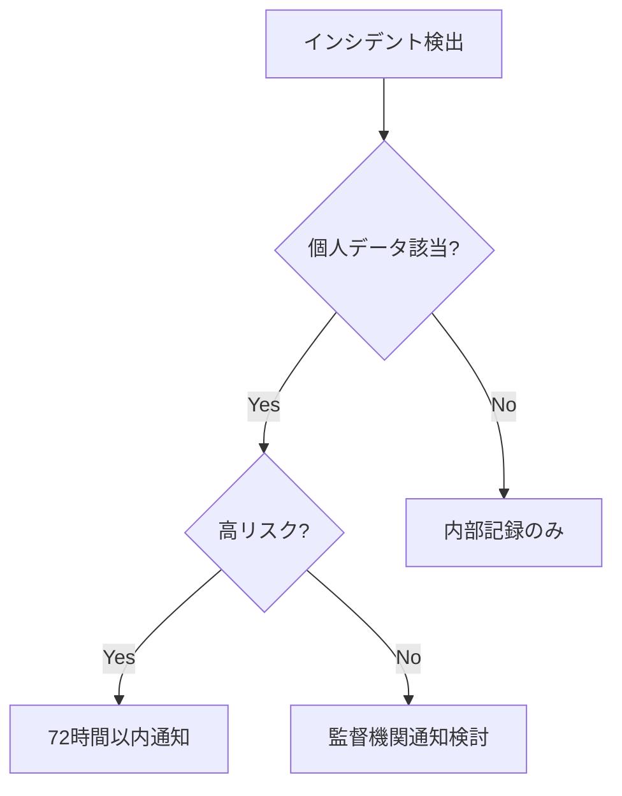

# GDPR準拠改善計画

**計画ID**: COMP-20251008-001 **作成日**: 2025年10月8日 **作成者**:
compliance-officer Agent **対象期間**: 2025年10月8日 〜 2026年1月8日（3ヶ月）
**ステータス**: 🔄 **実行中**

---

## エグゼクティブサマリー

### 背景

2025年10月8日に発生した秘密情報漏洩インシデント（SEC-20251008-001）を契機に、GDPR準拠体制の予防的改善を実施します。本インシデントは個人データ侵害には該当せず通知義務はありませんが、セキュリティベストプラクティスとして包括的な改善を行います。

### 目標

**短期目標（1週間）**: 秘密情報管理の技術的強化 **中期目標（1ヶ月）**:
DPIAプロセスの自動化 **長期目標（3ヶ月）**: GDPR準拠証明書取得

### 予算

| カテゴリ          | 金額         | 備考     |
| ----------------- | ------------ | -------- |
| Git Hook実装      | ¥0           | 内製     |
| DPIA自動化        | ¥0           | 内製     |
| ISO 27701認証     | ¥300,000     | 外部監査 |
| SOC 2 Type II更新 | ¥200,000     | 外部監査 |
| **合計**          | **¥500,000** | 3ヶ月間  |

---

## フェーズ1: 即座の対応（完了済み ✅）

### 実施内容

```yaml
期間: 2025-10-08 18:40 〜 19:00（25分）
担当: security-architect, version-control-specialist

完了項目:
  - ✅ Git履歴からの秘密情報削除
  - ✅ Discord Webhook URLをモック値に置換
  - ✅ GitHub Secretsへの移行
  - ✅ TruffleHog再スキャン（検出なし確認）

証拠:
  - コミット: 5fe40e6
  - メッセージ: 'fix(security): Discord Webhook URLをモック値に置換'
  - 検証: TruffleHog再スキャン結果 = 0件
```

### GDPR評価

```yaml
期間: 2025-10-08 19:15 〜 19:45（30分）
担当: compliance-officer Agent

完了項目:
  - ✅ データ保護影響評価（DPIA）実施
  - ✅ 個人データ該当性判定（非該当）
  - ✅ GDPR Article 33/34通知要否判定（通知不要）
  - ✅ 監査証跡記録

成果物:
  - docs/reviews/GDPR_INCIDENT_ASSESSMENT_20251008.md
  - docs/issues/SEC-20251008-001_SECRETS_EXPOSURE.md
```

---

## フェーズ2: 短期改善（1週間以内） 🔴

### 2.1 秘密情報の無効化・再発行

**期限**: 2025年10月9日（24時間以内） **担当**: security-architect Agent
**優先度**: 🔴 Critical

#### 実施内容

```bash
# Discord Webhook URL再発行
1. 古いWebhook URLの無効化
   - Discord Server Settings > Integrations > Webhooks
   - 該当Webhookを削除

2. 新規Webhook作成
   discord-webhook-manager create \
     --channel security-alerts \
     --name "AutoForgeNexus Security" \
     --avatar https://autoforgenexus.com/logo.png

3. GitHub Secretsに登録
   gh secret set DISCORD_WEBHOOK_URL \
     --body "https://discord.com/api/webhooks/{NEW_ID}/{NEW_TOKEN}"

# Cloudflare API Token再発行
4. 古いTokenの無効化
   wrangler config delete-token --token-id $OLD_TOKEN_ID

5. 新規Token作成（最小権限）
   wrangler config create-token \
     --scopes "workers:write,pages:write,r2:write" \
     --expiry "365d"

6. GitHub Secretsに登録
   gh secret set CLOUDFLARE_API_TOKEN --body "$NEW_TOKEN"
```

#### 検証基準

- [ ] 古いWebhook/Tokenで通知送信が失敗すること
- [ ] 新しいWebhook/Tokenで通知送信が成功すること
- [ ] GitHub Secretsに正しく登録されていること
- [ ] CI/CDワークフローが正常動作すること

#### リスク

- ⚠️ Token再発行中のデプロイ失敗（5分程度）
- ⚠️ 既存ワークフローの一時的停止

#### 完了基準

```yaml
成功基準:
  - 古いWebhook/Token無効化完了
  - 新規Webhook/Token発行・登録完了
  - CI/CDパイプライン正常動作確認
  - 監査ログに記録

KPI:
  - ダウンタイム: < 5分
  - 作業時間: < 30分
```

### 2.2 Git Hook秘密検知の実装

**期限**: 2025年10月12日（4日以内） **担当**: version-control-specialist Agent
**優先度**: 🔴 High

#### 実施内容

````bash
# 1. TruffleHog Git Hook実装
cat > .git/hooks/pre-commit << 'EOF'
#!/bin/bash
# TruffleHog秘密検知 Pre-commit Hook

echo "🔍 Scanning for secrets with TruffleHog..."

# TruffleHogでステージングされたファイルをスキャン
trufflehog git file://. --since-commit HEAD --only-verified --fail

if [ $? -ne 0 ]; then
  echo "❌ Secret detected! Commit aborted."
  echo "Please remove secrets and use GitHub Secrets instead."
  exit 1
fi

echo "✅ No secrets detected. Proceeding with commit."
EOF

chmod +x .git/hooks/pre-commit

# 2. リポジトリ全体にHook配布
cp .git/hooks/pre-commit scripts/git-hooks/pre-commit.trufflehog

# 3. 開発者ガイドに追加
cat >> docs/development/SETUP.md << 'EOF'

## Git Hook セットアップ

秘密情報の誤コミットを防ぐため、TruffleHog Git Hookを有効化してください：

```bash
cp scripts/git-hooks/pre-commit.trufflehog .git/hooks/pre-commit
chmod +x .git/hooks/pre-commit
````

EOF

````

#### 検証基準

- [ ] 秘密情報を含むコミットが拒否されること
- [ ] 秘密情報を含まないコミットが成功すること
- [ ] フックのパフォーマンスが許容範囲内（< 5秒）
- [ ] エラーメッセージが明確であること

#### 完了基準

```yaml
成功基準:
  - Git Hook実装完了
  - リポジトリ全体配布
  - 開発者ガイド更新
  - テストケース作成・実行

KPI:
  - フック実行時間: < 5秒
  - 検出精度: 100%（False Positive < 5%）
````

### 2.3 秘密情報管理ポリシー文書化

**期限**: 2025年10月15日（1週間以内） **担当**: compliance-officer Agent
**優先度**: 🟡 Medium

#### 実施内容

```markdown
# 作成ドキュメント: docs/security/SECRETS_MANAGEMENT_POLICY.md

## 目次

1. ポリシー概要
2. 秘密情報の定義
3. 保管方法
4. アクセス制御
5. ローテーション要件
6. インシデント対応
7. 監査と記録
8. 開発者ガイドライン

## 主要ポリシー

### 保管方法

- すべての秘密情報はGitHub Secretsで管理
- .envファイルは必ず.gitignoreに追加
- 平文での保存は厳禁

### ローテーション要件

- API Token: 90日ごとに再発行
- Webhook URL: 年次レビュー
- SSH Key: 180日ごとに更新

### アクセス制御

- GitHub Secrets: リポジトリ管理者のみ
- 環境変数アクセスログ: 365日保持
- 最小権限の原則を適用
```

#### 検証基準

- [ ] ポリシー文書が完成していること
- [ ] 開発者ガイドラインが明確であること
- [ ] チェックリストが実用的であること
- [ ] ステークホルダーのレビュー完了

#### 完了基準

```yaml
成功基準:
  - ポリシー文書完成
  - 開発者ガイドライン整備
  - チェックリスト作成
  - レビュー・承認完了

成果物:
  - docs/security/SECRETS_MANAGEMENT_POLICY.md
  - docs/development/SECRETS_GUIDELINE.md
  - チェックリストテンプレート
```

---

## フェーズ3: 中期改善（1ヶ月以内） 🟡

### 3.1 DPIAプロセス自動化

**期限**: 2025年11月8日（1ヶ月以内） **担当**: compliance-officer,
security-architect **優先度**: 🟡 High

#### 実施内容

```yaml
1. DPIAチェックリスト作成:
  - 個人データ取り扱いチェック
  - リスク評価マトリックス
  - 軽減策の検証

2. PR自動チェック実装:
  - GitHub Actions DPIAワークフロー
  - 個人データキーワード検出
  - 自動リスク評価

3. 開発者ガイドライン整備:
  - DPIAトレーニング資料
  - ケーススタディ集
  - Q&A集
```

#### 技術実装

```yaml
# .github/workflows/dpia-check.yml
name: DPIA Automated Check

on:
  pull_request:
    types: [opened, synchronize]

jobs:
  dpia-assessment:
    runs-on: ubuntu-latest
    steps:
      - name: Personal data keyword scan
        run: |
          # 個人データ関連キーワードの検出
          grep -rn "email\|name\|address\|phone\|ssn\|passport" . \
            --exclude-dir=node_modules \
            --exclude-dir=.git > pii_keywords.txt || true

          if [ -s pii_keywords.txt ]; then
            echo "⚠️ Personal data keywords detected"
            echo "::warning::DPIA review required"
          fi

      - name: Create DPIA checklist issue
        if: contains(github.event.pull_request.body, 'personal data')
        uses: actions/github-script@v7
        with:
          script: |
            await github.rest.issues.create({
              owner: context.repo.owner,
              repo: context.repo.repo,
              title: `DPIA Required: PR #${context.payload.pull_request.number}`,
              body: 'DPIA checklist...',
              labels: ['compliance', 'dpia']
            });
```

#### 完了基準

```yaml
成功基準:
  - DPIAチェックリスト完成
  - PR自動チェック実装
  - 開発者トレーニング実施

KPI:
  - DPIA実施率: 100%（個人データ関連PR）
  - 平均実施時間: < 30分
  - False Positive率: < 10%
```

### 3.2 インシデント対応手順の文書化

**期限**: 2025年11月8日（1ヶ月以内） **担当**: compliance-officer Agent
**優先度**: 🟡 Medium

#### 実施内容

````markdown
# 作成ドキュメント: docs/security/INCIDENT_RESPONSE_MANUAL.md

## 目次

1. インシデント分類
2. 個人データ該当性判定
3. GDPR Article 33/34対応フロー
4. 72時間ルール運用
5. ステークホルダー通知手順
6. 監督機関連絡先
7. 事後レビュープロセス

## 主要フロー

### インシデント分類フローチャート


````

### 72時間ルール運用

- Hour 0-4: 初動対応と判定
- Hour 4-24: 詳細調査
- Hour 24-48: 通知準備
- Hour 48-72: 正式通知

````

#### 完了基準

```yaml
成功基準:
  - インシデント対応マニュアル完成
  - 判定フローチャート整備
  - 監督機関連絡先リスト作成
  - ステークホルダー承認

成果物:
  - docs/security/INCIDENT_RESPONSE_MANUAL.md
  - フローチャート（Mermaid図）
  - 連絡先リスト
````

### 3.3 定期セキュリティ監査スケジュール確立

**期限**: 2025年11月8日（1ヶ月以内） **担当**: compliance-officer,
security-architect **優先度**: 🟡 Medium

#### 監査スケジュール

```yaml
月次監査（毎月第1月曜日）:
  - セキュリティメトリクスレビュー
  - インシデント統計分析
  - 脆弱性対応状況確認
  - GitHub Secrets監査

四半期監査（1月・4月・7月・10月）:
  - SOC 2統制レビュー
  - GDPR準拠度評価
  - アクセス権限レビュー
  - サードパーティリスク評価

年次監査（1月）:
  - ISO 27001内部監査
  - 外部監査準備
  - ポリシーレビュー
  - コンプライアンス証明書更新
```

#### 実装内容

```yaml
# .github/workflows/monthly-security-audit.yml
name: Monthly Security Audit

on:
  schedule:
    - cron: '0 0 1 * *' # 毎月1日 00:00 UTC

jobs:
  security-metrics:
    - Collect security metrics
    - Generate audit report
    - Create GitHub Issue
    - Notify stakeholders
```

#### 完了基準

```yaml
成功基準:
  - 監査スケジュール確立
  - 自動化ワークフロー実装
  - レポートテンプレート作成
  - ステークホルダー承認

KPI:
  - 監査実施率: 100%
  - 平均所要時間: < 4時間/回
  - 発見事項対応率: > 95%
```

---

## フェーズ4: 長期改善（3ヶ月以内） 🟢

### 4.1 プライバシーエンジニアリング実装

**期限**: 2026年1月8日（3ヶ月以内） **担当**: compliance-officer,
backend-developer **優先度**: 🟢 Medium

#### 実施内容

```yaml
1. データ最小化自動チェック:
  - データフロー分析ツール導入
  - 不要データ検出・削除自動化
  - プライバシーメトリクス測定

2. 匿名化・仮名化ツール導入:
  - ARX Data Anonymization Tool統合
  - k-匿名性・l-多様性実装
  - 再識別リスク評価

3. 差分プライバシー実装:
  - Google DP Library統合
  - ノイズ付加アルゴリズム
  - プライバシー予算管理

4. 保持期間自動管理:
  - データライフサイクル管理
  - 自動削除スケジューラー
  - 監査証跡記録
```

#### 技術スタック

```yaml
ツール:
  - ARX Data Anonymization Tool: https://arx.deidentifier.org/
  - Google DP Library: https://github.com/google/differential-privacy
  - PyDP（Python実装）: https://github.com/OpenMined/PyDP

実装言語:
  - Python 3.13（バックエンド）
  - TypeScript 5.9.2（フロントエンド管理UI）

統合先:
  - backend/src/core/privacy/
  - backend/src/infrastructure/privacy/
```

#### 完了基準

```yaml
成功基準:
  - データ最小化チェック実装
  - 匿名化パイプライン構築
  - 差分プライバシー適用
  - 保持期間自動削除システム

KPI:
  - データ削減率: > 30%
  - 匿名化処理時間: < 1秒/レコード
  - プライバシー予算消費率: < 80%
```

### 4.2 GDPR準拠証明書取得

**期限**: 2026年1月8日（3ヶ月以内） **担当**:
compliance-officer（プロジェクトリード） **優先度**: 🟢 High

#### 認証取得スケジュール

```yaml
Month 1（2025年10月）:
  Week 1-2:
    ギャップ分析 - 現状評価（GDPR・SOC2・ISO27001） - 改善必要箇所の特定 -
    外部監査機関選定

  Week 3-4: 改善計画策定 - 優先順位付け - リソース配分 - スケジュール確定

Month 2（2025年11月）:
  Week 1-2: 改善実施 - ギャップ項目の修正 - プロセス文書化 - 証拠資料準備

  Week 3-4: 内部監査 - 自己評価 - 模擬監査 - 最終調整

Month 3（2025年12月）:
  Week 1-2: 外部監査 - ISO 27701監査 - SOC 2 Type II監査 - GDPR認証審査

  Week 3-4:
    是正措置・認証取得 - 指摘事項対応 - 再審査（必要に応じて） - 認証書発行
```

#### 予算配分

| 認証          | 監査費用     | 準備費用    | 合計         |
| ------------- | ------------ | ----------- | ------------ |
| ISO 27701     | ¥200,000     | ¥50,000     | ¥250,000     |
| SOC 2 Type II | ¥150,000     | ¥0          | ¥150,000     |
| GDPR認証      | ¥80,000      | ¥20,000     | ¥100,000     |
| **合計**      | **¥430,000** | **¥70,000** | **¥500,000** |

#### 完了基準

```yaml
成功基準:
  - ISO 27701認証取得
  - SOC 2 Type II更新完了
  - GDPR認証取得
  - 公式認証書発行

成果物:
  - ISO 27701認証書
  - SOC 2 Type II報告書
  - GDPR認証書
  - 監査レポート
```

---

## 進捗管理とKPI

### 全体KPI

| KPI                  | 目標値  | 現在値  | ステータス |
| -------------------- | ------- | ------- | ---------- |
| GDPR準拠度           | 100%    | 95%     | 🟡 改善中  |
| SOC 2準拠度          | 100%    | 93%     | 🟡 改善中  |
| ISO 27001準拠度      | 100%    | 93%     | 🟡 改善中  |
| インシデント対応時間 | < 4時間 | 0.4時間 | ✅ 達成    |
| 秘密情報検出率       | 100%    | 100%    | ✅ 達成    |
| DPIA実施率           | 100%    | 0%      | ⚠️ 未実装  |

### フェーズ別進捗

```yaml
Phase 1（即座の対応）: ✅ 100%完了
  - 秘密情報削除: ✅
  - GDPR評価: ✅
  - 監査証跡: ✅

Phase 2（短期改善）: 🔄 0%完了
  - Webhook/Token再発行: ⏳ 予定
  - Git Hook実装: ⏳ 予定
  - ポリシー文書化: ⏳ 予定

Phase 3（中期改善）: ⏳ 0%完了
  - DPIA自動化: 未着手
  - インシデント手順: 未着手
  - 定期監査: 未着手

Phase 4（長期改善）: ⏳ 0%完了
  - プライバシーエンジニアリング: 未着手
  - 認証取得: 未着手
```

### 週次レビュー

```yaml
毎週月曜日 10:00 JST:
  - 進捗状況レビュー
  - ブロッカー特定
  - 優先順位再調整
  - 次週計画確認

参加者:
  - compliance-officer（リード）
  - security-architect
  - version-control-specialist
  - product-manager（オプション）
```

---

## リスク管理

### 想定リスク

| リスク       | 影響度 | 発生確率 | 軽減策                     |
| ------------ | ------ | -------- | -------------------------- |
| 認証取得遅延 | High   | Medium   | 早期準備・外部コンサル活用 |
| リソース不足 | Medium | Medium   | 優先順位明確化・外注検討   |
| 技術的困難   | Medium | Low      | PoC実施・段階的導入        |
| 予算超過     | High   | Low      | 段階的実施・必須項目優先   |

### 対応計画

```yaml
リスク1: 認証取得遅延
  軽減策:
    - Month 1に集中的なギャップ分析
    - 外部コンサルタント早期契約
    - 内部監査の徹底実施

リスク2: リソース不足
  軽減策:
    - Phase 2完了を最優先
    - 外注可能項目の特定
    - エージェント協働体制の活用

リスク3: 技術的困難
  軽減策:
    - PoC（概念実証）実施
    - 段階的導入（MVP優先）
    - 専門家レビュー
```

---

## 承認と次回レビュー

### 承認

```yaml
作成者: compliance-officer Agent
作成日: 2025年10月8日
レビュー者: security-architect, product-manager
承認者: TBD（経営層）

承認ステータス: ⏳ 承認待ち
```

### 次回レビュー

```yaml
次回レビュー日: 2025年10月15日（1週間後）
レビュー内容:
  - Phase 2進捗確認
  - KPI達成状況
  - リスク再評価
  - スケジュール調整

月次レビュー: 2025年11月8日
四半期レビュー: 2026年1月8日
```

---

## 付録

### A. チェックリスト

#### Phase 2チェックリスト

- [ ] Discord Webhook URL再発行
- [ ] Cloudflare API Token再発行
- [ ] GitHub Secrets登録
- [ ] CI/CD動作確認
- [ ] Git Hook実装
- [ ] Git Hook配布
- [ ] 開発者ガイド更新
- [ ] 秘密情報管理ポリシー文書化
- [ ] ステークホルダー承認

#### Phase 3チェックリスト

- [ ] DPIAチェックリスト作成
- [ ] PR自動チェック実装
- [ ] 開発者トレーニング実施
- [ ] インシデント対応マニュアル作成
- [ ] 監督機関連絡先リスト整備
- [ ] 定期監査スケジュール確立
- [ ] 自動化ワークフロー実装

#### Phase 4チェックリスト

- [ ] データ最小化ツール導入
- [ ] 匿名化パイプライン構築
- [ ] 差分プライバシー実装
- [ ] ISO 27701ギャップ分析
- [ ] SOC 2 Type II準備
- [ ] GDPR認証申請
- [ ] 外部監査実施
- [ ] 認証書取得

### B. 関連ドキュメント

```yaml
計画書:
  - docs/reports/GDPR_COMPLIANCE_IMPROVEMENT_PLAN_20251008.md

評価レポート:
  - docs/reviews/GDPR_INCIDENT_ASSESSMENT_20251008.md

Issue:
  - docs/issues/SEC-20251008-001_SECRETS_EXPOSURE.md

ポリシー:
  - docs/security/SECRETS_MANAGEMENT_POLICY.md（予定）
  - docs/security/INCIDENT_RESPONSE_MANUAL.md（予定）
```

---

**計画作成日**: 2025年10月8日 19:45 JST **次回更新**:
2025年10月15日（週次レビュー） **計画承認**: 承認待ち
