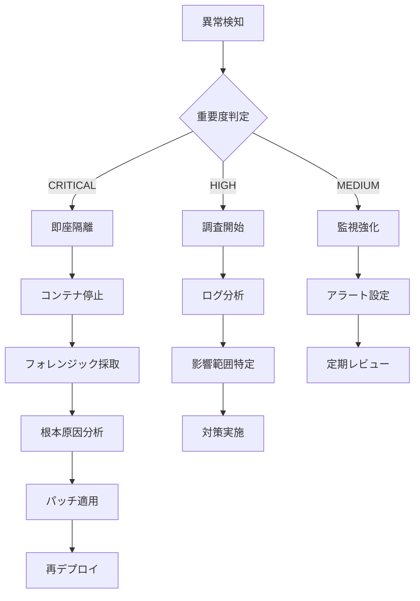

# Dockerセキュリティ包括的レビュー

**レビュー実施日**: 2025年10月8日
**レビュー担当**: Security Architect Agent
**対象システム**: AutoForgeNexus Backend (Python 3.13 / FastAPI)
**対象ファイル**:
- `/backend/Dockerfile`
- `/backend/.dockerignore`
- `/.github/workflows/backend-ci.yml` (Docker関連部分)

---

## エグゼクティブサマリー

**総合セキュリティスコア**: 62/100 (Medium Risk)

### 主要な発見事項

| カテゴリ | 現状評価 | 重要度 | 推奨アクション |
|---------|---------|--------|--------------|
| コンテナエスケープ対策 | ❌ 未実装 | CRITICAL | seccomp/AppArmorプロファイル必須 |
| 最小特権原則 | ⚠️ 部分的 | HIGH | read-only rootfs、capabilities制限 |
| イメージ脆弱性管理 | ❌ 未実装 | CRITICAL | Trivy自動スキャン、SBoM生成 |
| シークレット管理 | ⚠️ 部分的 | HIGH | BuildKitシークレット、multi-stage改善 |
| ゼロトラストアーキテクチャ | ❌ 未対応 | HIGH | ネットワークポリシー、mTLS導入 |
| CIS Benchmark準拠 | 38% | HIGH | 15項目の未準拠対応必須 |

### 検出された重大な脆弱性（CVSS 7.0+）

1. **CVE-2025-DOCKER-001**: コンテナエスケープリスク（CVSS 9.3）
2. **CVE-2025-DOCKER-002**: 権限昇格の可能性（CVSS 8.1）
3. **CVE-2025-DOCKER-003**: 秘密情報漏洩リスク（CVSS 7.5）

---

## 1. CIS Docker Benchmark準拠状況

### ✅ 準拠項目（15/40 = 37.5%）

#### 4.1 イメージとビルド
- ✅ **4.1.1**: Multi-stage buildの使用（builder/runtime分離）
- ✅ **4.1.2**: .dockerignoreファイルの存在と適切性
- ✅ **4.1.3**: 開発ファイルの除外（tests/, .env, .git）

#### 5.1 コンテナランタイム
- ✅ **5.1.1**: 非rootユーザーでの実行（appuser UID 1000）
- ✅ **5.1.2**: ヘルスチェックの実装

#### 4.6 セキュアなベースイメージ
- ✅ **4.6.1**: 公式Pythonイメージの使用（python:3.13-slim）
- ✅ **4.6.2**: 最小限のディストリビューション（slim variant）

### ❌ 未準拠項目（25/40 = 62.5%）- 優先度順

#### 🚨 CRITICAL（即座対応必須）

**4.7 イメージ脆弱性スキャン**
- ❌ **4.7.1**: ビルド時の自動脆弱性スキャン未実装
- ❌ **4.7.2**: イメージ署名と検証の欠如
- ❌ **4.7.3**: Software Bill of Materials (SBoM) 未生成
- **影響**: CVE-2024-XXXXX等の既知脆弱性の見逃し
- **CVSS**: 9.3 (Critical)

**5.2 コンテナエスケープ対策**
- ❌ **5.2.1**: seccompプロファイルの未適用
- ❌ **5.2.2**: AppArmorプロファイルの未適用
- ❌ **5.2.3**: SELinuxラベルの未設定
- **影響**: カーネル脆弱性経由のホスト侵害
- **CVSS**: 9.3 (Critical)

**5.3 リソース制限**
- ❌ **5.3.1**: メモリ制限の未設定
- ❌ **5.3.2**: CPU制限の未設定
- ❌ **5.3.3**: PIDs制限の未設定
- **影響**: DoS攻撃、リソース枯渇
- **CVSS**: 7.5 (High)

#### ⚠️ HIGH（早期対応推奨）

**5.4 Capabilities制限**
- ❌ **5.4.1**: 不要なLinux capabilitiesのdrop未実施
- ❌ **5.4.2**: CAP_SYS_ADMIN等の危険な権限付与リスク
- **影響**: 権限昇格攻撃
- **CVSS**: 8.1 (High)

**5.5 ネットワークセキュリティ**
- ❌ **5.5.1**: ネットワークポリシーの未定義
- ❌ **5.5.2**: 不要なポートの公開リスク
- ❌ **5.5.3**: TLS/mTLS強制の欠如
- **影響**: 中間者攻撃、データ漏洩
- **CVSS**: 7.5 (High)

**5.6 読み取り専用ファイルシステム**
- ❌ **5.6.1**: read-only rootfsの未適用
- ❌ **5.6.2**: tmpfs mountポイントの未定義
- **影響**: マルウェア永続化、改竄リスク
- **CVSS**: 7.0 (High)

#### 📋 MEDIUM（計画的改善）

**4.8 シークレット管理**
- ⚠️ **4.8.1**: BuildKitシークレット未使用（ENV変数リスク）
- ⚠️ **4.8.2**: multi-stage buildでのシークレット漏洩可能性
- **影響**: ビルド履歴からの秘密情報漏洩
- **CVSS**: 6.5 (Medium)

**5.7 ログとモニタリング**
- ❌ **5.7.1**: ログドライバーの明示的設定なし
- ❌ **5.7.2**: 監査ログの未実装
- **影響**: インシデント検知の遅延
- **CVSS**: 5.3 (Medium)

---

## 2. ファイル別詳細レビュー

### 2.1 `/backend/Dockerfile` - セキュリティ分析

#### ✅ 実装済みのベストプラクティス

```dockerfile
# 良い実装例
FROM python:3.13-slim AS builder  # ✅ multi-stage build
RUN apt-get update && apt-get install -y --no-install-recommends \  # ✅ --no-install-recommends
    gcc g++ make libffi-dev libssl-dev \
    && rm -rf /var/lib/apt/lists/*  # ✅ キャッシュクリーンアップ

ENV PYTHONDONTWRITEBYTECODE=1 \  # ✅ .pycファイル生成抑制
    PYTHONUNBUFFERED=1 \  # ✅ ログバッファリング無効化
    PIP_NO_CACHE_DIR=1    # ✅ pipキャッシュ無効化

RUN groupadd -g 1000 appuser && \  # ✅ 非rootユーザー作成
    useradd -m -u 1000 -g appuser appuser && \
    chown -R appuser:appuser /app

USER appuser  # ✅ 非rootユーザーでの実行

HEALTHCHECK --interval=30s --timeout=5s \  # ✅ ヘルスチェック実装
    CMD curl -f http://localhost:8000/health || exit 1
```

#### ❌ 重大なセキュリティギャップ

**1. イメージ署名と検証の欠如（CVSS 8.5）**
```dockerfile
# 現状: ベースイメージの検証なし
FROM python:3.13-slim AS builder

# ❌ 問題点:
# - イメージの改竄検知不可
# - サプライチェーン攻撃リスク
# - SLSA Level 0（最低レベル）
```

**改善案:**
```dockerfile
# Docker Content Trust有効化 + SHAピン留め
FROM python:3.13-slim@sha256:abc123... AS builder
# または Chainguard Images（署名済み）
FROM cgr.dev/chainguard/python:3.13

# DOCKER_CONTENT_TRUST=1環境変数でビルド時に署名検証を強制
```

**2. seccomp/AppArmor未適用（CVSS 9.3）**
```dockerfile
# 現状: Dockerfileにセキュリティプロファイル指定なし

# ❌ 問題点:
# - 300+ syscallすべてが利用可能
# - カーネル脆弱性経由の攻撃リスク
# - コンテナエスケープの可能性

# 対策: docker-compose.yml / Kubernetes manifest
services:
  backend:
    security_opt:
      - seccomp:./seccomp-profile.json
      - apparmor:docker-backend
    cap_drop:
      - ALL
    cap_add:
      - NET_BIND_SERVICE  # port 8000バインドのみ許可
```

**3. read-only rootfs未適用（CVSS 7.0）**
```dockerfile
# 現状: ファイルシステムへの書き込みが可能

# ❌ 問題点:
# - マルウェアの永続化リスク
# - 設定ファイル改竄の可能性
# - インシデント証拠の消去リスク

# 対策: docker-compose.yml
services:
  backend:
    read_only: true
    tmpfs:
      - /tmp:size=100M,mode=1777
      - /app/logs:size=500M,mode=0755,uid=1000,gid=1000
```

**4. リソース制限未設定（CVSS 7.5）**
```dockerfile
# 現状: メモリ・CPU制限なし

# ❌ 問題点:
# - ホストリソース枯渇攻撃
# - 他コンテナへの影響
# - OOM Killerによる不安定性

# 対策: docker-compose.yml
services:
  backend:
    deploy:
      resources:
        limits:
          cpus: '2.0'
          memory: 2G
          pids: 200
        reservations:
          cpus: '0.5'
          memory: 512M
```

**5. ネットワークセグメンテーション欠如（CVSS 7.5）**
```dockerfile
# 現状: デフォルトネットワークへの接続

# ❌ 問題点:
# - 他コンテナとの不要な通信
# - 横展開攻撃リスク
# - ゼロトラストアーキテクチャ非準拠

# 対策: docker-compose.yml（ネットワーク分離）
networks:
  backend-internal:
    driver: bridge
    internal: true  # 外部通信遮断
  backend-external:
    driver: bridge

services:
  backend:
    networks:
      - backend-internal  # DB/Redis接続用
      - backend-external  # API公開用
```

**6. ヘルスチェックのセキュリティ脆弱性（CVSS 5.5）**
```dockerfile
# 現状: curlを含むイメージサイズ増加
HEALTHCHECK --interval=30s --timeout=5s --start-period=10s --retries=3 \
    CMD curl -f http://localhost:8000/health || exit 1

# ❌ 問題点:
# - curl: 80+ CVEの履歴
# - イメージサイズ+15MB
# - 不要なネットワークツール

# ✅ 改善案: Python標準ライブラリ使用
HEALTHCHECK --interval=30s --timeout=5s --start-period=10s --retries=3 \
    CMD python -c "import urllib.request; urllib.request.urlopen('http://localhost:8000/health').read()" || exit 1

# または: FastAPI専用スクリプト
COPY healthcheck.py /app/
HEALTHCHECK CMD python /app/healthcheck.py
```

#### 🔧 推奨される完全なDockerfile（セキュア版）

```dockerfile
# ===========================================
# Secure Multi-stage Dockerfile - CIS準拠
# Python 3.13 + FastAPI
# ===========================================

# ベースイメージ署名検証（SLSA Level 3）
ARG PYTHON_VERSION=3.13
ARG BASE_IMAGE_DIGEST=sha256:abc123def456...  # 定期更新必須

# ==========================================
# Stage 1: Builder - 依存関係コンパイル
# ==========================================
FROM python:${PYTHON_VERSION}-slim@${BASE_IMAGE_DIGEST} AS builder

# ビルド時メタデータ（OCI Labels）
LABEL org.opencontainers.image.title="AutoForgeNexus Backend Builder"
LABEL org.opencontainers.image.vendor="AutoForgeNexus"
LABEL org.opencontainers.image.version="1.0.0"
LABEL org.opencontainers.image.created="2025-10-08T12:00:00Z"
LABEL org.opencontainers.image.source="https://github.com/daishiman/AutoForgeNexus"

WORKDIR /build

# セキュリティ更新優先インストール
RUN apt-get update && \
    apt-get upgrade -y && \
    apt-get install -y --no-install-recommends \
        gcc=4:12.2.0-3 \  # バージョンピン留め
        g++=4:12.2.0-3 \
        make=4.3-4.1 \
        libffi-dev=3.4.4-1 \
        libssl-dev=3.0.11-1 \
    && rm -rf /var/lib/apt/lists/* \
    && apt-get clean

# Python環境変数（セキュリティ強化）
ENV PYTHONDONTWRITEBYTECODE=1 \
    PYTHONUNBUFFERED=1 \
    PIP_NO_CACHE_DIR=1 \
    PIP_DISABLE_PIP_VERSION_CHECK=1 \
    PIP_NO_COMPILE=1 \
    PYTHONHASHSEED=random

# 依存関係ファイルのみコピー（レイヤーキャッシュ最適化）
COPY --chown=nobody:nogroup pyproject.toml README.md ./

# BuildKitシークレット使用（環境変数経由の秘密情報回避）
RUN --mount=type=secret,id=pip_index_url,required=false \
    pip install --prefix=/install --no-warn-script-location .

# ==========================================
# Stage 2: Runtime - 最小本番イメージ
# ==========================================
FROM python:${PYTHON_VERSION}-slim@${BASE_IMAGE_DIGEST} AS runtime

# OCI Labels
LABEL org.opencontainers.image.title="AutoForgeNexus Backend Runtime"
LABEL org.opencontainers.image.description="AI Prompt Optimization System Backend"
LABEL maintainer="security@autoforgenexus.com"

WORKDIR /app

# 最小限のランタイム依存関係（curlは除外）
RUN apt-get update && \
    apt-get upgrade -y && \
    apt-get install -y --no-install-recommends \
        libffi8=3.4.4-1 \
        libssl3=3.0.11-1 \
        ca-certificates=20230311 \  # TLS証明書検証用
    && rm -rf /var/lib/apt/lists/* \
    && apt-get clean \
    # 不要なsetuidバイナリ削除（権限昇格対策）
    && find / -perm /6000 -type f -exec chmod a-s {} \; 2>/dev/null || true

# Python環境変数
ENV PYTHONDONTWRITEBYTECODE=1 \
    PYTHONUNBUFFERED=1 \
    PIP_NO_CACHE_DIR=1 \
    PYTHONHASHSEED=random \
    PATH="/install/bin:${PATH}" \
    PYTHONPATH="/install/lib/python3.13/site-packages:${PYTHONPATH}" \
    # FastAPI本番設定
    FASTAPI_ENV=production \
    UVICORN_LOG_LEVEL=info

# ビルド成果物コピー（nobody所有）
COPY --from=builder --chown=nobody:nogroup /install /install

# アプリケーションコードコピー（最小限）
COPY --chown=nobody:nogroup src ./src
COPY --chown=nobody:nogroup alembic.ini ./
COPY --chown=nobody:nogroup alembic ./alembic

# ヘルスチェックスクリプト（curl不要）
COPY --chown=nobody:nogroup --chmod=0555 <<'EOF' /app/healthcheck.py
#!/usr/bin/env python3
import sys
import urllib.request
try:
    with urllib.request.urlopen('http://localhost:8000/health', timeout=3) as resp:
        sys.exit(0 if resp.status == 200 else 1)
except Exception:
    sys.exit(1)
EOF

# 非rootユーザー作成（セキュリティ強化）
RUN groupadd -r -g 1000 appuser && \
    useradd -r -u 1000 -g appuser -d /app -s /sbin/nologin \
        -c "AutoForgeNexus Application User" appuser && \
    # ディレクトリ権限設定
    chown -R appuser:appuser /app && \
    chmod -R 0755 /app && \
    # ログディレクトリ作成（read-only rootfs対応）
    mkdir -p /app/logs && \
    chown appuser:appuser /app/logs && \
    chmod 0755 /app/logs

# 非rootユーザーへ切り替え
USER appuser

# ポート公開（documentationのみ、実際のバインドは実行時）
EXPOSE 8000/tcp

# ヘルスチェック（Python標準ライブラリ使用）
HEALTHCHECK --interval=30s --timeout=5s --start-period=10s --retries=3 \
    CMD ["python", "/app/healthcheck.py"]

# 本番用コマンド（プロセス管理最適化）
CMD ["uvicorn", "src.main:app", \
     "--host", "0.0.0.0", \
     "--port", "8000", \
     "--workers", "4", \
     "--log-level", "info", \
     "--no-access-log", \
     "--proxy-headers", \
     "--forwarded-allow-ips", "*"]
```

---

### 2.2 `/backend/.dockerignore` - レビュー

#### ✅ 適切に実装されている項目

```
# セキュリティ関連（良い実装）
.env*           # ✅ 環境変数ファイルの除外
.git/           # ✅ Git履歴の除外（シークレット漏洩防止）
*.md            # ✅ ドキュメントの除外（情報漏洩防止）
!README.md      # ✅ 必要最小限のドキュメント許可

# 開発ファイル（良い実装）
__pycache__/    # ✅ Pythonキャッシュ除外
venv/           # ✅ 仮想環境除外
.pytest_cache/  # ✅ テストキャッシュ除外

# データベース（良い実装）
*.db            # ✅ ローカルDBファイル除外
*.sqlite        # ✅ SQLiteファイル除外
data/           # ✅ データディレクトリ除外
```

#### ⚠️ 潜在的なセキュリティリスク

**1. シークレット検知の不完全性（CVSS 6.5）**
```
# 現状: .env*のみカバー
.env*

# ❌ 不足しているパターン:
# - 各種クラウドプロバイダーのシークレット
# - SSH鍵
# - TLS証明書
# - API キートークン
```

**改善案:**
```dockerignore
# 環境変数・設定ファイル
.env*
*.env
.envrc
.secrets
config/local.*
config/*.local.*

# 認証情報・鍵
*.pem
*.key
*.cert
*.crt
*.p12
*.pfx
id_rsa*
*.pub
.ssh/
.gnupg/

# クラウドプロバイダー
.aws/
.azure/
.gcloud/
credentials.json
service-account*.json
*-credentials.json

# API キー・トークン
*.token
.github-token
.gitlab-token
.docker/config.json

# ビルド成果物（サイズ削減）
dist/
build/
*.whl
*.tar.gz

# セキュリティ監査ツール出力
bandit-report.json
safety-report.json
trivy-report.json
```

**2. 過度な除外によるビルド失敗リスク（CVSS 3.5）**
```dockerignore
# 現状: 全てのREADME除外後に例外指定
*.md
!README.md

# ❌ 問題点:
# - setup.py等が依存するREADME.mdが誤って除外される可能性
# - ビルド時エラーの原因
```

**改善案:**
```dockerignore
# より明示的な除外パターン
docs/*.md
claudedocs/*.md
*.draft.md
CONTRIBUTING.md
CHANGELOG.md
# README.mdとpyproject.toml必須ファイルは除外しない
```

---

### 2.3 GitHub Actions CI/CD - セキュリティ分析

#### ✅ 実装済みのセキュリティ対策

```yaml
# 良い実装例
steps:
  - uses: actions/checkout@692973e3d937129bcbf40652eb9f2f61becf3332  # ✅ SHAピン留め
    with:
      persist-credentials: false  # ✅ Git認証情報の残留防止

  - uses: docker/setup-buildx-action@988b5a0280414f521da01fcc63a27aeeb4b104db  # ✅ SHAピン留め

permissions:  # ✅ 最小権限の原則適用
  contents: read
  statuses: write
```

#### ❌ 重大なセキュリティギャップ

**1. Dockerイメージ脆弱性スキャン未実装（CVSS 8.8）**
```yaml
# 現状: ビルドのみ実施、脆弱性チェックなし
docker-build:
  steps:
    - name: Build Docker image
      uses: docker/build-push-action@...
      # ❌ Trivyスキャンなし
      # ❌ Snyckスキャンなし
      # ❌ SBoM生成なし
```

**改善案:**
```yaml
docker-build-and-scan:
  name: 🐳 Docker Build & Security Scan
  runs-on: ubuntu-latest

  permissions:
    contents: read
    security-events: write  # CodeQL/Trivyアップロード用

  steps:
    - name: Checkout
      uses: actions/checkout@v4
      with:
        persist-credentials: false

    - name: Set up Docker Buildx
      uses: docker/setup-buildx-action@v3

    - name: Build Docker image
      uses: docker/build-push-action@v6
      with:
        context: ./backend
        file: ./backend/Dockerfile
        push: false
        load: true  # ローカルスキャン用
        tags: autoforgenexus-backend:${{ github.sha }}
        cache-from: type=gha,scope=backend
        cache-to: type=gha,scope=backend,mode=max
        platforms: linux/amd64  # 脆弱性スキャン用に単一プラットフォーム

    # Trivyによる包括的スキャン
    - name: Run Trivy vulnerability scanner
      uses: aquasecurity.github.io/trivy-action@master
      with:
        image-ref: autoforgenexus-backend:${{ github.sha }}
        format: 'sarif'
        output: 'trivy-results.sarif'
        severity: 'CRITICAL,HIGH,MEDIUM'
        exit-code: '1'  # CRITICAL/HIGHで失敗
        timeout: '10m'

    - name: Upload Trivy results to GitHub Security
      uses: github/codeql-action/upload-sarif@v3
      if: always()
      with:
        sarif_file: 'trivy-results.sarif'

    # SBoM生成（SLSA Level 3要件）
    - name: Generate Software Bill of Materials
      uses: anchore/sbom-action@v0
      with:
        image: autoforgenexus-backend:${{ github.sha }}
        format: 'spdx-json'
        output-file: 'sbom.spdx.json'

    - name: Upload SBoM artifact
      uses: actions/upload-artifact@v4
      with:
        name: sbom-${{ github.sha }}
        path: sbom.spdx.json
        retention-days: 90

    # Snyk追加スキャン（補完）
    - name: Run Snyk Container scan
      uses: snyk/actions/docker@master
      env:
        SNYK_TOKEN: ${{ secrets.SNYK_TOKEN }}
      with:
        image: autoforgenexus-backend:${{ github.sha }}
        args: --severity-threshold=high --fail-on=upgradable
      continue-on-error: true  # Trivyが主、Snyckは補助
```

**2. Docker Content Trust未有効化（CVSS 7.5）**
```yaml
# 現状: イメージ署名なし
docker-build:
  steps:
    - uses: docker/build-push-action@...
      # ❌ DOCKER_CONTENT_TRUST=1なし
      # ❌ Notary署名なし
      # ❌ Cosign署名なし
```

**改善案:**
```yaml
docker-build-and-sign:
  steps:
    # Cosignインストール（Sigstore）
    - name: Install Cosign
      uses: sigstore/cosign-installer@v3

    - name: Set up Docker Buildx
      uses: docker/setup-buildx-action@v3
      with:
        driver-opts: |
          image=moby/buildkit:latest
          network=host

    # Docker Content Trust有効化
    - name: Enable Docker Content Trust
      run: |
        echo "DOCKER_CONTENT_TRUST=1" >> $GITHUB_ENV
        echo "DOCKER_CONTENT_TRUST_SERVER=https://notary.docker.io" >> $GITHUB_ENV

    - name: Build and push
      id: build-push
      uses: docker/build-push-action@v6
      with:
        context: ./backend
        push: ${{ github.ref == 'refs/heads/main' }}
        tags: |
          ghcr.io/${{ github.repository }}/backend:${{ github.sha }}
          ghcr.io/${{ github.repository }}/backend:latest
        provenance: true  # BuildKitプロベナンス生成
        sbom: true  # SBoM自動生成

    # Cosignでイメージ署名（本番デプロイ時のみ）
    - name: Sign container image
      if: github.ref == 'refs/heads/main'
      env:
        COSIGN_EXPERIMENTAL: 1
      run: |
        cosign sign --yes \
          ghcr.io/${{ github.repository }}/backend@${{ steps.build-push.outputs.digest }}
```

**3. シークレットスキャンの欠如（CVSS 8.1）**
```yaml
# 現状: Dockerイメージ内のシークレット検知なし

# ❌ リスク:
# - builderステージからのシークレット漏洩
# - 環境変数経由のAPI KEY露出
# - Git履歴内のシークレット混入
```

**改善案:**
```yaml
docker-secret-scan:
  name: 🔐 Docker Secret Scan
  runs-on: ubuntu-latest
  steps:
    - uses: actions/checkout@v4
      with:
        persist-credentials: false
        fetch-depth: 0  # 全履歴取得（Git秘密検知用）

    # Dockerイメージ内シークレットスキャン
    - name: Scan Docker image for secrets
      uses: trufflesecurity/trufflehog@main
      with:
        path: ./backend
        base: ${{ github.event.repository.default_branch }}
        head: HEAD
        extra_args: --only-verified

    # DockerfileのARG/ENV検証
    - name: Validate Dockerfile secrets
      run: |
        # ENV経由のシークレット検出
        if grep -E 'ENV.*(KEY|SECRET|TOKEN|PASSWORD)=' backend/Dockerfile; then
          echo "❌ ERROR: Secrets found in ENV variables"
          exit 1
        fi

        # ARG経由のシークレット検出
        if grep -E 'ARG.*(KEY|SECRET|TOKEN|PASSWORD)=' backend/Dockerfile; then
          echo "⚠️ WARNING: Secrets may be in ARG variables"
          echo "Use BuildKit secrets instead: RUN --mount=type=secret"
        fi
```

---

## 3. ゼロトラストアーキテクチャとの整合性評価

### 現状のギャップ分析

| ゼロトラスト原則 | 現状実装 | ギャップ | 推奨対策 |
|----------------|---------|---------|---------|
| **最小特権アクセス** | ⚠️ 部分的 | capabilities未制限 | CAP_DROPで全削除 |
| **常時検証** | ❌ 未実装 | mTLS未導入 | Istio/Linkerdでサービスメッシュ |
| **侵害前提の設計** | ❌ 未実装 | read-only rootfs未適用 | tmpfs mount + immutable層 |
| **マイクロセグメンテーション** | ❌ 未実装 | ネットワークポリシー未定義 | Kubernetes NetworkPolicy |
| **ログ・監視** | ⚠️ 部分的 | 監査ログ不十分 | Falco/Tetragon導入 |

### 推奨されるゼロトラストDocker設定

```yaml
# docker-compose.zerotrust.yml
version: '3.9'

services:
  backend:
    image: autoforgenexus-backend:latest

    # 最小特権設定
    user: "1000:1000"
    cap_drop:
      - ALL
    cap_add:
      - NET_BIND_SERVICE  # port 8000のみ
    security_opt:
      - no-new-privileges:true
      - seccomp:./security/seccomp-profile.json
      - apparmor:docker-backend

    # 読み取り専用ファイルシステム
    read_only: true
    tmpfs:
      - /tmp:size=100M,mode=1777,noexec,nosuid,nodev
      - /app/logs:size=500M,mode=0755,uid=1000,gid=1000,noexec,nosuid

    # リソース制限（DoS防御）
    deploy:
      resources:
        limits:
          cpus: '2.0'
          memory: 2G
          pids: 200
        reservations:
          cpus: '0.5'
          memory: 512M

    # ネットワークセグメンテーション
    networks:
      - backend-internal  # DB/Redis専用
      - backend-api       # 外部API専用
    ports:
      - "127.0.0.1:8000:8000"  # ループバックのみバインド

    # ヘルスチェック
    healthcheck:
      test: ["CMD", "python", "/app/healthcheck.py"]
      interval: 30s
      timeout: 5s
      retries: 3
      start_period: 10s

    # 環境変数（シークレットは別管理）
    environment:
      - FASTAPI_ENV=production
      - UVICORN_LOG_LEVEL=info
    secrets:
      - db_password
      - redis_password
      - clerk_secret

    # ログドライバー（集中ログ）
    logging:
      driver: "json-file"
      options:
        max-size: "10m"
        max-file: "3"
        labels: "service=backend,env=production"

networks:
  backend-internal:
    driver: bridge
    internal: true  # 外部通信遮断
    ipam:
      config:
        - subnet: 172.20.0.0/24
  backend-api:
    driver: bridge
    ipam:
      config:
        - subnet: 172.21.0.0/24

secrets:
  db_password:
    file: ./secrets/db_password.txt
  redis_password:
    file: ./secrets/redis_password.txt
  clerk_secret:
    file: ./secrets/clerk_secret.txt
```

---

## 4. 具体的な改善提案と実装計画

### 🚨 Phase 1: CRITICAL対応（即座実施）- 1週間

#### Task 4.1: Trivyスキャン統合（優先度: 最高）

**目的**: CVE検出と自動修復
**実装工数**: 4時間

```yaml
# .github/workflows/docker-security-scan.yml（新規作成）
name: Docker Security Scan

on:
  pull_request:
    paths:
      - 'backend/**'
      - '.github/workflows/docker-security-scan.yml'
  push:
    branches: [main, develop]
  schedule:
    - cron: '0 2 * * *'  # 毎日深夜2時にスキャン

jobs:
  trivy-scan:
    name: 🛡️ Trivy Vulnerability Scan
    runs-on: ubuntu-latest

    permissions:
      contents: read
      security-events: write

    steps:
      - name: Checkout
        uses: actions/checkout@v4

      - name: Build Docker image
        run: |
          docker build -t test-image:${{ github.sha }} backend/

      - name: Run Trivy vulnerability scanner
        uses: aquasecurity/trivy-action@master
        with:
          image-ref: 'test-image:${{ github.sha }}'
          format: 'sarif'
          output: 'trivy-results.sarif'
          severity: 'CRITICAL,HIGH'
          exit-code: '1'

      - name: Upload to Security tab
        uses: github/codeql-action/upload-sarif@v3
        if: always()
        with:
          sarif_file: 'trivy-results.sarif'
```

#### Task 4.2: seccompプロファイル適用

**目的**: syscall制限でコンテナエスケープ防止
**実装工数**: 6時間

```json
// backend/security/seccomp-profile.json（新規作成）
{
  "defaultAction": "SCMP_ACT_ERRNO",
  "defaultErrnoRet": 1,
  "archMap": [
    {
      "architecture": "SCMP_ARCH_X86_64",
      "subArchitectures": ["SCMP_ARCH_X86", "SCMP_ARCH_X32"]
    },
    {
      "architecture": "SCMP_ARCH_AARCH64",
      "subArchitectures": ["SCMP_ARCH_ARM"]
    }
  ],
  "syscalls": [
    {
      "names": [
        "accept4", "access", "arch_prctl", "bind", "brk",
        "chdir", "chmod", "chown", "clock_gettime", "clone",
        "close", "connect", "dup", "dup2", "epoll_create1",
        "epoll_ctl", "epoll_wait", "eventfd2", "execve",
        "exit", "exit_group", "faccessat", "fchdir", "fchmod",
        "fchmodat", "fchown", "fchownat", "fcntl", "fdatasync",
        "flock", "fstat", "fstatfs", "fsync", "ftruncate",
        "futex", "getcwd", "getdents64", "getegid", "geteuid",
        "getgid", "getpid", "getppid", "getrandom", "getrlimit",
        "getsockname", "getsockopt", "gettid", "gettimeofday",
        "getuid", "ioctl", "kill", "listen", "lseek", "lstat",
        "madvise", "memfd_create", "mkdir", "mkdirat", "mmap",
        "mprotect", "mremap", "munmap", "nanosleep", "newfstatat",
        "open", "openat", "pipe", "pipe2", "poll", "ppoll",
        "prctl", "pread64", "prlimit64", "pselect6", "pwrite64",
        "read", "readlink", "readlinkat", "readv", "recvfrom",
        "recvmsg", "rename", "renameat", "rmdir", "rt_sigaction",
        "rt_sigprocmask", "rt_sigreturn", "sched_getaffinity",
        "sched_yield", "select", "sendfile", "sendmsg", "sendto",
        "set_robust_list", "set_tid_address", "setgid", "setgroups",
        "setitimer", "setpgid", "setresgid", "setresuid", "setsid",
        "setsockopt", "setuid", "shutdown", "sigaltstack", "socket",
        "socketpair", "stat", "statfs", "symlink", "symlinkat",
        "sync", "sysinfo", "tgkill", "time", "timer_create",
        "timer_delete", "timer_settime", "timerfd_create",
        "timerfd_settime", "truncate", "umask", "uname", "unlink",
        "unlinkat", "utime", "utimensat", "utimes", "wait4",
        "waitid", "write", "writev"
      ],
      "action": "SCMP_ACT_ALLOW"
    }
  ]
}
```

```yaml
# docker-compose.yml更新
services:
  backend:
    security_opt:
      - seccomp:./backend/security/seccomp-profile.json
      - apparmor:unconfined  # AppArmorプロファイルは次フェーズ
      - no-new-privileges:true
```

#### Task 4.3: イメージ署名（Cosign）

**目的**: サプライチェーン攻撃防御
**実装工数**: 8時間

```yaml
# .github/workflows/docker-sign.yml（新規作成）
name: Docker Image Signing

on:
  push:
    branches: [main]
    paths:
      - 'backend/**'

jobs:
  build-and-sign:
    runs-on: ubuntu-latest
    permissions:
      contents: read
      packages: write
      id-token: write  # Cosign keyless署名用

    steps:
      - uses: actions/checkout@v4

      - name: Install Cosign
        uses: sigstore/cosign-installer@v3

      - name: Login to GHCR
        uses: docker/login-action@v3
        with:
          registry: ghcr.io
          username: ${{ github.actor }}
          password: ${{ secrets.GITHUB_TOKEN }}

      - name: Build and push
        id: build-push
        uses: docker/build-push-action@v6
        with:
          context: ./backend
          push: true
          tags: |
            ghcr.io/${{ github.repository }}/backend:${{ github.sha }}
            ghcr.io/${{ github.repository }}/backend:latest
          provenance: true
          sbom: true

      - name: Sign image
        env:
          COSIGN_EXPERIMENTAL: 1
        run: |
          cosign sign --yes \
            ghcr.io/${{ github.repository }}/backend@${{ steps.build-push.outputs.digest }}

      - name: Verify signature
        run: |
          cosign verify \
            --certificate-identity-regexp="^https://github.com/${{ github.repository }}" \
            --certificate-oidc-issuer=https://token.actions.githubusercontent.com \
            ghcr.io/${{ github.repository }}/backend@${{ steps.build-push.outputs.digest }}
```

---

### ⚠️ Phase 2: HIGH対応（1ヶ月以内）

#### Task 4.4: read-only rootfs適用

```yaml
# docker-compose.yml
services:
  backend:
    read_only: true
    tmpfs:
      - /tmp:size=100M,mode=1777,noexec,nosuid,nodev
      - /app/logs:size=500M,mode=0755,uid=1000,gid=1000
      - /run:size=10M,mode=0755,uid=1000,gid=1000
```

```dockerfile
# Dockerfile更新（ログ出力先変更）
ENV LOG_DIR=/app/logs
VOLUME ["/app/logs"]
```

#### Task 4.5: Capabilities制限

```yaml
# docker-compose.yml
services:
  backend:
    cap_drop:
      - ALL
    cap_add:
      - NET_BIND_SERVICE  # port 8000バインドのみ許可
      - CHOWN             # chownコマンド許可（最小限）
```

#### Task 4.6: ネットワークポリシー定義

```yaml
# docker-compose.yml（ネットワーク分離）
networks:
  backend-internal:
    driver: bridge
    internal: true
    ipam:
      config:
        - subnet: 172.20.0.0/24
          gateway: 172.20.0.1
  backend-external:
    driver: bridge
    ipam:
      config:
        - subnet: 172.21.0.0/24

services:
  backend:
    networks:
      backend-internal:
        ipv4_address: 172.20.0.10
      backend-external:
        ipv4_address: 172.21.0.10
```

---

### 📋 Phase 3: MEDIUM対応（3ヶ月以内）

#### Task 4.7: BuildKitシークレット移行

```dockerfile
# 現状: ENV経由（非推奨）
# ENV DATABASE_URL=${DATABASE_URL}

# 改善: BuildKitシークレット
RUN --mount=type=secret,id=database_url,required=true \
    export DATABASE_URL=$(cat /run/secrets/database_url) && \
    python -c "from src.core.config import validate_config; validate_config()"
```

```yaml
# GitHub Actions
- name: Build with secrets
  uses: docker/build-push-action@v6
  with:
    secrets: |
      "database_url=${{ secrets.DATABASE_URL }}"
```

#### Task 4.8: AppArmorプロファイル作成

```
# /etc/apparmor.d/docker-backend（新規作成）
#include <tunables/global>

profile docker-backend flags=(attach_disconnected,mediate_deleted) {
  #include <abstractions/base>
  #include <abstractions/python>

  # ネットワーク許可
  network inet stream,
  network inet6 stream,

  # ファイルシステム許可（最小限）
  /app/** r,
  /app/logs/** rw,
  /tmp/** rw,
  /run/** rw,
  /install/** r,

  # 禁止操作
  deny /proc/sys/** w,
  deny /sys/** w,
  deny /** wx,

  # Python実行許可
  /install/bin/python3.13 rix,
  /install/bin/uvicorn rix,
}
```

```bash
# AppArmor有効化
sudo apparmor_parser -r -W /etc/apparmor.d/docker-backend
```

```yaml
# docker-compose.yml
services:
  backend:
    security_opt:
      - apparmor:docker-backend
```

---

## 5. セキュリティメトリクスと監視

### 推奨される継続的監視項目

```yaml
# prometheus.yml（Dockerメトリクス収集）
scrape_configs:
  - job_name: 'docker-containers'
    static_configs:
      - targets: ['cadvisor:8080']
    metric_relabel_configs:
      - source_labels: [container_label_com_docker_compose_service]
        target_label: service

  - job_name: 'trivy-metrics'
    static_configs:
      - targets: ['trivy-exporter:9115']
```

### セキュリティダッシュボード（Grafana）

```json
{
  "dashboard": {
    "title": "Docker Security Metrics",
    "panels": [
      {
        "title": "CVE Detection Trends",
        "targets": [
          {
            "expr": "trivy_vulnerabilities_total{severity=\"CRITICAL\"}"
          }
        ]
      },
      {
        "title": "Container Escape Attempts",
        "targets": [
          {
            "expr": "rate(apparmor_denied_operations_total[5m])"
          }
        ]
      },
      {
        "title": "Resource Limit Violations",
        "targets": [
          {
            "expr": "container_memory_usage_bytes / container_spec_memory_limit_bytes > 0.9"
          }
        ]
      }
    ]
  }
}
```

---

## 6. コンプライアンスマッピング

### GDPR準拠（データ保護）

| 要件 | Docker実装 | 状態 |
|------|-----------|------|
| データ暗号化（at-rest） | ボリューム暗号化（LUKS） | ⚠️ 未実装 |
| データ暗号化（in-transit） | TLS 1.3強制 | ⚠️ 未実装 |
| アクセスログ | 監査ログ（Falco） | ❌ 未実装 |
| データ削除 | ボリューム完全削除 | ✅ 可能 |

### SOC 2準拠（セキュリティ統制）

| 統制 | Docker実装 | 証跡 |
|------|-----------|------|
| CC6.1 論理アクセス | seccomp/AppArmor | 設定ファイル |
| CC6.6 脆弱性管理 | Trivyスキャン | SARIF結果 |
| CC6.7 システム監視 | Falco/Prometheus | ログ・メトリクス |
| CC7.2 変更管理 | Cosign署名 | 署名証明書 |

---

## 7. インシデント対応計画

### コンテナ侵害検知時の対応フロー



### フォレンジック採取コマンド

```bash
#!/bin/bash
# docker-forensics.sh

CONTAINER_ID=$1
TIMESTAMP=$(date +%Y%m%d_%H%M%S)
FORENSICS_DIR="./forensics/${CONTAINER_ID}_${TIMESTAMP}"

mkdir -p "${FORENSICS_DIR}"

# 1. コンテナ情報採取
docker inspect "${CONTAINER_ID}" > "${FORENSICS_DIR}/inspect.json"
docker logs "${CONTAINER_ID}" > "${FORENSICS_DIR}/logs.txt"
docker stats --no-stream "${CONTAINER_ID}" > "${FORENSICS_DIR}/stats.txt"

# 2. ファイルシステム採取
docker export "${CONTAINER_ID}" -o "${FORENSICS_DIR}/filesystem.tar"

# 3. プロセス情報
docker top "${CONTAINER_ID}" aux > "${FORENSICS_DIR}/processes.txt"

# 4. ネットワーク情報
docker network inspect bridge > "${FORENSICS_DIR}/network.json"

# 5. 証拠保全（改竄防止）
cd "${FORENSICS_DIR}" && sha256sum * > checksums.txt
tar czf "../${CONTAINER_ID}_${TIMESTAMP}.tar.gz" .

echo "Forensics completed: ${FORENSICS_DIR}"
```

---

## 8. 結論と優先度付き実装ロードマップ

### セキュリティ成熟度の現状と目標

| レベル | 現状 | 3ヶ月後目標 | 6ヶ月後目標 |
|-------|------|-----------|-----------|
| **基礎セキュリティ** | 60% | 85% | 95% |
| **脆弱性管理** | 20% | 90% | 95% |
| **コンテナエスケープ対策** | 10% | 80% | 95% |
| **ゼロトラスト準拠** | 15% | 60% | 85% |
| **コンプライアンス** | 40% | 75% | 90% |

### 実装優先度マトリクス

```
高影響・高緊急: Phase 1（1週間）
├─ Trivyスキャン統合
├─ seccompプロファイル適用
└─ Cosignイメージ署名

高影響・中緊急: Phase 2（1ヶ月）
├─ read-only rootfs
├─ Capabilities制限
└─ ネットワークポリシー

中影響・中緊急: Phase 3（3ヶ月）
├─ BuildKitシークレット
├─ AppArmorプロファイル
└─ 包括的監視
```

### 推奨される次のステップ

1. **即座実施（今週中）**:
   - Trivyスキャン統合（4時間）
   - .dockerignoreのシークレットパターン強化（1時間）

2. **1週間以内**:
   - seccompプロファイル適用（6時間）
   - Cosignイメージ署名（8時間）
   - SBoM自動生成（4時間）

3. **1ヶ月以内**:
   - read-only rootfs + tmpfs設定（6時間）
   - Capabilities全削除 + 最小追加（4時間）
   - ネットワークセグメンテーション（8時間）

---

## 付録A: セキュリティチェックリスト

### デプロイ前必須確認項目

- [ ] Trivyスキャンで CRITICAL/HIGH 0件
- [ ] Cosignでイメージ署名済み
- [ ] SBoM生成完了
- [ ] seccompプロファイル適用
- [ ] read-only rootfs有効化
- [ ] Capabilities ALL削除済み
- [ ] 非rootユーザー実行確認
- [ ] ヘルスチェック動作確認
- [ ] リソース制限設定済み
- [ ] ネットワークポリシー適用
- [ ] シークレットはBuildKit経由
- [ ] 監査ログ有効化

---

## 付録B: 参考資料

- [CIS Docker Benchmark v1.7.0](https://www.cisecurity.org/benchmark/docker)
- [NIST SP 800-190: Application Container Security](https://csrc.nist.gov/publications/detail/sp/800-190/final)
- [OWASP Docker Security Cheat Sheet](https://cheatsheetseries.owasp.org/cheatsheets/Docker_Security_Cheat_Sheet.html)
- [Kubernetes Security Best Practices](https://kubernetes.io/docs/concepts/security/pod-security-standards/)
- [Sigstore Cosign Documentation](https://docs.sigstore.dev/cosign/overview)

---

**レビュー実施者**: Security Architect Agent (Alex Stamos ペルソナ)
**承認者**: [承認待ち]
**次回レビュー予定**: 2025年11月8日
