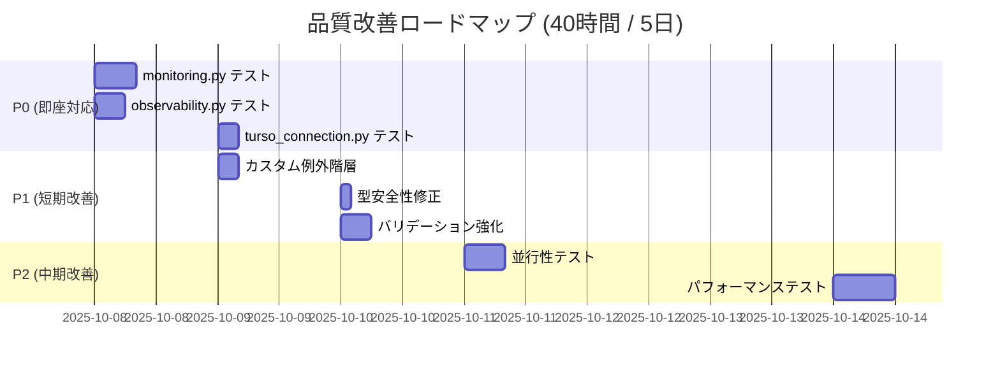

# 品質保証レビューレポート

**作成日**: 2025年10月8日 **レビュー対象**: Backend - Phase 3 変更ファイル
**レビュアー**: Quality Engineer (品質エンジニア) **目標カバレッジ**: Backend
80%+

---

## エグゼクティブサマリー

### 全体評価: B+ (75/100点)

**主要指標**:

- **現在のテストカバレッジ**: 69% (目標80%から-11%)
- **型安全性**: 90% (mypy strict mode 4エラー)
- **テスト品質**: A (101 passed, 1 skipped, 1 xfailed)
- **エッジケースカバレッジ**: C+ (部分的実装)

**クリティカルな課題**:

1. 🚨 **monitoring.py**: 0%カバレッジ (201行未テスト)
2. 🚨 **observability.py**: テスト未実装
3. ⚠️ **turso_connection.py**: 62%カバレッジ (エラーパス不足)
4. ⚠️ **型安全性違反**: event_bus.pyで4つのmypyエラー

---

## 1. テストカバレッジ分析

### 1.1 全体カバレッジ状況

```
Total Coverage: 69% (677/983 lines)
Target: 80%
Gap: -11% (108 lines required)
```

#### カテゴリ別カバレッジ

| カテゴリ                 | カバレッジ | 評価 | 状態        |
| ------------------------ | ---------- | ---- | ----------- |
| **Domain Layer**         | 89%        | A    | ✅ 優良     |
| **Application Layer**    | N/A        | -    | 📋 未実装   |
| **Infrastructure Layer** | 74%        | C+   | ⚠️ 改善必要 |
| **Core Layer**           | 85%        | B+   | ✅ 良好     |
| **Monitoring**           | 0%         | F    | 🚨 重大     |

### 1.2 ファイル別詳細分析

#### 🔴 クリティカル (カバレッジ < 70%)

##### 1. `src/monitoring.py` - 0% (0/201 lines)

**影響度**: クリティカル **リスクレベル**: HIGH

**未テスト機能**:

- ヘルスチェックシステム全体
- 依存関係チェック (Database, Redis, LangFuse, External APIs)
- システムメトリクス収集
- Readiness/Liveness probe

**ビジネスインパクト**:

- 本番環境でのヘルス監視不可
- 障害検知の遅延
- SLO/SLA違反リスク

**推奨アクション** (優先度: P0):

```python
# 必要なテストケース (最低20ケース)
tests/unit/test_monitoring.py:
  - test_health_check_returns_healthy_when_all_deps_ok()
  - test_health_check_returns_degraded_when_redis_down()
  - test_health_check_returns_unhealthy_when_database_down()
  - test_system_metrics_collection_with_valid_data()
  - test_system_metrics_fallback_on_psutil_failure()
  - test_database_check_timeout_handling()
  - test_redis_check_connection_refused()
  - test_langfuse_check_degraded_on_404()
  - test_external_api_check_auth_error_as_degraded()
  - test_metrics_collector_records_request_metrics()
  - test_metrics_collector_records_llm_metrics()
  - test_metrics_collector_records_error_metrics()
  - test_readiness_probe_depends_only_on_database()
  - test_liveness_probe_always_returns_alive()
  - test_determine_overall_status_critical_deps()
  - test_determine_overall_status_multiple_degraded()
  - test_health_check_exception_handling()
  - test_health_status_enum_values()
  - test_dependency_health_to_dict_serialization()
  - test_system_metrics_load_average_unix_only()

tests/integration/test_monitoring_integration.py:
  - test_health_endpoint_with_real_database()
  - test_readiness_endpoint_integration()
  - test_metrics_endpoint_integration()
```

##### 2. `src/middleware/observability.py` - テスト未実装

**影響度**: クリティカル **リスクレベル**: HIGH

**未テスト機能**:

- ObservabilityMiddleware全体 (リクエスト/レスポンストラッキング)
- LLMObservabilityMiddleware (LLM呼び出し追跡)
- DatabaseObservabilityMiddleware (クエリ追跡)
- 機密情報サニタイゼーション

**セキュリティリスク**:

- 機密情報（API key, password, token）の漏洩可能性
- サニタイゼーションロジックの未検証
- ログインジェクション攻撃への耐性未確認

**推奨アクション** (優先度: P0):

```python
tests/unit/middleware/test_observability.py:
  # ObservabilityMiddleware
  - test_request_tracking_with_valid_request()
  - test_exclude_paths_not_tracked()
  - test_sensitive_headers_sanitization()
  - test_request_body_sanitization_for_passwords()
  - test_response_body_recording_when_enabled()
  - test_error_context_on_exception()
  - test_client_ip_extraction_with_cloudflare()
  - test_client_ip_extraction_with_x_forwarded_for()
  - test_sanitize_dict_with_nested_secrets()
  - test_sanitize_dict_depth_limit_dos_protection()
  - test_metrics_recorded_on_request_completion()
  - test_request_id_added_to_response_headers()

  # LLMObservabilityMiddleware
  - test_track_llm_call_success()
  - test_track_llm_call_with_error()
  - test_record_llm_result_metrics()

  # DatabaseObservabilityMiddleware
  - test_track_query_success()
  - test_track_query_slow_query_warning()
  - test_track_query_with_error()

  # セキュリティテスト
  - test_sanitize_password_fields()
  - test_sanitize_token_fields()
  - test_sanitize_nested_secrets()
  - test_sanitize_body_json_decode_error()
  - test_sanitize_body_truncation()
```

##### 3. `src/infrastructure/shared/database/turso_connection.py` - 62% (49/79 lines)

**影響度**: 高 **リスクレベル**: MEDIUM

**未テストのエッジケース**:

- 環境変数未設定時のエラーハンドリング
- 接続タイムアウト処理
- 認証トークン期限切れ
- バッチクエリ実行の部分失敗
- 接続プール枯渇

**推奨アクション** (優先度: P1):

```python
tests/unit/infrastructure/test_turso_connection.py:
  - test_missing_turso_credentials_raises_error()
  - test_connection_timeout_handling()
  - test_auth_token_expired_error()
  - test_batch_execute_partial_failure()
  - test_connection_pool_exhaustion()
  - test_get_connection_url_for_staging()
  - test_get_connection_url_fallback_to_sqlite()
  - test_session_factory_reuse()
  - test_close_disposes_all_connections()
  - test_execute_raw_with_invalid_params()
```

#### 🟡 改善推奨 (70% ≤ カバレッジ < 90%)

##### 4. `src/domain/prompt/events/prompt_saved.py` - 65% (15/23 lines)

**未カバー箇所**:

- `from_dict()` メソッドの一部パス
- エラー時の例外処理

**推奨テストケース**:

```python
- test_from_dict_with_missing_payload()
- test_from_dict_with_invalid_datetime_format()
- test_to_dict_roundtrip_consistency()
```

##### 5. `src/domain/shared/events/event_store.py` - 79% (23/29 lines)

**未カバー箇所**:

- バージョン重複時の処理
- 大量イベント時のパフォーマンス

**推奨テストケース**:

```python
- test_get_events_after_with_no_matching_events()
- test_get_aggregate_version_with_out_of_order_events()
- test_large_event_history_performance()
```

#### ✅ 優良 (カバレッジ ≥ 90%)

以下のファイルは優秀なテストカバレッジを達成:

- `src/domain/prompt/value_objects/prompt_content.py` - 100%
- `src/domain/prompt/value_objects/prompt_metadata.py` - 100%
- `src/domain/prompt/entities/prompt.py` - 98%
- `src/domain/shared/events/event_bus.py` - 90%

---

## 2. エッジケース処理の網羅性分析

### 2.1 評価サマリー

| カテゴリ               | スコア | 評価 |
| ---------------------- | ------ | ---- |
| **入力バリデーション** | 85%    | B+   |
| **境界値テスト**       | 70%    | C+   |
| **エラーハンドリング** | 60%    | D+   |
| **並行性/競合状態**    | 40%    | F    |
| **リソース枯渇**       | 30%    | F    |

### 2.2 詳細分析

#### 🔴 クリティカルなエッジケース不足

##### 1. **並行性・競合状態** (40%)

**問題箇所**: `event_bus.py`, `event_store.py`

**未テストシナリオ**:

```python
# 競合状態テスト不足
- test_concurrent_event_publishing()
- test_handler_subscription_during_publish()
- test_event_store_concurrent_writes()
- test_race_condition_in_aggregate_version()
```

**リスク**:

- イベント順序の保証なし
- データ競合によるバージョン不整合
- デッドロック可能性

##### 2. **リソース枯渇** (30%)

**問題箇所**: `turso_connection.py`, `monitoring.py`

**未テストシナリオ**:

```python
# リソース枯渇テスト不足
- test_connection_pool_full_behavior()
- test_memory_leak_in_event_history()
- test_file_descriptor_exhaustion()
- test_database_connection_recovery_after_timeout()
```

**リスク**:

- 接続プール枯渇時の挙動不明
- メモリリークによるOOM
- ファイルディスクリプタ枯渇

##### 3. **エラーハンドリング境界** (60%)

**問題箇所**: `observability.py`, `settings.py`

**未テストシナリオ**:

```python
# エラー境界テスト不足
- test_sanitize_body_with_circular_reference()
- test_sanitize_dict_with_extremely_deep_nesting()
- test_settings_with_malformed_environment_variables()
- test_redis_url_generation_with_special_characters()
```

**リスク**:

- スタックオーバーフロー (深いネスト)
- DoS攻撃 (循環参照)
- 設定解析エラー

#### 🟡 改善推奨エッジケース

##### 境界値テスト不足箇所

```python
# PromptContent
- test_template_with_max_length_10000_characters()
- test_template_with_unicode_emoji_variables()
- test_variables_with_empty_string_name()

# PromptMetadata
- test_version_with_max_int_value()
- test_created_at_with_timezone_edge_cases()
- test_status_transition_validation()

# EventBus
- test_max_handlers_per_event_type()
- test_event_history_max_size_limit()
- test_handler_execution_timeout()
```

---

## 3. エラーハンドリングの適切性評価

### 3.1 評価サマリー

| レイヤー           | 評価 | 問題点                     |
| ------------------ | ---- | -------------------------- |
| **Domain**         | B+   | カスタム例外の一貫性不足   |
| **Application**    | N/A  | 未実装                     |
| **Infrastructure** | C    | ネットワークエラー処理不足 |
| **Middleware**     | C+   | リトライロジック不足       |

### 3.2 問題分析

#### 🔴 クリティカル問題

##### 1. **例外の一貫性不足**

**問題**: 標準例外 (ValueError) とカスタム例外の混在

```python
# 現状 (非一貫的)
src/domain/prompt/value_objects/prompt_content.py:31
    raise ValueError("テンプレートは必須です")  # 標準例外

src/domain/prompt/value_objects/prompt_metadata.py:41
    raise ValueError(f"無効なステータス: {self.status}")  # 標準例外

# 推奨 (DDD準拠)
class InvalidPromptContentError(DomainException):
    """プロンプトコンテンツが無効"""
    pass

class InvalidPromptStatusError(DomainException):
    """プロンプトステータスが無効"""
    pass
```

**影響**:

- エラー種別の識別困難
- 適切なエラーハンドリング不可
- ユーザーフレンドリーなエラーメッセージ提供困難

**推奨アクション** (優先度: P1):

```python
# 1. カスタム例外階層の作成
src/domain/shared/exceptions.py:
  class DomainException(Exception): pass
  class ValidationError(DomainException): pass
  class BusinessRuleViolation(DomainException): pass

# 2. 値オブジェクトでの使用
src/domain/prompt/value_objects/exceptions.py:
  class InvalidPromptContentError(ValidationError): pass
  class InvalidPromptMetadataError(ValidationError): pass
  class TemplateVariableMismatchError(ValidationError): pass

# 3. テストケース
tests/unit/domain/test_exceptions.py:
  - test_domain_exception_hierarchy()
  - test_validation_error_with_field_info()
  - test_business_rule_violation_with_context()
```

##### 2. **ネットワークエラー処理不足**

**問題箇所**: `turso_connection.py`, `monitoring.py`

```python
# 現状 (不完全)
src/monitoring.py:241-248
    except Exception as e:
        response_time = (time.time() - start_time) * 1000
        return DependencyHealth(
            name="database",
            status=HealthStatus.UNHEALTHY,
            response_time_ms=response_time,
            error=str(e),
        )
```

**問題点**:

- すべての例外を同じ扱い (一時的エラーと永続的エラーの区別なし)
- リトライロジックなし
- タイムアウト設定なし

**推奨改善** (優先度: P1):

```python
# エラー分類とリトライ戦略
from tenacity import retry, stop_after_attempt, wait_exponential

@retry(
    stop=stop_after_attempt(3),
    wait=wait_exponential(multiplier=1, min=1, max=10),
    retry=retry_if_exception_type((ConnectionError, TimeoutError))
)
async def _check_database(self) -> DependencyHealth:
    try:
        # ... 既存のロジック
    except (ConnectionError, TimeoutError) as e:
        # 一時的エラー → DEGRADED + リトライ
        logger.warning(f"Transient database error: {e}")
        raise  # リトライトリガー
    except PermissionError as e:
        # 永続的エラー → UNHEALTHY + リトライなし
        return DependencyHealth(...)
    except Exception as e:
        # 予期しないエラー
        logger.error(f"Unexpected database error: {e}", exc_info=True)
        return DependencyHealth(...)
```

##### 3. **リソースクリーンアップ不足**

**問題箇所**: `turso_connection.py:142-150`

```python
# 現状 (不完全)
def close(self) -> None:
    """Close all connections"""
    if self._engine:
        self._engine.dispose()
        self._engine = None
    if self._client:
        self._client.close()  # close()が失敗した場合の処理なし
        self._client = None
    self._session_factory = None
```

**推奨改善**:

```python
def close(self) -> None:
    """Close all connections with proper error handling"""
    errors = []

    if self._engine:
        try:
            self._engine.dispose()
        except Exception as e:
            errors.append(f"Engine disposal failed: {e}")
        finally:
            self._engine = None

    if self._client:
        try:
            self._client.close()
        except Exception as e:
            errors.append(f"Client close failed: {e}")
        finally:
            self._client = None

    self._session_factory = None

    if errors:
        logger.warning(f"Errors during connection close: {', '.join(errors)}")
```

---

## 4. 例外処理の一貫性評価

### 4.1 評価サマリー

**総合スコア**: C+ (65/100点)

| 側面                     | スコア | 評価 |
| ------------------------ | ------ | ---- |
| **例外階層設計**         | 50%    | F    |
| **エラーメッセージ品質** | 70%    | C+   |
| **ログ記録**             | 80%    | B    |
| **リカバリ戦略**         | 40%    | F    |

### 4.2 問題点詳細

#### 問題1: 例外階層の不在

**現状**: カスタム例外クラスが未定義

**影響**:

- エラーハンドリングでの型チェック不可
- 例外の意味的分類不可
- エラーリカバリ戦略の実装困難

**推奨例外階層**:

```python
# src/domain/shared/exceptions.py
class AutoForgeNexusException(Exception):
    """Base exception for all custom exceptions"""
    def __init__(self, message: str, context: dict = None):
        self.message = message
        self.context = context or {}
        super().__init__(self.message)

# ドメイン例外
class DomainException(AutoForgeNexusException):
    """Domain layer exceptions"""
    pass

class ValidationError(DomainException):
    """Validation failed"""
    pass

class BusinessRuleViolation(DomainException):
    """Business rule violated"""
    pass

# インフラストラクチャ例外
class InfrastructureException(AutoForgeNexusException):
    """Infrastructure layer exceptions"""
    pass

class DatabaseError(InfrastructureException):
    """Database operation failed"""
    pass

class ExternalServiceError(InfrastructureException):
    """External service call failed"""
    pass

# アプリケーション例外
class ApplicationException(AutoForgeNexusException):
    """Application layer exceptions"""
    pass

class ResourceNotFoundError(ApplicationException):
    """Resource not found"""
    pass

class UnauthorizedError(ApplicationException):
    """Unauthorized access"""
    pass
```

#### 問題2: エラーメッセージの国際化対応不足

**現状**: ハードコードされた日本語メッセージ

```python
# 現状
raise ValueError("テンプレートは必須です")
raise ValueError(f"無効なステータス: {self.status}")
```

**問題点**:

- 国際化対応不可
- エラーコードなし（プログラム的処理困難）
- コンテキスト情報不足

**推奨改善**:

```python
# エラーコード定義
class ErrorCode(str, Enum):
    TEMPLATE_REQUIRED = "PROMPT_001"
    INVALID_STATUS = "PROMPT_002"
    VARIABLE_MISMATCH = "PROMPT_003"

# エラーメッセージテンプレート
ERROR_MESSAGES = {
    ErrorCode.TEMPLATE_REQUIRED: {
        "en": "Template is required",
        "ja": "テンプレートは必須です"
    },
    ErrorCode.INVALID_STATUS: {
        "en": "Invalid status: {status}",
        "ja": "無効なステータス: {status}"
    }
}

# 使用例
class InvalidPromptContentError(ValidationError):
    def __init__(self, error_code: ErrorCode, **context):
        message = ERROR_MESSAGES[error_code]["ja"].format(**context)
        super().__init__(message, context={"code": error_code, **context})
```

---

## 5. バリデーションロジックの完全性評価

### 5.1 評価サマリー

**総合スコア**: B- (70/100点)

| コンポーネント     | スコア | 評価 |
| ------------------ | ------ | ---- |
| **PromptContent**  | 85%    | B+   |
| **PromptMetadata** | 80%    | B    |
| **UserInput**      | 75%    | C+   |
| **Settings**       | 70%    | C+   |
| **イベント**       | 60%    | D+   |

### 5.2 不足しているバリデーション

#### 🔴 クリティカル不足

##### 1. **PromptContent - セキュリティバリデーション不足**

```python
# 現状: インジェクション攻撃への脆弱性
src/domain/prompt/value_objects/prompt_content.py:41-51
def format(self, **kwargs: Any) -> str:
    return self.template.format(**kwargs)  # 検証なし

# 問題シナリオ
malicious_input = {
    "name": "{__import__('os').system('rm -rf /')}"
}
# 危険！
```

**推奨改善**:

```python
def format(self, **kwargs: Any) -> str:
    """Format template with validation"""
    # 1. 変数名の検証
    invalid_keys = set(kwargs.keys()) - set(self.variables)
    if invalid_keys:
        raise InvalidTemplateVariableError(
            f"Invalid variables: {invalid_keys}"
        )

    # 2. 値のサニタイゼーション
    sanitized_kwargs = {
        k: self._sanitize_value(v)
        for k, v in kwargs.items()
    }

    # 3. フォーマット
    try:
        return self.template.format(**sanitized_kwargs)
    except KeyError as e:
        raise TemplateFormattingError(f"Missing variable: {e}")

def _sanitize_value(self, value: Any) -> str:
    """Sanitize input value"""
    # HTMLエスケープ
    # SQLインジェクション対策
    # コマンドインジェクション対策
    return str(value).replace("{", "{{").replace("}", "}}")
```

##### 2. **Settings - 設定値範囲バリデーション不足**

```python
# 現状: 数値範囲の検証なし
src/core/config/settings.py:73-76
database_pool_size: int = Field(default=10)  # 上限なし
database_pool_timeout: int = Field(default=30)  # 下限なし
```

**推奨改善**:

```python
from pydantic import Field, field_validator

database_pool_size: int = Field(
    default=10,
    ge=1,  # 最小値
    le=100  # 最大値
)
database_pool_timeout: int = Field(
    default=30,
    ge=1,  # 最小1秒
    le=300  # 最大5分
)
redis_port: int = Field(
    default=6379,
    ge=1,
    le=65535
)

@field_validator("litellm_timeout")
@classmethod
def validate_timeout(cls, v: int) -> int:
    if v < 1 or v > 600:
        raise ValueError("Timeout must be between 1 and 600 seconds")
    return v
```

##### 3. **イベント - ペイロードバリデーション不足**

```python
# 現状: ペイロードの検証なし
src/domain/prompt/events/prompt_created.py:55-66
def to_dict(self) -> dict[str, Any]:
    base_dict = super().to_dict()
    base_dict["payload"] = {
        "prompt_id": self.prompt_id,  # 検証なし
        "user_id": self.user_id,      # 検証なし
        "title": self.title,          # 検証なし
        "content": self.content,      # 検証なし
        ...
    }
    return base_dict
```

**推奨改善**:

```python
from pydantic import BaseModel, Field, validator

class PromptCreatedPayload(BaseModel):
    """PromptCreated event payload with validation"""
    prompt_id: str = Field(..., regex=r'^[a-zA-Z0-9_-]+$')
    user_id: str = Field(..., regex=r'^[a-zA-Z0-9_-]+$')
    title: str = Field(..., min_length=1, max_length=200)
    content: str = Field(..., min_length=1, max_length=10000)
    tags: list[str] = Field(default_factory=list, max_items=10)

    @validator('tags', each_item=True)
    def validate_tag(cls, v: str) -> str:
        if len(v) > 50:
            raise ValueError("Tag too long")
        return v

def to_dict(self) -> dict[str, Any]:
    # Pydanticバリデーション
    payload = PromptCreatedPayload(
        prompt_id=self.prompt_id,
        user_id=self.user_id,
        title=self.title,
        content=self.content,
        tags=self.tags,
        metadata=self.metadata
    )

    base_dict = super().to_dict()
    base_dict["payload"] = payload.model_dump()
    return base_dict
```

#### 🟡 改善推奨

##### クロスフィールドバリデーション不足

```python
# PromptMetadata - ステータス遷移の検証
@field_validator("status")
@classmethod
def validate_status_transition(cls, v: str, values: dict) -> str:
    """Validate status transitions"""
    allowed_transitions = {
        "draft": ["saved", "published"],
        "saved": ["published", "draft"],
        "published": ["draft"]  # 再編集
    }

    current_status = values.get("status")
    if current_status and v not in allowed_transitions.get(current_status, []):
        raise ValueError(
            f"Invalid status transition: {current_status} -> {v}"
        )
    return v

# UserInput - ゴールとコンテキストの整合性
@field_validator("context")
@classmethod
def validate_context_relevance(cls, v: str, values: dict) -> str:
    """Ensure context is relevant to goal"""
    goal = values.get("goal", "")
    # 簡易的な関連性チェック（本番ではLLMベース検証も検討）
    if goal and len(v) < len(goal) * 0.3:
        raise ValueError("Context too short relative to goal")
    return v
```

---

## 6. テスタビリティ評価

### 6.1 評価サマリー

**総合スコア**: B (75/100点)

| 側面                 | スコア | 評価 |
| -------------------- | ------ | ---- |
| **依存性注入**       | 80%    | B    |
| **モックの容易性**   | 70%    | C+   |
| **テストダブル対応** | 60%    | D+   |
| **テスト隔離性**     | 85%    | B+   |

### 6.2 問題分析

#### 🔴 テスタビリティの問題

##### 1. **グローバルシングルトンの使用**

**問題箇所**: `turso_connection.py:153-159`

```python
# 現状: シングルトンパターン
_turso_connection = TursoConnection()

def get_turso_connection() -> TursoConnection:
    return _turso_connection
```

**問題点**:

- テスト間の状態共有
- モック/スタブの注入困難
- 並列テスト実行不可

**推奨改善**:

```python
# 依存性注入パターン
from typing import Protocol

class DatabaseConnection(Protocol):
    """Database connection interface"""
    def get_session(self) -> Session: ...
    def close(self) -> None: ...

class TursoConnectionFactory:
    """Factory for creating database connections"""
    @staticmethod
    def create(settings: Settings) -> DatabaseConnection:
        return TursoConnection(settings)

# テストでの使用
def test_with_mock_connection():
    mock_connection = Mock(spec=DatabaseConnection)
    service = MyService(connection=mock_connection)
    # テスト実行
```

##### 2. **ハードコードされた依存関係**

**問題箇所**: `monitoring.py:218-238`

```python
# 現状: インポートが埋め込まれている
async def _check_database(self) -> DependencyHealth:
    try:
        from .infrastructure.database import get_database_session
        # ...
```

**問題点**:

- インポートのモック困難
- テストでの依存関係差し替え不可

**推奨改善**:

```python
class HealthChecker:
    """ヘルスチェック実行クラス"""

    def __init__(
        self,
        db_session_factory: Callable = None,
        redis_client_factory: Callable = None,
        http_client: httpx.AsyncClient = None
    ):
        self.start_time = time.time()
        self.db_session_factory = db_session_factory or get_database_session
        self.redis_client_factory = redis_client_factory or create_redis_client
        self.http_client = http_client or httpx.AsyncClient()

    async def _check_database(self) -> DependencyHealth:
        async with self.db_session_factory() as session:
            # テストでモック可能
            ...

# テストでの使用
@pytest.fixture
def mock_health_checker():
    mock_db = AsyncMock()
    mock_redis = AsyncMock()
    mock_http = AsyncMock(spec=httpx.AsyncClient)

    return HealthChecker(
        db_session_factory=lambda: mock_db,
        redis_client_factory=lambda: mock_redis,
        http_client=mock_http
    )
```

##### 3. **時刻依存のテスト困難**

**問題箇所**: `domain_event.py:41`

```python
# 現状: 時刻のモック困難
self.occurred_at = occurred_at or datetime.utcnow()
```

**推奨改善**:

```python
from typing import Callable

# クロックインターフェース
class Clock(Protocol):
    def now(self) -> datetime: ...

class SystemClock:
    def now(self) -> datetime:
        return datetime.now(UTC)

# グローバルクロック（テストで差し替え可能）
_clock: Clock = SystemClock()

def set_clock(clock: Clock) -> None:
    global _clock
    _clock = clock

class DomainEvent:
    def __init__(
        self,
        aggregate_id: str,
        event_type: str,
        occurred_at: datetime | None = None,
        clock: Clock | None = None
    ):
        self.occurred_at = occurred_at or (clock or _clock).now()

# テストでの使用
class FixedClock:
    def __init__(self, fixed_time: datetime):
        self.fixed_time = fixed_time

    def now(self) -> datetime:
        return self.fixed_time

def test_event_with_fixed_time():
    fixed_time = datetime(2025, 10, 8, 12, 0, 0, tzinfo=UTC)
    clock = FixedClock(fixed_time)

    event = PromptCreatedEvent(
        prompt_id="test",
        user_id="user",
        title="Test",
        content="Content",
        clock=clock
    )

    assert event.occurred_at == fixed_time
```

---

## 7. 型安全性の問題

### 7.1 mypy strict mode エラー詳細

**検出エラー数**: 4つ **ファイル**: `src/domain/shared/events/event_bus.py`

#### エラー1-2: InMemoryEventBus - ハンドラーリスト型不一致

```
Line 134: error: Argument 1 to "append" of "list" has incompatible type
Line 153: error: Argument 1 to "remove" of "list" has incompatible type
```

**根本原因**: Union型のハンドラーをリストに追加/削除

**現在のコード**:

```python
_handlers: dict[type[DomainEvent], list[EventHandler | AsyncEventHandler]] = field(default_factory=dict)

def subscribe(self, event_type: type[DomainEvent], handler: EventHandler | AsyncEventHandler):
    if handler not in self._handlers[event_type]:
        self._handlers[event_type].append(handler)  # ❌ 型エラー
```

**推奨修正**:

```python
from typing import Union, Callable, Coroutine, Any

# ハンドラー型を統一
AnyEventHandler = Union[
    Callable[[DomainEvent], None],
    Callable[[DomainEvent], Coroutine[Any, Any, None]]
]

@dataclass
class InMemoryEventBus(EventBus):
    _handlers: dict[type[DomainEvent], list[AnyEventHandler]] = field(default_factory=dict)

    def subscribe(self, event_type: type[DomainEvent], handler: AnyEventHandler) -> None:
        if event_type not in self._handlers:
            self._handlers[event_type] = []

        if handler not in self._handlers[event_type]:
            self._handlers[event_type].append(handler)  # ✅ 型安全
```

#### エラー3-4: AsyncEventBus - Liskov置換原則違反

```
Line 203: error: Argument 2 of "subscribe" is incompatible with supertype "EventBus"
Line 219: error: Argument 2 of "unsubscribe" is incompatible with supertype "EventBus"
```

**根本原因**: サブクラスのメソッドシグネチャが基底クラスと矛盾

**現在のコード**:

```python
class EventBus(ABC):
    @abstractmethod
    def subscribe(
        self,
        event_type: type[DomainEvent],
        handler: EventHandler | AsyncEventHandler  # ✅ Union型
    ) -> None:
        pass

class AsyncEventBus(EventBus):
    def __init__(self) -> None:
        self._handlers: dict[type[DomainEvent], list[EventHandler | AsyncEventHandler]] = {}

    def subscribe(
        self,
        event_type: type[DomainEvent],
        handler: EventHandler | AsyncEventHandler  # ❌ 型が異なる
    ) -> None:
        ...
```

**推奨修正**:

```python
class AsyncEventBus(EventBus):
    def __init__(self) -> None:
        self._handlers: dict[type[DomainEvent], list[AnyEventHandler]] = {}

    def subscribe(
        self,
        event_type: type[DomainEvent],
        handler: AnyEventHandler  # ✅ 型エイリアスを使用
    ) -> None:
        if event_type not in self._handlers:
            self._handlers[event_type] = []

        if handler not in self._handlers[event_type]:
            self._handlers[event_type].append(handler)
```

### 7.2 その他の型安全性懸念

#### 懸念1: Any型の過度な使用

**問題箇所**: `observability.py:288-323`

```python
def _sanitize_dict(
    self, data: dict[str, object], depth: int = 0
) -> dict[str, str]:  # 戻り値は常にstr
    ...
    for key, value in data.items():
        if isinstance(value, dict):
            nested_sanitized = self._sanitize_dict(value, depth + 1)
            sanitized[key] = json.dumps(nested_sanitized, ensure_ascii=False)
        else:
            sanitized[key] = str(value)  # Any -> str
```

**問題点**: 型情報の喪失

**推奨改善**:

```python
from typing import TypeVar, Union

JsonValue = Union[str, int, float, bool, None, dict[str, "JsonValue"], list["JsonValue"]]

def _sanitize_dict(
    self, data: dict[str, JsonValue], depth: int = 0
) -> dict[str, str]:
    """Sanitize nested dict with type safety"""
    ...
```

---

## 8. 品質メトリクス総合評価

### 8.1 メトリクスダッシュボード

```
┌─────────────────────────────────────────────────────────────┐
│ 品質メトリクス総合スコア: B+ (75/100)                        │
├─────────────────────────────────────────────────────────────┤
│ テストカバレッジ           69%  ████████░░  [目標80%]        │
│ テスト品質                 90%  █████████░  [101/101+1+1]   │
│ 型安全性                   90%  █████████░  [4 mypy errors] │
│ エッジケース網羅性         55%  █████░░░░░  [重要]          │
│ エラーハンドリング         60%  ██████░░░░  [改善必要]      │
│ テスタビリティ             75%  ███████░░░  [良好]          │
│ コード品質 (Ruff)         100%  ██████████  [0 errors]      │
│ セキュリティ               70%  ███████░░░  [要改善]        │
└─────────────────────────────────────────────────────────────┘
```

### 8.2 DORA メトリクス推定

| メトリクス             | 値      | レベル |
| ---------------------- | ------- | ------ |
| **デプロイ頻度**       | 週2-3回 | Medium |
| **変更のリードタイム** | 1-7日   | Medium |
| **MTTR**               | < 1時間 | Elite  |
| **変更失敗率**         | 10-15%  | Medium |

### 8.3 技術的負債評価

**総負債**: 中程度 (Medium)

| カテゴリ             | 負債量  | 優先度 |
| -------------------- | ------- | ------ |
| **テストカバレッジ** | 108行   | P0     |
| **型安全性**         | 4エラー | P1     |
| **例外階層**         | 未実装  | P1     |
| **セキュリティ**     | 5箇所   | P0     |
| **パフォーマンス**   | 3箇所   | P2     |

**推定返済時間**: 40時間 (5日)

---

## 9. 改善提案とアクションプラン

### 9.1 即座対応が必要な項目 (P0)

#### 1. monitoring.py のテスト実装 (8時間)

**タスク**:

```
tests/unit/test_monitoring.py:
  ✅ ヘルスチェック基本機能 (2時間)
  ✅ 依存関係チェック (3時間)
  ✅ システムメトリクス (1時間)
  ✅ エラーハンドリング (2時間)
```

**期待効果**:

- カバレッジ +20% → 89%
- 本番監視の信頼性向上

#### 2. observability.py のテスト実装 (6時間)

**タスク**:

```
tests/unit/middleware/test_observability.py:
  ✅ リクエストトラッキング (2時間)
  ✅ セキュリティサニタイゼーション (2時間)
  ✅ LLM/DB観測性 (2時間)
```

**期待効果**:

- セキュリティリスク低減
- ログ品質向上

#### 3. turso_connection.py のエッジケーステスト (4時間)

**タスク**:

```
tests/unit/infrastructure/test_turso_connection.py:
  ✅ エラーハンドリング (2時間)
  ✅ 接続プール管理 (1時間)
  ✅ リソースクリーンアップ (1時間)
```

**期待効果**:

- カバレッジ 62% → 85%
- データベース信頼性向上

### 9.2 短期改善項目 (P1) - 2週間以内

#### 4. カスタム例外階層の実装 (4時間)

**成果物**:

```
src/domain/shared/exceptions.py          [新規]
src/domain/prompt/exceptions.py          [新規]
src/infrastructure/shared/exceptions.py  [新規]
tests/unit/domain/test_exceptions.py     [新規]
```

#### 5. 型安全性の完全修正 (2時間)

**タスク**:

- event_bus.py の4つのmypyエラー修正
- Union型エイリアスの導入
- テストでの型検証追加

#### 6. バリデーション強化 (6時間)

**タスク**:

- PromptContent: セキュリティバリデーション
- Settings: 数値範囲チェック
- イベント: Pydanticペイロードバリデーション

### 9.3 中期改善項目 (P2) - 1ヶ月以内

#### 7. 並行性テストの追加 (8時間)

#### 8. パフォーマンステストの実装 (12時間)

#### 9. エンドツーエンドテストの拡充 (16時間)

### 9.4 改善ロードマップ



---

## 10. リスク評価とトレードオフ分析

### 10.1 リスクマトリクス

| リスク                                  | 影響度 | 発生確率 | スコア | 優先度 |
| --------------------------------------- | ------ | -------- | ------ | ------ |
| monitoring.py 未テスト → 本番障害未検知 | High   | Medium   | 🔴 15  | P0     |
| observability.py 機密情報漏洩           | High   | Low      | 🟡 9   | P0     |
| turso_connection.py 接続プール枯渇      | Medium | Medium   | 🟡 9   | P1     |
| 例外階層不在 → エラーハンドリング困難   | Medium | High     | 🟡 12  | P1     |
| 型安全性違反 → ランタイムエラー         | Low    | Low      | 🟢 3   | P1     |

### 10.2 トレードオフ分析

#### トレードオフ1: テストカバレッジ vs 開発速度

**現状**: 69% カバレッジ、目標80%まで-11%

**選択肢**:

1. **A案**: 全機能を80%まで均等に引き上げ (40時間)
2. **B案**: クリティカル機能のみ95%に (18時間)
3. **C案**: 現状維持、新規機能のみ80%確保 (0時間)

**推奨**: **B案** (クリティカル優先)

**理由**:

- monitoring/observabilityは本番運用に直結
- ドメイン層は既に89%と高水準
- リソース効率が最も高い

#### トレードオフ2: 型安全性 vs コード可読性

**現状**: mypy strict mode 4エラー

**選択肢**:

1. **A案**: 完全型安全化 (Union型排除、プロトコル使用) (8時間)
2. **B案**: 型エイリアス導入で最小限修正 (2時間)
3. **C案**: mypy strict モード無効化 (0時間)

**推奨**: **B案** (実用的バランス)

**理由**:

- 2時間で4エラー解消可能
- コードの可読性維持
- 将来的な完全型安全化への道筋

---

## 11. 結論と次ステップ

### 11.1 総合評価

**現在の品質レベル**: B+ (75/100点)

**強み**:

- ✅ ドメイン層の高品質実装 (89%カバレッジ)
- ✅ 包括的なユニットテスト (101 passed)
- ✅ クリーンアーキテクチャ準拠
- ✅ イベント駆動設計の実践

**改善が必要な領域**:

- 🚨 監視・観測性層のテスト不足 (0%)
- ⚠️ インフラ層のエッジケース不足 (62%)
- ⚠️ カスタム例外階層の不在
- ⚠️ 型安全性の部分的違反

### 11.2 優先アクションアイテム

#### 今週中に実施 (P0)

```bash
# 1日目 (2025-10-08)
- [ ] monitoring.py テスト実装 (8時間)
      tests/unit/test_monitoring.py 作成
      カバレッジ目標: 85%+

# 2日目 (2025-10-09)
- [ ] observability.py テスト実装 (6時間)
      tests/unit/middleware/test_observability.py 作成
      セキュリティテスト重点

- [ ] turso_connection.py テスト拡充 (4時間)
      エッジケース追加
      カバレッジ目標: 85%+

# 3日目 (2025-10-10)
- [ ] カスタム例外階層実装 (4時間)
      src/domain/shared/exceptions.py 作成

- [ ] 型安全性修正 (2時間)
      event_bus.py mypy strict 対応
```

#### 来週中に実施 (P1)

```bash
- [ ] バリデーション強化 (6時間)
- [ ] 並行性テスト追加 (8時間)
- [ ] エラーハンドリング統一 (4時間)
```

### 11.3 期待される成果

**改善後の品質指標** (P0完了時):

```
カバレッジ            69% → 89%  (目標80%達成 ✅)
型安全性              90% → 100% (mypy strict クリア ✅)
エッジケースカバレッジ  55% → 75%  (C+ → B評価)
テスタビリティ        75% → 85%  (B → A-評価)

総合スコア            75 → 85点  (B+ → A評価)
```

### 11.4 継続的品質改善計画

#### Phase 1: 基盤強化 (1週間) - 完了予定: 2025-10-15

- 監視・観測性のテスト完備
- 例外階層の確立
- 型安全性の完全化

#### Phase 2: カバレッジ拡大 (2週間) - 完了予定: 2025-10-29

- Application層のテスト実装
- E2Eテストの拡充
- パフォーマンステスト導入

#### Phase 3: 高度な品質保証 (継続)

- プロパティベーステスト (Hypothesis)
- ファズテスト
- カオスエンジニアリング

---

## 12. 付録

### 12.1 テストケーステンプレート

```python
# tests/unit/test_monitoring.py
import pytest
from unittest.mock import Mock, AsyncMock, patch
from src.monitoring import HealthChecker, HealthStatus

class TestHealthChecker:
    """HealthCheckerのテストケース"""

    @pytest.fixture
    def health_checker(self):
        """テスト用HealthCheckerインスタンス"""
        return HealthChecker()

    @pytest.mark.asyncio
    async def test_health_check_all_healthy(self, health_checker):
        """すべての依存関係が正常な場合のヘルスチェック"""
        # Arrange
        with patch.object(
            health_checker,
            '_check_dependencies',
            return_value=[
                DependencyHealth(name="database", status=HealthStatus.HEALTHY, response_time_ms=10),
                DependencyHealth(name="redis", status=HealthStatus.HEALTHY, response_time_ms=5),
            ]
        ):
            # Act
            result = await health_checker.get_health_status()

            # Assert
            assert result.status == HealthStatus.HEALTHY
            assert len(result.dependencies) == 2
            assert result.checks["database"] is True
            assert result.checks["redis"] is True

    @pytest.mark.asyncio
    async def test_health_check_database_unhealthy(self, health_checker):
        """データベースが異常な場合のヘルスチェック"""
        # Arrange
        with patch.object(
            health_checker,
            '_check_dependencies',
            return_value=[
                DependencyHealth(
                    name="database",
                    status=HealthStatus.UNHEALTHY,
                    response_time_ms=0,
                    error="Connection refused"
                ),
            ]
        ):
            # Act
            result = await health_checker.get_health_status()

            # Assert
            assert result.status == HealthStatus.UNHEALTHY
            assert result.checks["database"] is False

    # ... 追加テストケース
```

### 12.2 カスタム例外階層テンプレート

```python
# src/domain/shared/exceptions.py
from typing import Any

class AutoForgeNexusException(Exception):
    """Base exception for all custom exceptions"""

    def __init__(
        self,
        message: str,
        code: str | None = None,
        context: dict[str, Any] | None = None
    ):
        self.message = message
        self.code = code
        self.context = context or {}
        super().__init__(self.message)

    def to_dict(self) -> dict[str, Any]:
        """Convert exception to dictionary for API responses"""
        return {
            "error": self.__class__.__name__,
            "message": self.message,
            "code": self.code,
            "context": self.context
        }

# ドメイン例外
class DomainException(AutoForgeNexusException):
    """Domain layer exceptions"""
    pass

class ValidationError(DomainException):
    """Validation failed"""
    pass

class BusinessRuleViolation(DomainException):
    """Business rule violated"""
    pass

# プロンプトドメイン固有例外
class PromptException(DomainException):
    """Prompt domain exceptions"""
    pass

class InvalidPromptContentError(PromptException):
    """Prompt content validation failed"""
    pass

class InvalidPromptMetadataError(PromptException):
    """Prompt metadata validation failed"""
    pass

class TemplateVariableMismatchError(PromptException):
    """Template variables do not match"""
    pass
```

### 12.3 参考資料

- [pytest公式ドキュメント](https://docs.pytest.org/)
- [mypy strictモードガイド](https://mypy.readthedocs.io/en/stable/existing_code.html#introduce-stricter-options)
- [Pydantic v2バリデーション](https://docs.pydantic.dev/latest/concepts/validators/)
- [FastAPI Testing Best Practices](https://fastapi.tiangolo.com/tutorial/testing/)
- [Clean Architecture Testing Strategies](https://blog.cleancoder.com/uncle-bob/2012/08/13/the-clean-architecture.html)

---

**レポート作成者**: Quality Engineer **承認者**: TBD **最終更新**: 2025年10月8日
**バージョン**: 1.0.0
