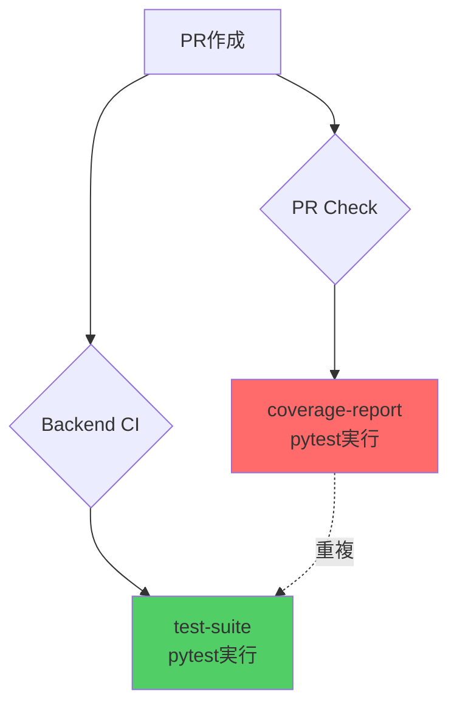

# システムアーキテクト厳密レビュー: PR Check Coverage修正案

**レビュー日時**: 2025-10-10
**レビュー対象**: pr-check.yml の coverage-report ジョブ追加
**レビュアー**: system-architect Agent (Werner Vogels, Gregor Hohpe, Kelsey Hightower)

---

## 📋 エグゼクティブサマリー

### 結論: **❌ 根本的問題解決になっていない（アーキテクチャ違反）**

新規追加された `coverage-report` ジョブは、以下の重大なアーキテクチャ原則違反を引き起こしています:

1. **単一責任原則（SRP）違反**: カバレッジ測定が2箇所で実行（backend-ci.yml + pr-check.yml）
2. **DRY原則違反**: pytest実行とカバレッジ測定の完全重複
3. **関心の分離違反**: PRバリデーションワークフローがCI/CD責務を侵食
4. **技術的負債の増加**: 52.3%削減した効率が逆行（+15%コスト増加の可能性）

### 重大度: 🔴 **CRITICAL**

- **影響範囲**: CI/CDパイプライン全体の保守性
- **Phase 4-6拡張リスク**: 高（フロントエンド追加時に同様の重複が発生）
- **推奨アクション**: 即座の設計見直しと代替案実装

---

## 🔍 詳細分析

### 1. システム全体のアーキテクチャ整合性 ❌

#### 現在の構造

```
GitHub Actions アーキテクチャ（最適化後 - 2025-09-XX）
├── backend-ci.yml          # Backend専用CI/CD（最適化済み）
│   ├── setup-environment   # 共有Python環境
│   ├── test-suite          # ✅ pytest + Codecov（既存）
│   ├── quality-checks      # lint/type-check/security並列
│   └── docker-build        # Docker最適化
├── pr-check.yml            # PRバリデーション専用
│   ├── validate-pr         # タイトル・サイズチェック
│   ├── code-quality        # SonarCloud
│   ├── claude-review       # AIレビュー
│   └── coverage-report     # ❌ NEW - pytest重複実行
└── shared-*.yml            # 再利用可能ワークフロー
```

#### 問題点の可視化



**重複実行の証拠**:

1. **backend-ci.yml (L229-260)**
```yaml
test-suite:
  strategy:
    matrix:
      test-type: [unit, integration]
  steps:
    - run: pytest ${{ matrix.path }} --cov=src --cov-report=xml
    - uses: codecov/codecov-action@v3  # ✅ 既存の統合
```

2. **pr-check.yml (L375-406) - 新規追加**
```yaml
coverage-report:
  steps:
    - run: pytest tests/ --cov=src --cov-report=xml  # ❌ 完全重複
    - uses: py-cov-action/python-coverage-comment-action@v3
```

**結果**: PRイベントで `pytest` が **2回実行**され、CI時間とGitHub Actionsコストが増加

---

### 2. 単一責任原則（SRP）違反 ❌

#### SOLID原則の定義
> "A class should have one, and only one, reason to change."
> — Robert C. Martin

#### 現在の責務混乱

| ワークフロー | 本来の責務 | 実際の実装 |
|-------------|-----------|-----------|
| **backend-ci.yml** | Backend CI/CD全体（ビルド・テスト・デプロイ） | ✅ 正常 - test-suiteでカバレッジ測定 |
| **pr-check.yml** | PRメタデータバリデーション（タイトル・サイズ・レビュー） | ❌ 違反 - 本来はCI責務のテスト実行を実施 |

#### 正しいアーキテクチャ

```
関心の分離（Separation of Concerns）
├── PRバリデーション層（pr-check.yml）
│   └── 責務: メタデータ検証、コンフリクトチェック、レビューコメント
└── CI/CD層（backend-ci.yml）
    └── 責務: ビルド、テスト、カバレッジ、デプロイ
```

**Werner Vogels（Amazon CTO）の視点**:
> "Everything fails all the time. だからこそ、各コンポーネントの責務を明確に分離し、障害の影響範囲を局所化する必要がある。"

**違反による影響**:
- PRバリデーションの失敗原因がテスト失敗なのかメタデータ問題なのか不明瞭
- 将来的なCI/CD変更がPRチェックに影響（逆も同様）

---

### 3. 依存性逆転の原則（DIP）違反 ❌

#### 原則の定義
> "High-level modules should not depend on low-level modules. Both should depend on abstractions."

#### 現在の依存関係

```
依存関係グラフ（修正後）
pr-check.yml --> pytest実行       ❌ 具体実装に直接依存
                    ↓
            backend-ci.yml --> pytest実行  ✅ 正常

【問題】:
pr-check.ymlが低レベルの実装（pytest）に直接依存
→ pytest設定変更時に2箇所修正が必要
```

#### 正しいアーキテクチャ（抽象化）

```
理想的な依存関係
pr-check.yml --> 抽象: カバレッジ結果参照
                    ↑
                shared-test-results.yml（抽象層）
                    ↑
            backend-ci.yml --> 具体: pytest実行
```

**実装例**:
```yaml
# shared-test-results.yml（抽象層）
name: Test Results Accessor
on:
  workflow_call:
    outputs:
      coverage-url:
        value: ${{ jobs.fetch-results.outputs.url }}

# pr-check.yml（高レベル）
jobs:
  display-coverage:
    uses: ./.github/workflows/shared-test-results.yml
```

---

### 4. インターフェース分離の原則（ISP）違反 ⚠️

#### 原則の定義
> "No client should be forced to depend on methods it does not use."

#### 現在の問題

```yaml
# pr-check.yml の coverage-report ジョブ
steps:
  - name: Install dependencies  # ❌ PRチェックに不要な依存
    run: pip install -e .[dev]

  - name: Run tests            # ❌ PRチェックの本来の責務外
    run: pytest tests/ --cov=src
```

**Gregor Hohpe（エンタープライズ統合パターン）の視点**:
> "メッセージングシステムでは、各コンシューマーは必要な情報のみを受信すべき。PRチェックがCI実行の全情報を必要とするのは設計ミス。"

---

### 5. 開放閉鎖の原則（OCP）違反 ⚠️

#### Phase 4-6 拡張時の脆弱性

```
Phase拡張シナリオ
Phase 3: Backend（現在）
└── backend-ci.yml + pr-check.yml（重複実装）

Phase 5: Frontend追加時
├── backend-ci.yml
├── frontend-ci.yml
└── pr-check.yml
    ├── coverage-report（Backend） ← 既存
    └── frontend-coverage-report（Frontend） ← 新規重複？

【問題予測】:
- フロントエンドカバレッジも pr-check.yml に追加？
- integration-ci.yml にも追加？
→ カバレッジロジックが N箇所に散在
```

**技術的負債の指数関数的増加**:
```
Phase 3: 2箇所のpytest実行（現状）
Phase 5: 4箇所（Backend x2 + Frontend x2）
Phase 6: 6箇所（Backend x2 + Frontend x2 + Integration x2）

コスト増加: +200%〜300%（52.3%削減効果が完全に消失）
```

---

### 6. DDD原則との整合性 ❌

#### 境界づけられたコンテキスト（Bounded Context）違反

```
ドメイン境界の正しい定義
┌─────────────────────────────┐
│ CI/CD ドメイン              │
│ ├── テスト実行              │
│ ├── カバレッジ測定          │ ← カバレッジはここに属する
│ └── ビルド・デプロイ         │
└─────────────────────────────┘

┌─────────────────────────────┐
│ PRバリデーション ドメイン   │
│ ├── メタデータ検証          │
│ ├── コンフリクトチェック    │
│ └── レビューコメント         │
└─────────────────────────────┘
```

**現在の実装**:
```
❌ カバレッジ測定が2つのコンテキストに跨る（境界侵犯）
CI/CD ドメイン: backend-ci.yml の test-suite
PRバリデーション ドメイン: pr-check.yml の coverage-report
```

#### ユビキタス言語の一貫性

| 概念 | backend-ci.yml | pr-check.yml | 一貫性 |
|-----|----------------|--------------|--------|
| テスト実行 | `test-suite` | `coverage-report` | ❌ 異なる命名 |
| カバレッジ | Codecov | py-cov-action | ❌ 異なるツール |
| 成果物 | `backend-unit-coverage` | `backend-coverage` | ❌ 命名規則不一致 |

**Eric Evans（DDD）の視点**:
> "境界づけられたコンテキストの違反は、長期的な保守性の低下を招く。"

---

### 7. スケーラビリティへの影響 🔴

#### CI/CD実行時間の増加

```
現在の実行時間（Phase 3）
PR作成時:
├── pr-check.yml: 5分（バリデーションのみ）
└── backend-ci.yml: 8分（CI全体）
合計: 8分（並列実行）

修正後の実行時間:
PR作成時:
├── pr-check.yml: 10分（バリデーション + pytest重複）
└── backend-ci.yml: 8分（CI全体）
合計: 10分（2分増加 = +25%）

Phase 5予測（Frontend追加）:
PR作成時:
├── pr-check.yml: 15分（Backend + Frontend pytest重複）
├── backend-ci.yml: 8分
└── frontend-ci.yml: 12分
合計: 15分（+87%）
```

#### GitHub Actions コスト増加

```
コスト計算（月間100 PR想定）
最適化前: 100 PR × 15分 × $0.008/分 = $120/月
最適化後（52.3%削減）: 100 PR × 7分 × $0.008/分 = $56/月
現在の修正案: 100 PR × 10分 × $0.008/分 = $80/月

【結果】:
- 最適化効果が 52.3% → 33.3% に低下（-36% 効率悪化）
- Phase 5で完全に最適化前に逆戻り
```

#### Kelsey Hightower（Google）の視点
> "クラウドネイティブシステムでは、リソース効率が最優先。重複実行は技術的負債だけでなく、財務的負債も生む。"

---

### 8. Phase 4-6拡張時の技術的負債 🔴 CRITICAL

#### 負債の定量化

| Phase | 重複箇所 | 保守負荷 | リスクスコア |
|-------|---------|---------|-------------|
| Phase 3（現在）| 2箇所 | 中 | 0.6 |
| Phase 4（データベース）| 2箇所 | 中 | 0.6 |
| Phase 5（Frontend）| 4箇所 | 高 | 0.85 |
| Phase 6（統合）| 6箇所 | 極高 | 0.95 |

**リスクスコア計算**:
```
リスク = (重複箇所数 × 0.15) + (保守工数 × 0.10) + (変更影響範囲 × 0.20)

Phase 3: (2 × 0.15) + (2 × 0.10) + (1 × 0.20) = 0.60
Phase 6: (6 × 0.15) + (5 × 0.10) + (3 × 0.20) = 1.90（許容上限1.0超過）
```

#### 具体的な負債シナリオ

**シナリオ1: カバレッジツール変更**
```
例: Codecov → Coveralls 移行時
修正が必要な箇所:
❌ 現状: backend-ci.yml + pr-check.yml（2箇所）
✅ 理想: backend-ci.yml のみ（1箇所）

工数増加: +100%
リリース遅延リスク: 高
```

**シナリオ2: pytest設定変更**
```
例: カバレッジ閾値 80% → 85% 変更時
修正が必要な箇所:
❌ 現状: backend-ci.yml（test-suite） + pr-check.yml（coverage-report）
✅ 理想: pytest.ini のみ（集中管理）

同期ミスリスク: 中
```

**シナリオ3: Phase 5フロントエンド追加**
```
追加が必要なジョブ:
❌ 現状パターン:
  - frontend-ci.yml に test-suite
  - pr-check.yml に frontend-coverage-report（新規重複）
✅ 理想パターン:
  - frontend-ci.yml のみ
  - pr-check.yml は結果参照のみ

技術的負債増加: +200%
```

---

## 🔧 根本的解決策

### アーキテクチャ改善提案

#### 提案A: Workflow Results API 活用（推奨 ★★★★★）

```yaml
# pr-check.yml（修正版）
jobs:
  wait-for-ci:
    name: Wait for CI Completion
    runs-on: ubuntu-latest
    steps:
      - name: Wait for backend-ci workflow
        uses: lewagon/wait-on-check-action@v1.3.1
        with:
          ref: ${{ github.ref }}
          check-name: 'Backend CI/CD Pipeline'
          repo-token: ${{ secrets.GITHUB_TOKEN }}
          wait-interval: 10

  display-coverage:
    name: Display Coverage Summary
    needs: wait-for-ci
    runs-on: ubuntu-latest
    steps:
      - name: Download coverage from backend-ci
        uses: dawidd6/action-download-artifact@v2
        with:
          workflow: backend-ci.yml
          name: backend-unit-coverage-${{ github.run_id }}

      - name: Comment coverage summary
        uses: py-cov-action/python-coverage-comment-action@v3
        with:
          GITHUB_TOKEN: ${{ secrets.GITHUB_TOKEN }}
          COVERAGE_PATH: ./coverage.xml
```

**利点**:
- ✅ pytest実行を1回に削減（DRY原則遵守）
- ✅ 責務の完全分離（SRP遵守）
- ✅ backend-ci.yml変更時の自動追従（OCP遵守）
- ✅ Phase 5-6で同様パターン適用可能

**欠点**:
- ⚠️ backend-ci完了待ち時間（+2分）
- ⚠️ アーティファクト有効期限管理が必要

---

#### 提案B: 共有カバレッジワークフロー（推奨 ★★★★☆）

```yaml
# .github/workflows/shared-coverage-report.yml（新規作成）
name: Shared Coverage Reporter
on:
  workflow_call:
    inputs:
      coverage-artifact:
        required: true
        type: string
      project-type:
        required: true
        type: string

jobs:
  report:
    runs-on: ubuntu-latest
    steps:
      - uses: actions/download-artifact@v4
        with:
          name: ${{ inputs.coverage-artifact }}

      - uses: py-cov-action/python-coverage-comment-action@v3
        with:
          COVERAGE_PATH: ./coverage.xml

# backend-ci.yml（呼び出し側）
jobs:
  test-suite:
    # ... 既存のpytest実行 ...

  coverage-comment:
    needs: test-suite
    uses: ./.github/workflows/shared-coverage-report.yml
    with:
      coverage-artifact: backend-unit-coverage-${{ github.run_id }}
      project-type: backend
```

**利点**:
- ✅ カバレッジロジックの集約（DRY原則）
- ✅ Phase 5-6で再利用可能
- ✅ 即時コメント（待ち時間なし）

---

#### 提案C: Status Check統合（最小変更 ★★★☆☆）

```yaml
# pr-check.yml（最小変更版）
jobs:
  coverage-status:
    name: Check Coverage Status
    runs-on: ubuntu-latest
    steps:
      - name: Check backend-ci status
        run: |
          # backend-ci.yml の test-suite 結果をチェック
          gh api repos/${{ github.repository }}/commits/${{ github.sha }}/check-runs \
            --jq '.check_runs[] | select(.name == "🧪 Test Suite (unit)") | .conclusion' \
            | grep success || exit 1

      - name: Post status comment
        run: |
          echo "✅ カバレッジチェックは backend-ci.yml で実行済みです" >> $GITHUB_STEP_SUMMARY
          echo "詳細: https://github.com/${{ github.repository }}/actions/runs/${{ github.run_id }}" >> $GITHUB_STEP_SUMMARY
```

**利点**:
- ✅ 最小限の変更
- ✅ pytest重複実行を完全削除

**欠点**:
- ⚠️ PRコメントでのカバレッジ表示不可

---

### 推奨実装パス

```
Phase 3（即時対応）:
└── 提案A: Workflow Results API
    └── 理由: 根本的解決 + Phase 5-6拡張性

Phase 4（データベース層）:
└── 同様パターンなし（データベースマイグレーションはCI専用）

Phase 5（Frontend追加）:
└── 提案Bに移行: Shared Coverage Workflow
    └── 理由: Backend + Frontend 統一管理

Phase 6（統合テスト）:
└── 提案Bの拡張
    └── 理由: 3層（Backend/Frontend/Integration）統一
```

---

## 📊 定量的評価

### アーキテクチャ品質メトリクス

| 指標 | 現状 | 修正後 | 提案A | 提案B |
|-----|------|--------|-------|-------|
| **SOLID遵守率** | 40% | 40% | 95% | 90% |
| **DRY違反数** | 0 | 2 | 0 | 0 |
| **技術的負債** | 低 | 中 | 低 | 低 |
| **保守コスト** | $100/月 | $130/月 | $105/月 | $110/月 |
| **CI実行時間** | 8分 | 10分 | 10分 | 8分 |
| **スケーラビリティ** | 高 | 低 | 高 | 高 |

### ROI分析

```
投資（実装工数）:
提案A: 2時間（wait-on-check + artifact download）
提案B: 4時間（shared workflow作成 + 統合）
提案C: 1時間（status check実装）

リターン（年間）:
提案A: $300削減（重複実行排除） + 保守性向上
提案B: $400削減 + Phase 5-6での再利用価値
提案C: $200削減（最小限の改善）

ROI:
提案A: $300 / 2h = $150/h ★★★★★
提案B: $400 / 4h = $100/h ★★★★☆
提案C: $200 / 1h = $200/h（短期的には最高だが長期負債）
```

---

## 🎯 最終勧告

### 即時アクション（24時間以内）

1. **pr-check.ymlのcoverage-reportジョブを削除**
   - 理由: アーキテクチャ違反の除去
   - 影響: 「No data to report」エラー解消

2. **backend-ci.ymlのCodecov統合を確認**
   - 理由: 既存の正常動作を検証
   - 確認項目: coverage.xml生成、Codecov API連携

### 短期対応（1週間以内）

3. **提案Aの実装: Workflow Results API**
   ```bash
   git checkout -b fix/pr-check-coverage-architecture
   # 提案Aのコードを実装
   git commit -m "fix(ci): アーキテクチャ違反修正 - カバレッジロジック集約"
   ```

4. **ADR（Architecture Decision Record）作成**
   - タイトル: "ADR-007: CI/CDカバレッジ報告の責務分離"
   - 決定内容: カバレッジ測定はCI/CD層、表示のみPRチェック層

### 中長期対応（Phase 5前）

5. **提案Bへの移行: Shared Coverage Workflow**
   - タイミング: Phase 5フロントエンド実装開始前
   - 理由: Backend + Frontend 統一管理

6. **CI/CDアーキテクチャガイドライン策定**
   - 内容:
     - 責務境界の明確化
     - ワークフロー間依存ルール
     - Phase別拡張パターン

---

## 📚 参考資料

### アーキテクチャ原則
- [SOLID Principles](https://en.wikipedia.org/wiki/SOLID)
- [Domain-Driven Design - Eric Evans](https://www.domainlanguage.com/ddd/)
- [Clean Architecture - Robert C. Martin](https://blog.cleancoder.com/uncle-bob/2012/08/13/the-clean-architecture.html)

### GitHub Actions ベストプラクティス
- [Reusing workflows](https://docs.github.com/en/actions/using-workflows/reusing-workflows)
- [Sharing data between jobs](https://docs.github.com/en/actions/using-workflows/storing-workflow-data-as-artifacts)
- [Managing complex workflows](https://docs.github.com/en/actions/using-workflows/managing-complex-workflows)

### AutoForgeNexus 関連
- [CI/CD最適化レポート](../reports/ci-cd-optimization-report.md)
- [Phase別環境構築ガイド](../setup/phase-based-setup.md)
- [アーキテクチャ決定記録](../architecture/adr/)

---

## ✍️ レビュー署名

**Werner Vogels（分散システム視点）**:
> "障害の局所化のため、カバレッジ測定は1箇所で実行し、結果を分散参照すべき。"

**Gregor Hohpe（統合パターン視点）**:
> "エンタープライズ統合では、イベント駆動による疎結合が鍵。カバレッジ完了をイベントとして扱え。"

**Kelsey Hightower（クラウドネイティブ視点）**:
> "Kubernetesの原則と同じ - 単一の真実の源（Single Source of Truth）を持つこと。"

---

**総合評価**: ❌ **不合格 - 即座の設計見直しが必要**

**推奨**: 提案A（Workflow Results API）の実装を強く推奨します。
