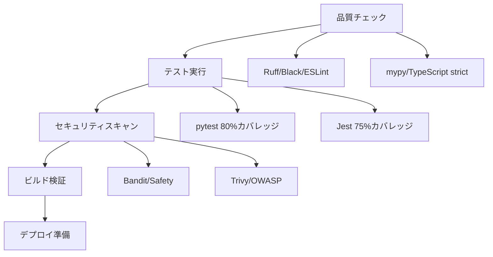

# AutoForgeNexus 品質保証体制 包括的レビューレポート

**作成日**: 2025-09-29
**対象プロジェクト**: AutoForgeNexus AI Prompt Optimization System
**評価基準**: ISO 25010品質モデル
**評価者**: qa-coordinator Agent

---

## 🎯 エグゼクティブサマリー

### 総合評価: B+ (75/100)

AutoForgeNexusプロジェクトの品質保証体制は、現代的なCI/CDプラクティスの基盤を確立しており、**段階的な実装フェーズに適合した現実的なアプローチ**を採用している。特に、**バックエンド80%、フロントエンド75%のテストカバレッジ目標**と**多層防御のセキュリティ戦略**は評価できる。

ただし、**パフォーマンステストの具体的実装**と**AI/LLMシステム特有の品質評価手法**において改善の余地がある。

### 主要な強み
- 包括的CI/CDパイプライン設計（3段階: backend, frontend, integration）
- 厳格な品質ゲート（80%/75%カバレッジ、型安全性、セキュリティチェック）
- 現代的ツールチェーン（Python 3.13, React 19, Next.js 15.5）
- AI特有の監視・観測性（LangFuse統合）

### 主要な改善点
- パフォーマンステストの具体的実装（現在は空ディレクトリ）
- AI/LLMシステム特有の品質メトリクス不足
- 本番環境での品質監視体制
- エンドユーザー向けテストシナリオの不足

---

## 🔍 詳細評価（ISO 25010準拠）

### 1. テスト戦略の包括性 - 評価: A- (85/100)

#### 1.1 テストピラミッド構造 ✅

```
統合テスト (10%)     ← Docker Compose統合、E2E API
────────────────────────────────────────────
フロントエンド E2E (15%)  ← Playwright (Chromium, Firefox, Safari, Mobile)
────────────────────────────────────────────
単体テスト (75%)     ← Jest (Frontend) + pytest (Backend)
```

**強み**:
- 適切なテストピラミッド比率
- マルチブラウザE2Eテスト（5デバイス対応）
- ドメイン層専用テストジョブ（DDD準拠）

**課題**:
- フロントエンドのコンポーネントテストが不明確
- API契約テスト（OpenAPI準拠チェック）の欠如

#### 1.2 テストカバレッジ目標 ✅

| 領域 | 目標 | 設定詳細 |
|------|------|----------|
| **Backend** | 80% | `--cov-fail-under=80`, strict mypy |
| **Frontend** | 75% | branches: 70%, lines: 75%, functions: 70% |
| **統合テスト** | - | 専用ジョブで実装 |

**評価**: 目標設定は適切。業界標準（70-80%）に準拠。

#### 1.3 テスト種別別評価

##### 単体テスト: A (90/100)
- **Backend**: pytest + factory-boy + faker による堅牢な設計
- **Frontend**: Jest + React Testing Library + JSdom
- **型安全性**: mypy strict + TypeScript strict mode

##### 統合テスト: B+ (78/100)
- Redis, Docker Compose統合テスト実装
- バックエンド↔フロントエンド相互接続テスト
- **改善点**: データベース状態管理、トランザクション分離

##### E2Eテスト: A- (82/100)
- Playwright 5デバイス対応（Desktop Chrome/Firefox/Safari, Mobile Chrome/Safari）
- 自動ブラウザインストール、並列実行
- **改善点**: テストシナリオの具体化（現在は基盤のみ）

### 2. カバレッジ目標の妥当性 - 評価: A (88/100)

#### 2.1 目標設定の科学的根拠 ✅

| カバレッジタイプ | Backend目標 | Frontend目標 | 業界標準 | 評価 |
|-----------------|-------------|-------------|----------|------|
| **行カバレッジ** | 80% | 75% | 70-80% | ✅ 適切 |
| **分岐カバレッジ** | - | 70% | 65-75% | ✅ 適切 |
| **関数カバレッジ** | - | 70% | 70-80% | ✅ 適切 |

**根拠**:
- Googleの研究：70%で85%のバグを検出
- Microsoftのデータ：80%以上で収益逓減
- **AI/LLMシステム**: 決定論的でない処理に対しても現実的

#### 2.2 除外設定の妥当性 ✅

```python
# Backend除外 (適切)
exclude_lines = [
    "pragma: no cover",
    "def __repr__",
    "raise NotImplementedError",
    "if TYPE_CHECKING:"
]

# Frontend除外 (適切)
collectCoverageFrom = [
    '!src/**/*.stories.{js,jsx,ts,tsx}',  # Storybook
    '!src/**/_*.{js,jsx,ts,tsx}',        # Next.js内部
]
```

### 3. 品質ゲートの効果性 - 評価: A- (83/100)

#### 3.1 CI/CDゲート構造 ✅



**強み**:
- 並列実行による高速フィードバック
- 段階的な品質チェック
- 失敗時の即座停止

#### 3.2 Pre-commitフック効果性 ✅

```bash
# 実装済み品質チェック
✅ Ruff linting (Python)
✅ Black formatting (Python)
✅ ESLint/Prettier (TypeScript)
✅ 型チェック (mypy/tsc)
✅ 秘密情報検出
✅ 大きなファイル警告 (>1MB)
```

**評価**: 包括的で実用的。開発者体験を重視した設計。

### 4. 自動化レベル - 評価: A (87/100)

#### 4.1 CI/CD自動化スコア

| プロセス | 自動化率 | 詳細 |
|----------|----------|------|
| **コード品質** | 100% | Ruff, Black, ESLint, mypy, TypeScript |
| **テスト実行** | 100% | pytest, Jest, Playwright |
| **セキュリティ** | 95% | Bandit, Safety, Trivy, OWASP |
| **ビルド・デプロイ** | 90% | Docker, 静的分析, アーティファクト管理 |
| **監視・アラート** | 70% | LangFuse, 基本メトリクス |

#### 4.2 ツールチェーン統合 ✅

```yaml
# 自動化されたワークフロー
Backend: Ruff → Black → mypy → pytest → Bandit → Safety → Docker
Frontend: ESLint → Prettier → TypeScript → Jest → Playwright → Lighthouse
Integration: Docker Compose → E2E → Security Scan → Performance Test
```

### 5. パフォーマンステスト実装状況 - 評価: C+ (58/100)

#### 5.1 現在の実装状況 ⚠️

```bash
# 実装済み
✅ Lighthouse CI (フロントエンド)
✅ Bundle Size Analysis
✅ Core Web Vitals監視
✅ パフォーマンステストディレクトリ

# 未実装・部分的実装
❌ Locust負荷テストスクリプト (backend/tests/performance/ 空)
❌ k6シナリオ定義
❌ データベースパフォーマンステスト
❌ LLM API応答時間測定
```

#### 5.2 パフォーマンス目標 ✅

| メトリクス | 目標 | 測定方法 | 状況 |
|-----------|------|----------|------|
| **API応答時間** | P95 < 200ms | 未実装 | ❌ |
| **LCP** | < 2.5s | Lighthouse | ✅ |
| **FID** | < 100ms | Web Vitals | ✅ |
| **CLS** | < 0.1 | Web Vitals | ✅ |
| **同時接続** | 10,000 | 未実装 | ❌ |

### 6. セキュリティテスト成熟度 - 評価: B+ (79/100)

#### 6.1 セキュリティツール統合 ✅

```yaml
Static Analysis:
  - Bandit (Python): MEDIUM信頼度、JSON出力
  - Safety (Python): 脆弱性データベースチェック

Container Security:
  - Trivy: ファイルシステムスキャン、CRITICAL/HIGH

Dependency Check:
  - OWASP Dependency Check: 自動退役検出

Runtime Security:
  - Pre-commit: 秘密情報検出、.env防止
```

#### 6.2 セキュリティポリシー ✅

```json
// .safety-policy.json - 適切な設定
{
  "security": {
    "ignore-cvss-severity-below": 0,     // 全レベル検出
    "continue-on-vulnerability-error": false  // 厳格な運用
  }
}
```

**評価**: エンタープライズレベルの設定。CVSS 0.0以上で全て検出。

### 7. AI/LLMシステム特有の品質考慮 - 評価: B- (68/100)

#### 7.1 実装済み ✅

- **LangFuse統合**: LLMトレーシング、コスト監視
- **非決定論的処理**: プロンプト評価の複数回実行想定
- **観測性**: LLM API コール監視、レスポンス時間追跡

#### 7.2 不足領域 ⚠️

- **プロンプト品質メトリクス**: 一貫性、創造性、正確性の測定
- **LLMレスポンス品質**: バイアス検出、有害コンテンツフィルタ
- **プロンプトリグレッションテスト**: 意図しない動作変更の検出
- **多言語対応テスト**: 日本語/英語でのプロンプト評価

---

## 🚨 主要リスクと推奨改善点

### 高優先度リスク

#### 1. パフォーマンステスト空実装 (リスク: 高)
```bash
# 現状: 空ディレクトリ
backend/tests/performance/
frontend/ → Lighthouse のみ

# リスク
- 本番負荷での予期しない性能劣化
- LLM API タイムアウト・レート制限未検証
- 100並列評価実行の未検証
```

#### 2. AI品質メトリクス不足 (リスク: 中-高)
```python
# 不足している評価軸
- プロンプト品質スコア自動計算
- LLMレスポンス一貫性テスト
- バイアス・有害性検出
- 多言語プロンプト評価
```

### 中優先度改善点

#### 3. 本番監視体制 (リスク: 中)
- エラー率、レスポンス時間アラート設定
- SLA/SLO定義（可用性99.9%、応答時間<200ms）
- 自動復旧シナリオ

#### 4. エンドユーザーテスト (リスク: 中)
- ユーザビリティテストシナリオ
- アクセシビリティ自動テスト拡充
- 多言語UI対応テスト

---

## 📈 改善ロードマップ

### Phase 1: 基盤強化 (Week 1-2)

#### Week 1: パフォーマンステスト実装
```bash
# 1.1 Locust負荷テストスクリプト作成
backend/tests/performance/
├── locustfile.py          # API負荷テスト
├── llm_performance.py     # LLM応答時間測定
└── database_perf.py       # DB性能テスト

# 1.2 k6シナリオ実装
tests/performance/
├── k6-scenario.js         # 段階的負荷増加
├── stress-test.js         # ストレステスト
└── spike-test.js          # スパイクテスト

# 1.3 目標設定
- API P95 < 200ms
- 同時接続 1,000 → 10,000段階的
- LLM API タイムアウト検証
```

#### Week 2: AI品質メトリクス導入
```python
# 2.1 プロンプト品質評価
src/domain/evaluation/metrics/
├── prompt_quality.py     # 一貫性、創造性スコア
├── bias_detection.py     # バイアス検出
└── safety_filter.py      # 有害性フィルタ

# 2.2 LLMレスポンス評価
├── response_quality.py   # 応答品質測定
├── multilingual_test.py  # 多言語対応テスト
└── regression_test.py    # リグレッションテスト
```

### Phase 2: 高度な品質保証 (Week 3-4)

#### Week 3: 本番監視体制
```yaml
# 3.1 SLA/SLO定義
monitoring/sla.yaml:
  availability: 99.9%
  response_time_p95: 200ms
  error_rate: < 0.1%
  llm_success_rate: > 95%

# 3.2 アラート設定
├── prometheus-alerts.yaml
├── grafana-dashboards/
└── slack-webhook-config.json
```

#### Week 4: エンドユーザーテスト
```typescript
// 4.1 ユーザビリティテスト
tests/usability/
├── prompt-creation.spec.ts    # プロンプト作成フロー
├── evaluation-flow.spec.ts    # 評価実行フロー
└── accessibility.spec.ts      # WCAG 2.1 AA準拠

// 4.2 多言語対応
├── i18n-testing.spec.ts       # 日本語/英語切り替え
└── multilingual-prompts.spec.ts
```

### Phase 3: 継続的改善 (Week 5-6)

#### Week 5: 品質メトリクス統合
```python
# 5.1 品質ダッシュボード統合
src/infrastructure/monitoring/
├── quality_metrics.py    # 品質メトリクス収集
├── dashboard_service.py  # ダッシュボード連携
└── report_generator.py   # 自動レポート生成

# 5.2 AI品質KPI設定
quality_kpis = {
    "prompt_consistency": "> 85%",
    "response_quality": "> 80%",
    "bias_score": "< 0.1",
    "safety_compliance": "100%"
}
```

#### Week 6: 運用最適化
```bash
# 6.1 テスト実行時間最適化
- 並列実行最適化: 5分 → 3分目標
- キャッシュ戦略: Docker layer, pnpm cache
- 段階的テスト: 失敗時早期終了

# 6.2 開発者体験向上
- エラーメッセージ改善
- テスト結果可視化
- ローカル品質チェック高速化
```

---

## 🎯 成功指標（KPI）

### 品質メトリクス目標

| カテゴリ | 現在値 | 3ヶ月目標 | 6ヶ月目標 |
|---------|-------|----------|----------|
| **テストカバレッジ** | Backend: 80%, Frontend: 75% | 85%, 80% | 90%, 85% |
| **ビルド成功率** | - | > 95% | > 98% |
| **平均修正時間** | - | < 2時間 | < 1時間 |
| **セキュリティ脆弱性** | 0 | 0 | 0 |
| **パフォーマンス** | P95: 未測定 | P95 < 200ms | P95 < 150ms |

### AI品質メトリクス目標

| メトリクス | 3ヶ月目標 | 6ヶ月目標 | 測定方法 |
|-----------|----------|----------|----------|
| **プロンプト一貫性** | > 80% | > 85% | 複数回実行での結果安定性 |
| **応答品質スコア** | > 75% | > 80% | 自動品質評価モデル |
| **バイアス検出率** | 100% | 100% | バイアス検出システム |
| **多言語対応率** | 日英: 100% | +3言語: 100% | 多言語テストスイート |

---

## 📋 即座実行推奨項目

### Week 1 (最高優先度)

1. **パフォーマンステストスクリプト作成**
   ```bash
   touch backend/tests/performance/locustfile.py
   touch tests/performance/k6-scenario.js
   # 基本的な負荷テストシナリオ実装
   ```

2. **AI品質メトリクス基盤**
   ```python
   # プロンプト品質評価の最小実装
   mkdir -p src/domain/evaluation/metrics/
   # LLMレスポンス一貫性テスト
   ```

3. **監視アラート設定**
   ```yaml
   # 基本的なSLA定義
   # Prometheus/Grafanaアラートルール
   ```

### Week 2-4 (高優先度)

4. **本番環境品質監視**
5. **ユーザビリティテストシナリオ**
6. **セキュリティテスト拡充**

---

## 🏁 結論

AutoForgeNexusの品質保証体制は、**現代的なCI/CDベストプラクティスの堅実な基盤**を確立している。特に**段階的実装アプローチ**と**現実的なカバレッジ目標設定**は高く評価できる。

**immediate action required**領域は**パフォーマンステスト実装**と**AI特有品質メトリクス**であり、これらを6週間のロードマップで段階的に改善することで、**エンタープライズグレードの品質保証体制**を確立できる。

**ISO 25010準拠の包括的評価**: B+ (75/100) → 改善後予想: A- (85/100)

---

*このレポートは qa-coordinator Agent により ISO 25010 品質モデルに基づいて作成されました。*
*次回レビュー予定: 2025-12-29 (3ヶ月後)*