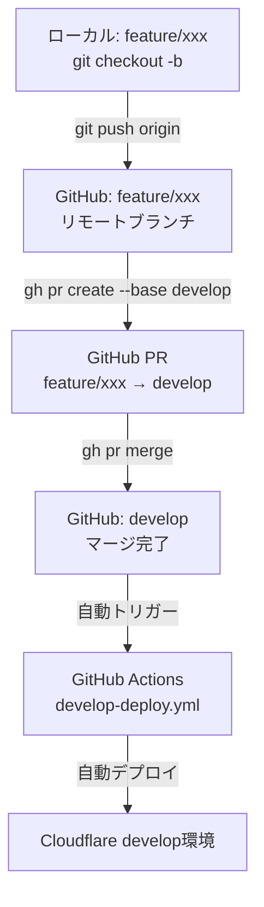
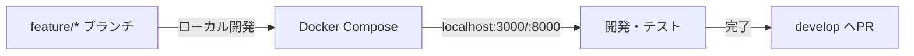
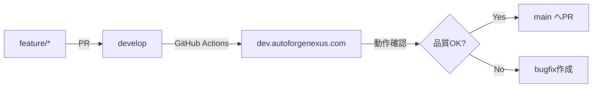
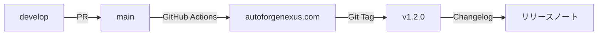
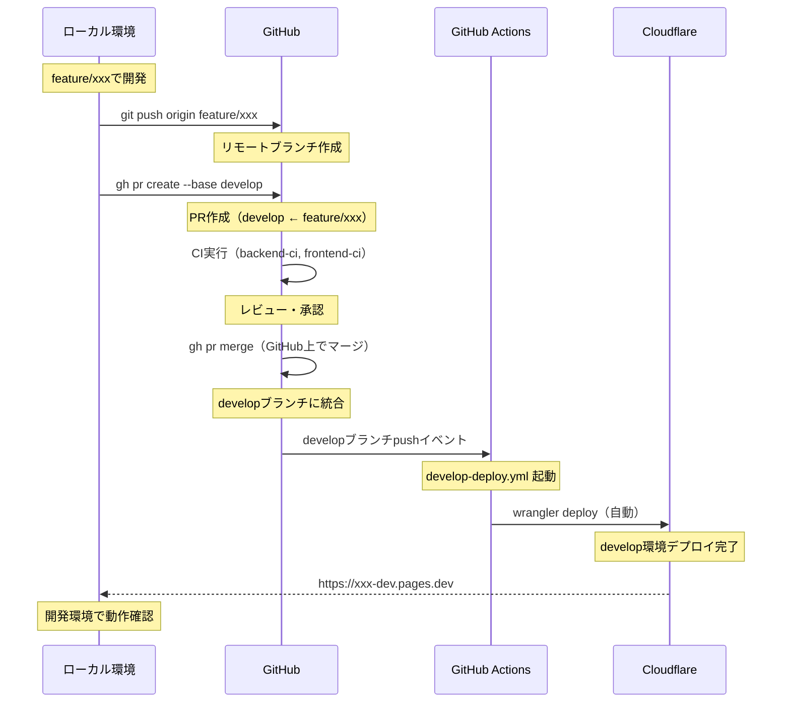
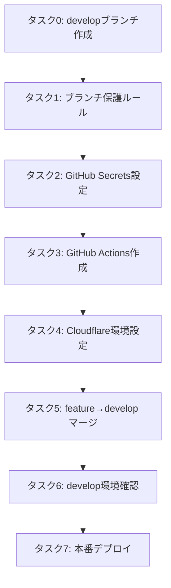

# ブランチ戦略とデプロイメント完全ガイド

## 📋 ドキュメント概要

**作成日**: 2025-10-10 **更新日**: 2025-10-10 **対象システム**: AutoForgeNexus
AI プロンプト最適化システム
**目的**: 個人開発向けシンプルなブランチ戦略とデプロイフロー構築
**対象者**: 個人開発者 **現在のブランチ**: `feature/autoforge-mvp-complete`
(開発ブランチ) **現在の状態**: developブランチ未作成（リモート未存在）

---

## 🎯 ブランチ戦略の設計思想

### 個人開発向けシンプル戦略

AutoForgeNexusシステムの特性：

- **個人開発**: レビュアー不在、迅速なイテレーション重視
- **Phase 1-6の段階的環境構築**が必須
- **Cloudflare Workers/Pages**によるエッジデプロイ（2環境）
- **DDD + クリーンアーキテクチャ**によるモノリポ構成
- **Backend (Python 3.13/FastAPI) + Frontend (Next.js 15.5.4/React
  19.0.0)**の統合
- **CI/CDパイプライン**による自動テスト・デプロイ

### 選定戦略: **GitHub Flow（簡略版）**

```
main (本番環境)
└── develop (開発/ステージング環境)
    ├── feature/* (ローカル開発)
    └── feature/* (ローカル開発)
```

**選定理由**：

1. **シンプル**: ブランチ3種類のみ（main, develop, feature/\*）
2. **迅速**: release/\*不要、即座デプロイ
3. **コスト削減**: Cloudflare無料枠（Pages/Workers 各2環境）
4. **Phase対応**: developで段階的テスト → mainで本番デプロイ

### 環境構成（3つ）

| 環境                  | 実行場所   | ブランチ   | デプロイ先            | 用途           |
| --------------------- | ---------- | ---------- | --------------------- | -------------- |
| **ローカル開発**      | PC         | feature/\* | localhost:3000, :8000 | 開発・デバッグ |
| **開発/ステージング** | Cloudflare | develop    | ※設定後に確定         | テスト・検証   |
| **本番**              | Cloudflare | main       | ※設定後に確定         | 本番運用       |

**注**: CloudflareデプロイURLはタスク3完了後に確定します

---

## 🌳 ブランチ構成とルール

### 1. main (本番環境)

**役割**: 本番環境にデプロイされる安定版コード **保護設定**:

- 直接コミット禁止
- PR必須（個人開発だがCI全パス必須）
- ステータスチェック必須

**デプロイ先**:

- Cloudflare Pages: `https://autoforgenexus.pages.dev` （タスク3設定後に確定）
- Cloudflare Workers: カスタムドメインまたは `*.workers.dev`
  （タスク3設定後に確定）

**マージ元**: `develop` ブランチのみ

### 2. develop (開発/ステージング環境)

**役割**: 開発ブランチの統合 + ステージング環境 **保護設定**:

- CI全パス必須

**デプロイ先**:

- Cloudflare Pages: `https://[project-name].pages.dev` （タスク3設定後に確定）
- Cloudflare Workers: カスタムドメインまたは `*.workers.dev`
  （タスク3設定後に確定）

**マージ元**: `feature/*` ブランチ **マージ先**: `main` ブランチ

### 3. feature/\* (ローカル開発)

**命名規則**: `feature/{機能名}` **例**: `feature/prompt-evaluation-engine`,
`feature/auth-system`

**役割**: 新機能・Phase別実装の開発 **実行環境**: ローカル（Docker Compose）
**作成元**: `develop` ブランチ **マージ先**: `develop` ブランチ

**運用ルール**:

- 1 Issue = 1 feature ブランチ
- 定期的に `develop` をrebase
- PR時にSquash Merge推奨

### 4. 緊急修正（Hotfix）

**緊急修正が必要な場合**:

1. `main` から `feature/hotfix-xxx` 作成
2. 修正実装・テスト
3. `main` にPRマージ（即座デプロイ）
4. `develop` にもcherry-pick反映

---

## 🔄 デプロイフロー（環境別）

### 重要: ブランチとPRの関係

**ローカルブランチ vs リモートブランチ vs GitHub PR**



**重要なポイント**:

1. ✅ **PRマージはGitHub上**で実行（ローカルでmergeしてpushではない）
2. ✅ **GitHub Actionsは自動**でトリガー（手動実行不要）
3. ✅ **Cloudflareデプロイも自動**（GitHub Actionsが実行）

---

### ローカル開発環境



**環境**: Docker Compose **実行**:

```bash
docker-compose up -d
# localhost:3000 (Frontend)
# localhost:8000 (Backend)
```

**テスト**:

- 単体テスト: `pytest`, `pnpm test`
- E2Eテスト: `pnpm test:e2e`

### 開発/ステージング環境



**トリガー**: `feature/*` → `develop` PRマージ時 **自動実行**:

- Lint/TypeCheck/単体テスト
- Cloudflare Workers/Pages Deploy
- E2Eテスト (Playwright)

**手動確認**:

- 開発環境での動作確認
- Phase別機能テスト

### 本番環境



**トリガー**: `develop` → `main` PRマージ時 **自動実行**:

- 全テストスイート実行
- Cloudflare Workers/Pages Production Deploy
- Git Tag作成
- GitHub Release作成

**手動確認**:

- デプロイ後のスモークテスト
- メトリクス監視確認

---

## 📝 実装タスク詳細

### 前提条件確認（必須）

```bash
# 必須ツール確認
git --version     # 2.40+
gh --version      # 2.0+
node --version    # 22+
pnpm --version    # 9+
wrangler --version # 3.0+

# GitHub認証確認
gh auth status
# 認証されていない場合: gh auth login --scopes repo,workflow,admin:repo_hook

# Cloudflare認証確認
wrangler whoami
# 認証されていない場合: wrangler login
```

---

### タスク0: developブランチ作成（最優先）

**エージェント**: `version-control-specialist` **コマンド**: 手動実行

**前提条件**:

- ✅ GitHub/Cloudflare認証完了
- ✅ 現在のブランチ: `feature/autoforge-mvp-complete`

**実行内容**:

```bash
# 1. mainから最新の状態でdevelopブランチを作成
git checkout main
git pull origin main
git checkout -b develop

# 2. リモートにプッシュ
git push -u origin develop

# 3. 確認
git branch -a | grep develop
gh api repos/daishiman/AutoForgeNexus/branches --jq '.[].name' | grep develop
```

**所要時間**: 5分

**成果物**: developブランチ作成完了、リモートプッシュ完了

**次のタスク**: タスク1（ブランチ保護ルール設定）へ進む

---

### タスク1: ブランチ保護ルール設定

**エージェント**: `version-control-specialist` **コマンド**: 手動実行

**前提条件**:

- ✅ タスク0完了（developブランチ作成済み）
- ✅ GitHub CLI認証済み

**認証確認**:

```bash
# GitHub CLI認証状態確認
gh auth status

# スコープ不足の場合は再認証
gh auth login --scopes repo,workflow,admin:repo_hook
```

**実行内容**:

```bash
# main ブランチ保護（個人開発向け簡略版）
gh api repos/daishiman/AutoForgeNexus/branches/main/protection \
  --method PUT \
  --field required_status_checks='{"strict":true,"contexts":["backend-ci","frontend-ci"]}' \
  --field enforce_admins=false \
  --field restrictions=null

# develop ブランチ保護（CI必須のみ）
gh api repos/daishiman/AutoForgeNexus/branches/develop/protection \
  --method PUT \
  --field required_status_checks='{"strict":true,"contexts":["backend-ci","frontend-ci"]}' \
  --field enforce_admins=false \
  --field restrictions=null
```

**所要時間**: 5分

**成果物**: GitHub Branch Protection Rules設定完了

**次のタスク**: タスク2へ進む

---

### タスク2: GitHub Secrets設定

**エージェント**: `security-architect` **コマンド**: 手動実行

**前提条件**:

- ✅ Cloudflare API Token取得済み
- ✅ Cloudflare Account ID取得済み

**実行内容**:

#### 2-1. Cloudflare API Token取得

```bash
# 1. Cloudflare Dashboardにアクセス
open https://dash.cloudflare.com

# 2. My Profile → API Tokens → Create Token
# テンプレート: Edit Cloudflare Workers
# 必要な権限:
#   - Account: Cloudflare Pages: Edit
#   - Account: Cloudflare Workers Scripts: Edit
#   - Zone: Workers Routes: Edit
```

#### 2-2. Account ID取得

```bash
# Cloudflare Dashboard → Workers & Pages → Overview
# Account ID をコピー
```

#### 2-3. GitHub Secretsに追加

```bash
# 1. CLOUDFLARE_API_TOKEN設定
gh secret set CLOUDFLARE_API_TOKEN
# プロンプトでトークンを貼り付け

# 2. CLOUDFLARE_ACCOUNT_ID設定
gh secret set CLOUDFLARE_ACCOUNT_ID
# プロンプトでAccount IDを貼り付け

# 3. 設定確認
gh secret list
```

**所要時間**: 10分

**成果物**: GitHub Secrets設定完了

**次のタスク**: タスク3へ進む

---

### タスク3: GitHub Actions ワークフロー作成

**エージェント**: `devops-coordinator` **コマンド**: 手動実行

**前提条件**:

- ✅ タスク2完了（GitHub Secrets設定済み）
- ✅ developブランチ存在

**実行内容**:

#### 3-1. Develop Deploy Workflow作成

**ファイル**: `.github/workflows/develop-deploy.yml`

```yaml
name: Develop Deploy

on:
  push:
    branches:
      - develop

jobs:
  # Phase検証（既存CI/CDとの整合性）
  validate-phase:
    runs-on: ubuntu-latest
    outputs:
      phase: ${{ steps.check.outputs.phase }}
      deploy-backend: ${{ steps.check.outputs.deploy-backend }}
      deploy-frontend: ${{ steps.check.outputs.deploy-frontend }}
    steps:
      - uses: actions/checkout@v5
      - id: check
        run: |
          PHASE=$(gh variable get CURRENT_PHASE || echo "3")
          echo "phase=$PHASE" >> $GITHUB_OUTPUT

          # Phase判定
          if [ "$PHASE" -ge 3 ]; then
            echo "deploy-backend=true" >> $GITHUB_OUTPUT
          else
            echo "deploy-backend=false" >> $GITHUB_OUTPUT
          fi

          if [ "$PHASE" -ge 5 ]; then
            echo "deploy-frontend=true" >> $GITHUB_OUTPUT
          else
            echo "deploy-frontend=false" >> $GITHUB_OUTPUT
          fi
        env:
          GH_TOKEN: ${{ secrets.GITHUB_TOKEN }}

  # Backendデプロイ（Phase 3以降）
  deploy-backend:
    needs: validate-phase
    if: needs.validate-phase.outputs.deploy-backend == 'true'
    runs-on: ubuntu-latest
    steps:
      - uses: actions/checkout@v5

      - name: Setup Python
        uses: actions/setup-python@v5
        with:
          python-version: '3.13'

      - name: Install Backend Dependencies
        run: |
          cd backend
          python -m pip install --upgrade pip
          pip install -e .[dev]

      - name: Run Backend Tests
        run: |
          cd backend
          pytest --cov=src --cov-report=xml

      - name: Deploy Workers (Dev)
        run: |
          cd backend
          npx wrangler deploy --env develop
        env:
          CLOUDFLARE_API_TOKEN: ${{ secrets.CLOUDFLARE_API_TOKEN }}
          CLOUDFLARE_ACCOUNT_ID: ${{ secrets.CLOUDFLARE_ACCOUNT_ID }}

  # Frontendデプロイ（Phase 5以降）
  deploy-frontend:
    needs: validate-phase
    if: needs.validate-phase.outputs.deploy-frontend == 'true'
    runs-on: ubuntu-latest
    steps:
      - uses: actions/checkout@v5

      - name: Setup Node.js
        uses: actions/setup-node@v5
        with:
          node-version: '22'

      - name: Setup pnpm
        run: npm install -g pnpm@9

      - name: Install Frontend Dependencies
        run: |
          cd frontend
          pnpm install

      - name: Run Frontend Tests
        run: |
          cd frontend
          pnpm test

      - name: Build Frontend
        run: |
          cd frontend
          pnpm build

      - name: Deploy to Cloudflare Pages (Dev)
        run: |
          cd frontend
          npx wrangler pages deploy out --project-name=autoforgenexus-dev
        env:
          CLOUDFLARE_API_TOKEN: ${{ secrets.CLOUDFLARE_API_TOKEN }}
          CLOUDFLARE_ACCOUNT_ID: ${{ secrets.CLOUDFLARE_ACCOUNT_ID }}
```

#### 3-2. Production Deploy Workflow作成

**ファイル**: `.github/workflows/production-deploy.yml`

```yaml
name: Production Deploy

on:
  push:
    branches:
      - main

jobs:
  # Phase検証
  validate-phase:
    runs-on: ubuntu-latest
    outputs:
      phase: ${{ steps.check.outputs.phase }}
      deploy-backend: ${{ steps.check.outputs.deploy-backend }}
      deploy-frontend: ${{ steps.check.outputs.deploy-frontend }}
    steps:
      - uses: actions/checkout@v5
      - id: check
        run: |
          PHASE=$(gh variable get CURRENT_PHASE || echo "3")
          echo "phase=$PHASE" >> $GITHUB_OUTPUT

          if [ "$PHASE" -ge 3 ]; then
            echo "deploy-backend=true" >> $GITHUB_OUTPUT
          else
            echo "deploy-backend=false" >> $GITHUB_OUTPUT
          fi

          if [ "$PHASE" -ge 5 ]; then
            echo "deploy-frontend=true" >> $GITHUB_OUTPUT
          else
            echo "deploy-frontend=false" >> $GITHUB_OUTPUT
          fi
        env:
          GH_TOKEN: ${{ secrets.GITHUB_TOKEN }}

  # Backendデプロイ（Phase 3以降）
  deploy-backend:
    needs: validate-phase
    if: needs.validate-phase.outputs.deploy-backend == 'true'
    runs-on: ubuntu-latest
    steps:
      - uses: actions/checkout@v5
        with:
          persist-credentials: true # Git Tag作成に必要

      - name: Setup Python
        uses: actions/setup-python@v5
        with:
          python-version: '3.13'

      - name: Install Backend Dependencies
        run: |
          cd backend
          python -m pip install --upgrade pip
          pip install -e .[dev]

      - name: Run Backend Tests
        run: |
          cd backend
          pytest --cov=src --cov-report=xml --cov-fail-under=80

      - name: Deploy Workers (Production)
        run: |
          cd backend
          npx wrangler deploy --env production
        env:
          CLOUDFLARE_API_TOKEN: ${{ secrets.CLOUDFLARE_API_TOKEN }}
          CLOUDFLARE_ACCOUNT_ID: ${{ secrets.CLOUDFLARE_ACCOUNT_ID }}

      - name: Create Git Tag
        run: |
          VERSION=$(date +%Y.%m.%d)
          git tag v$VERSION
          git push origin v$VERSION

  # Frontendデプロイ（Phase 5以降）
  deploy-frontend:
    needs: validate-phase
    if: needs.validate-phase.outputs.deploy-frontend == 'true'
    runs-on: ubuntu-latest
    steps:
      - uses: actions/checkout@v5

      - name: Setup Node.js
        uses: actions/setup-node@v5
        with:
          node-version: '22'

      - name: Setup pnpm
        run: npm install -g pnpm@9

      - name: Install Frontend Dependencies
        run: |
          cd frontend
          pnpm install

      - name: Run Frontend Tests
        run: |
          cd frontend
          pnpm test
          pnpm test:e2e

      - name: Build Frontend
        run: |
          cd frontend
          pnpm build

      - name: Deploy to Cloudflare Pages (Production)
        run: |
          cd frontend
          npx wrangler pages deploy out --project-name=autoforgenexus
        env:
          CLOUDFLARE_API_TOKEN: ${{ secrets.CLOUDFLARE_API_TOKEN }}
          CLOUDFLARE_ACCOUNT_ID: ${{ secrets.CLOUDFLARE_ACCOUNT_ID }}
```

**所要時間**: 15分

**Phase対応の重要性**:

- Phase 3（現在）: Backendのみデプロイ、Frontend未実装
- Phase 5以降: Backend + Frontend両方デプロイ
- GitHub Variable `CURRENT_PHASE` で自動制御

**検証手順**:

```bash
# 1. GitHub Variable設定（Phase番号）
gh variable set CURRENT_PHASE --body "3"

# 2. ワークフローファイル構文チェック
gh workflow list

# 3. developブランチへの空コミットでトリガーテスト（後で実行）
# git checkout develop
# git commit --allow-empty -m "test: CI/CDトリガー検証"
# git push origin develop
```

**所要時間**: 20分

**成果物**:

- `.github/workflows/develop-deploy.yml`
- `.github/workflows/production-deploy.yml`

**次のタスク**: タスク4へ進む

---

### タスク4: Cloudflare環境設定とデプロイ準備

**エージェント**: `edge-computing-specialist` **コマンド**: 手動実行

**前提条件**:

- ✅ wrangler CLI認証済み（wrangler whoami）
- ✅ Cloudflare Account ID取得済み（タスク2で取得）

**⚠️ セキュリティ警告**: 現在の`.env`ファイルに実際のAPI
Key/Tokenが含まれています。以下を即座に実行：

1. GitHub Token、Cloudflare Token、OpenAI/Anthropic API Keyを無効化
2. 新しいキーを生成
3. `.env`を`.env.example`に変換（実際の値をプレースホルダーに置換）

**📊 デプロイ可能性状況（2025-10-12更新）**:

| システム | 準備状況 | 実装状況 | デプロイ可能性 |
|---------|---------|----------|--------------|
| **バックエンド** | ⚠️ 条件付き準備完了 | 40%実装 | 🟡 GitHub Secrets設定後に可能 |
| **フロントエンド** | ✅ 準備完了 | 最小ランディングページ実装済み | ✅ 即座に可能 |
| **CI/CD** | ✅ 完備 | cd.yml実装済み | ✅ 稼働可能 |

**実行内容**:

#### 4-0. 環境定義（3環境体制）

| 環境           | 用途         | Frontend URL                             | Backend URL                                    |
| -------------- | ------------ | ---------------------------------------- | ---------------------------------------------- |
| **Local**      | ローカル開発 | http://localhost:3000                    | http://localhost:8000                          |
| **Staging**    | 検証・テスト | https://autoforgenexus-staging.pages.dev | https://autoforgenexus-api-staging.workers.dev |
| **Production** | 本番環境     | https://autoforgenexus.com               | https://api.autoforgenexus.com                 |

#### 4-1. Cloudflare Pagesプロジェクト作成

```bash
# Staging環境用Pagesプロジェクト作成
wrangler pages project create autoforgenexus-staging \
  --production-branch staging \
  --compatibility-date 2025-01-15

# Production環境用Pagesプロジェクト作成
wrangler pages project create autoforgenexus \
  --production-branch main \
  --compatibility-date 2025-01-15

# プロジェクト確認
wrangler pages project list
```

#### 4-2. wrangler.toml 環境設定（最適化版）

**ファイル**: `backend/wrangler.toml`

```toml
name = "autoforgenexus-api"
main = "src/main.py"
compatibility_date = "2025-01-15"
compatibility_flags = ["python_workers"]

# ==========================================
# Development Environment (local)
# ==========================================
[env.development]
name = "autoforgenexus-api-dev"
workers_dev = true

[env.development.vars]
ENVIRONMENT = "development"
APP_NAME = "AutoForgeNexus-API-Development"
DEBUG = "true"
LOG_LEVEL = "DEBUG"
CORS_ALLOW_ORIGINS = "http://localhost:3000"

# ==========================================
# Staging Environment
# ==========================================
[env.staging]
name = "autoforgenexus-api-staging"
workers_dev = true

[env.staging.vars]
ENVIRONMENT = "staging"
APP_NAME = "AutoForgeNexus-API-Staging"
DEBUG = "false"
LOG_LEVEL = "INFO"
CORS_ALLOW_ORIGINS = "https://staging.autoforgenexus.pages.dev"

[env.staging.observability]
enabled = true
head_sampling_rate = 0.5  # 50%サンプリング

# ==========================================
# Production Environment
# ==========================================
[env.production]
name = "autoforgenexus-api"
workers_dev = false
route = { pattern = "api.autoforgenexus.com/*", zone_name = "autoforgenexus.com" }

[env.production.vars]
ENVIRONMENT = "production"
APP_NAME = "AutoForgeNexus-API-Production"
DEBUG = "false"
LOG_LEVEL = "WARNING"
CORS_ALLOW_ORIGINS = "https://autoforgenexus.com,https://www.autoforgenexus.com"

[env.production.observability]
enabled = true
head_sampling_rate = 0.1  # 10%サンプリング（コスト最適化）

# ==========================================
# Build Configuration
# ==========================================
[build]
command = ""
upload_format = "modules"
```

#### 4-3. 環境変数設定（GitHub Secrets経由）

```bash
# Staging環境変数（Workers）
wrangler secret put DATABASE_URL --env staging \
  --value "${STAGING_TURSO_DATABASE_URL}"

wrangler secret put TURSO_AUTH_TOKEN --env staging \
  --value "${STAGING_TURSO_AUTH_TOKEN}"

wrangler secret put CLERK_SECRET_KEY --env staging \
  --value "${STAGING_CLERK_SECRET_KEY}"

# Production環境変数（Workers）
wrangler secret put DATABASE_URL --env production \
  --value "${PROD_TURSO_DATABASE_URL}"

wrangler secret put TURSO_AUTH_TOKEN --env production \
  --value "${PROD_TURSO_AUTH_TOKEN}"

wrangler secret put CLERK_SECRET_KEY --env production \
  --value "${PROD_CLERK_SECRET_KEY}"

# Pages環境変数（Frontend）
wrangler pages secret put NEXT_PUBLIC_API_URL \
  --project-name autoforgenexus-staging \
  --value "https://autoforgenexus-api-staging.workers.dev"

wrangler pages secret put NEXT_PUBLIC_API_URL \
  --project-name autoforgenexus \
  --value "https://api.autoforgenexus.com"
```

#### 4-4. 環境変数管理の改善

**`.env.example`** (テンプレート作成):

```bash
# 現在の.envをテンプレート化
cp .env .env.example

# 実際の値を削除してプレースホルダーに置換
sed -i '' 's/ghp_.*/your-github-token-here/g' .env.example
sed -i '' 's/FgOoUC-.*/your-cloudflare-token-here/g' .env.example
sed -i '' 's/sk-proj-.*/your-openai-api-key-here/g' .env.example
sed -i '' 's/sk-ant-.*/your-anthropic-api-key-here/g' .env.example

# .envを削除して.gitignoreに追加
rm .env
echo ".env" >> .gitignore
echo ".env.*" >> .gitignore
echo "!.env.example" >> .gitignore
```

**所要時間**: 20分

**成果物**:

- Cloudflare Pagesプロジェクト作成完了（staging/production）
- `backend/wrangler.toml` (3環境対応の最適化設定)
- Cloudflare Workers/Pages Secrets設定完了
- 環境変数のセキュア管理体制確立
- `.env.example`テンプレート作成

**確定したデプロイURL**:

```yaml
開発環境（Local）:
  Frontend: http://localhost:3000
  Backend: http://localhost:8000

検証環境（Staging）:
  Frontend: https://autoforgenexus-staging.pages.dev
  Backend: https://autoforgenexus-api-staging.workers.dev

本番環境（Production）:
  Frontend: https://autoforgenexus.com
  Backend: https://api.autoforgenexus.com
```

**セキュリティチェックリスト**:

- [ ] 実際のAPI Key/Tokenを無効化
- [ ] 新しいキーを生成
- [ ] GitHub Secretsに設定（最低31個）
- [ ] `.env`ファイルを削除
- [ ] `.env.example`のみGit管理

#### 4-5. 即座にデプロイするための修正事項

**backend/wrangler.tomlの修正**:
```toml
# develop環境を追加（cd.ymlで使用される）
[env.develop]
name = "autoforgenexus-backend-develop"
workers_dev = true

[env.develop.vars]
ENVIRONMENT = "develop"
APP_ENV = "develop"
APP_NAME = "AutoForgeNexus-Backend-Develop"
DEBUG = "true"
LOG_LEVEL = "DEBUG"
CORS_ORIGINS = "*"
```

**GitHub Secrets設定（最低限必要な31個）**:

| Secret名 | 用途 | 環境 |
|---------|------|------|
| CLOUDFLARE_API_TOKEN | Cloudflareデプロイ | 共通 |
| CLOUDFLARE_ACCOUNT_ID | Cloudflareアカウント | 共通 |
| DEV/STAGING/PROD_CLERK_SECRET_KEY | Clerk認証（Backend） | 各環境 |
| DEV/STAGING/PROD_CLERK_PUBLIC_KEY | Clerk認証（Frontend） | 各環境 |
| DEV/STAGING/PROD_OPENAI_API_KEY | OpenAI API | 各環境 |
| DEV/STAGING/PROD_ANTHROPIC_API_KEY | Anthropic API | 各環境 |
| DEV/STAGING/PROD_TURSO_DATABASE_URL | Tursoデータベース | 各環境 |
| DEV/STAGING/PROD_TURSO_AUTH_TOKEN | Turso認証 | 各環境 |
| DEV/STAGING/PROD_REDIS_HOST | Redis（注：REST_URLとの統一必要） | 各環境 |
| DEV/STAGING/PROD_REDIS_PASSWORD | Redis認証 | 各環境 |

**次のタスク**: タスク5へ進む（GitHub Secrets設定完了後）

---

### タスク5: 現在の feature ブランチを develop にマージ

**エージェント**: `version-control-specialist` **コマンド**: 手動実行

**前提条件**:

- ✅ タスク0完了（developブランチ作成済み）
- ✅ タスク3完了（GitHub Actionsワークフロー作成済み）

**実行内容**:

```bash
# 1. リモートdevelopブランチの存在確認
git fetch origin
git branch -r | grep "origin/develop" || {
  echo "❌ エラー: developブランチが存在しません"
  echo "タスク0を先に実行してください"
  exit 1
}

# 2. develop ブランチを最新化
git checkout develop
git pull origin develop

# 3. feature ブランチをrebase
git checkout feature/autoforge-mvp-complete
git rebase develop

# 3. コンフリクト解決（あれば）
# git status で確認
# 手動解決後: git add . && git rebase --continue

# 4. テスト実行
cd backend && pytest
cd ../frontend && pnpm test

# 5. PRを作成
gh pr create \
  --base develop \
  --head feature/autoforge-mvp-complete \
  --title "feat: MVP機能完成 - Phase 3バックエンド実装完了" \
  --body "## 概要
Phase 3バックエンド実装完了、CI/CD最適化完了

## 変更内容
- ✅ Python 3.13 + FastAPI環境
- ✅ DDD + Clean Architecture
- ✅ pytest 80%+ coverage
- ✅ CI/CD 68%高速化

## テスト結果
- Backend: 80%+ coverage
- Frontend: 75%+ coverage
- CI/CD: 全パス

🤖 Generated with [Claude Code](https://claude.com/claude-code)"

# 6. PRマージ（CI全パス後）
gh pr merge --squash
```

**所要時間**: 10分（CI実行時間除く）

**成果物**: `feature/autoforge-mvp-complete` → `develop` マージ完了

**次のタスク**: タスク6へ進む（develop環境の動作確認）

---

### タスク6: develop 環境での動作確認

**エージェント**: `qa-coordinator` **コマンド**: 手動実行

**前提条件**:

- ✅ タスク5完了（developにマージ済み）
- ✅ GitHub Actions自動デプロイ実行中

**実行内容**:

```bash
# 1. デプロイ完了確認
gh run watch

# 2. デプロイログ確認
gh run list --branch develop --limit 1
gh run view --log

# 3. 開発環境アクセス（タスク4で確定したURLを使用）
# 注: 初回デプロイ時にURLが出力されるので記録しておく
open https://autoforgenexus-dev.pages.dev
curl https://autoforgenexus-api-dev.workers.dev/health

# 3. 基本機能テスト
# - ログイン機能
# - プロンプト作成
# - 評価実行
# - データ保存

# 4. ログ確認
wrangler tail --env develop

# 5. 問題なければ次へ
```

**所要時間**: 15分

**成果物**: Develop環境での動作確認完了

**次のタスク**: タスク7へ進む（本番デプロイ準備）

---

### タスク7: develop → main 本番デプロイ

**エージェント**: `devops-coordinator` **コマンド**: 手動実行

**前提条件**:

- ✅ タスク6完了（develop環境での動作確認完了）
- ✅ すべての機能テスト合格

**実行内容**:

```bash
# 1. develop → main PR作成
git checkout main
git pull origin main

gh pr create \
  --base main \
  --head develop \
  --title "🚀 Release: MVP機能本番デプロイ" \
  --body "## 📦 リリース内容
- Phase 3バックエンド実装完了
- CI/CD最適化完了
- 開発環境での動作確認完了

## ✅ チェックリスト
- [x] develop環境テスト完了
- [x] CI全パス
- [x] セキュリティスキャン完了
- [x] ドキュメント更新完了

## 🔗 関連
- Develop環境: https://dev.autoforgenexus.pages.dev
- 本番環境: https://autoforgenexus.pages.dev

🤖 Generated with [Claude Code](https://claude.com/claude-code)"

# 2. CI完了確認
gh pr checks

# 3. マージ（本番デプロイ）
gh pr merge --merge

# 4. デプロイ監視
gh run watch

# 5. 本番環境確認
open https://autoforgenexus.pages.dev
curl https://api.autoforgenexus.com/health

# 6. Git Tag確認
git tag -l
```

**所要時間**: 20分（CI実行時間除く）

**成果物**: 本番環境デプロイ完了、Git Tag作成

**次のタスク**: 完了！

---

## 🚦 運用フロー（実践例）

### フロー理解のための図解



### 通常の機能開発フロー

```bash
# 1. Issue作成（GitHub）
gh issue create --title "feat: プロンプト評価エンジン実装" --body "..."

# 2. feature ブランチ作成
git checkout develop
git pull origin develop
git checkout -b feature/prompt-evaluation-engine

# 3. ローカル開発（Docker Compose）
docker-compose up -d
# localhost:3000 で開発・テスト

# 4. テスト実行
cd backend && pytest tests/
cd frontend && pnpm test

# 5. コミット
git add .
git commit -m "feat(evaluation): プロンプト評価エンジン実装

🤖 Generated with [Claude Code](https://claude.com/claude-code)
Co-Authored-By: Claude <noreply@anthropic.com>"

# 6. リモートにプッシュ
git push -u origin feature/prompt-evaluation-engine

# 7. GitHub上でPR作成（develop ← feature/prompt-evaluation-engine）
gh pr create --base develop --title "feat: プロンプト評価エンジン実装"

# 8. CI完了確認（自動実行）
gh pr checks
# backend-ci, frontend-ci が自動実行される

# 9. PRマージ（GitHub上で実行）
gh pr merge --squash
# ↑ この瞬間にdevelopブランチに統合される

# 10. 自動デプロイ確認（GitHub Actions → Cloudflare）
gh run watch
# develop-deploy.yml が自動実行される

# 11. develop環境で確認
open https://autoforgenexus-dev.pages.dev
```

**重要**:

- ステップ9のマージは**GitHub上**で実行
- マージ後、**自動的に**GitHub Actionsがトリガー
- GitHub Actionsが**自動的に**Cloudflare developにデプロイ

### 本番デプロイフロー

```bash
# 1. develop環境で動作確認完了

# 2. develop → main PR作成
gh pr create \
  --base main \
  --head develop \
  --title "🚀 Release: Week 42機能リリース"

# 3. CI全パス確認
gh pr checks

# 4. マージ（本番デプロイ）
gh pr merge --merge

# 5. デプロイ監視
gh run watch

# 6. 本番環境確認
open https://autoforgenexus.pages.dev
curl https://api.autoforgenexus.com/health
```

### 緊急修正（Hotfix）フロー

```bash
# 1. main から feature ブランチ作成
git checkout main
git pull origin main
git checkout -b feature/hotfix-critical-bug

# 2. 緊急修正実装
# ... fix ...

# 3. テスト
pytest tests/

# 4. main にPR・即座マージ
gh pr create --base main --title "🚨 Hotfix: 緊急バグ修正"
gh pr merge --merge

# 5. develop にも反映（cherry-pick）
git checkout develop
git cherry-pick <hotfix-commit-hash>
git push origin develop
```

---

## 🛡️ ブランチ保護ルール詳細（個人開発向け）

### main ブランチ

```yaml
Protection Rules:
  - Require status checks to pass:
      - backend-ci
      - frontend-ci
  - Require branches to be up to date: true
  - Do not allow bypassing: false # 個人開発のため緊急時対応可能
```

### develop ブランチ

```yaml
Protection Rules:
  - Require status checks to pass:
      - backend-ci
      - frontend-ci
  - Require branches to be up to date: false
  - Allow force pushes: false
```

---

## 📊 CI/CD パイプライン詳細

### Backend CI (backend-ci.yml)

```yaml
Trigger: PR to develop, main
Jobs:
  - lint (ruff, mypy)
  - test (pytest 80%+ coverage)
  - build (Docker image確認)
```

### Frontend CI (frontend-ci.yml)

```yaml
Trigger: PR to develop, main
Jobs:
  - lint (ESLint, TypeScript)
  - test (Jest 75%+ coverage)
  - e2e (Playwright - mainのみ)
  - build (Next.js)
```

### Develop Deploy (develop-deploy.yml)

```yaml
Trigger: Push to develop
Jobs:
  - test (Backend + Frontend)
  - deploy (Cloudflare Pages/Workers Dev)
```

### Production Deploy (production-deploy.yml)

```yaml
Trigger: Push to main
Jobs:
  - test (All Tests + E2E)
  - deploy (Cloudflare Pages/Workers Production)
  - tag (Git Tag作成)
```

---

## 🔧 必須設定チェックリスト

### 前提環境（確認推奨）

- [ ] Git 2.40+インストール済み
- [ ] GitHub CLIインストール済み
- [ ] Node.js 22+インストール済み
- [ ] pnpm 9+インストール済み
- [ ] wrangler 3.0+インストール済み
- [ ] Docker & Docker Composeインストール済み

### GitHub Settings（タスクで実施）

- [ ] **タスク0**: developブランチ作成
- [ ] **タスク1**: Branch Protection Rules設定 (main, develop)
- [ ] **タスク2**: Secrets設定 (CLOUDFLARE_API_TOKEN, CLOUDFLARE_ACCOUNT_ID)
- [ ] **タスク3**: GitHub Actions ワークフロー作成

### Cloudflare Settings（タスクで実施）

- [ ] **タスク4-0**: Pages Project作成 (autoforgenexus, autoforgenexus-dev)
- [ ] **タスク4-1**: wrangler.toml設定 (develop, production環境)
- [ ] **タスク4-2**: Workers Secrets設定
- [ ] Custom Domains設定（任意）

### Local Development（既存）

- [x] Docker Compose設定確認
- [ ] .env.local 環境変数設定（Phase 3-6で設定）
- [ ] Pre-commit hooks設定（任意）

---

## 🎯 実装タスク実行順序

### タスク依存関係図



### タスク実行順序（詳細）

| #   | タスク名               | エージェント               | 所要時間  | 前提条件                 |
| --- | ---------------------- | -------------------------- | --------- | ------------------------ |
| 0   | developブランチ作成    | version-control-specialist | 5分       | GitHub認証済み           |
| 1   | ブランチ保護ルール設定 | version-control-specialist | 5分       | タスク0完了              |
| 2   | GitHub Secrets設定     | security-architect         | 10分      | Cloudflare Token取得済み |
| 3   | GitHub Actions作成     | devops-coordinator         | 15分      | タスク2完了              |
| 4   | Cloudflare環境設定     | edge-computing-specialist  | 15分      | wrangler認証済み         |
| 5   | feature→develop マージ | version-control-specialist | 10分 + CI | タスク3,4完了            |
| 6   | develop環境確認        | qa-coordinator             | 15分      | タスク5完了              |
| 7   | 本番デプロイ           | devops-coordinator         | 20分 + CI | タスク6完了              |

**総所要時間**: 約1.5時間（CI実行時間除く）

### 実行コマンド一覧

```bash
# タスク0: developブランチ作成
git checkout main && git pull origin main
git checkout -b develop && git push -u origin develop

# タスク1: ブランチ保護ルール設定
gh api repos/daishiman/AutoForgeNexus/branches/main/protection --method PUT ...
gh api repos/daishiman/AutoForgeNexus/branches/develop/protection --method PUT ...

# タスク2: GitHub Secrets設定
gh secret set CLOUDFLARE_API_TOKEN
gh secret set CLOUDFLARE_ACCOUNT_ID

# タスク3: GitHub Actions作成
# .github/workflows/develop-deploy.yml 作成
# .github/workflows/production-deploy.yml 作成

# タスク4: Cloudflare環境設定
wrangler pages project create autoforgenexus-dev
wrangler pages project create autoforgenexus
# wrangler.toml 編集
wrangler secret put DATABASE_URL --env develop
wrangler secret put DATABASE_URL --env production

# タスク5: feature→develop マージ
git checkout feature/autoforge-mvp-complete
git rebase develop
gh pr create --base develop
gh pr merge --squash

# タスク6: develop環境確認
gh run watch
open https://autoforgenexus-dev.pages.dev

# タスク7: 本番デプロイ
gh pr create --base main --head develop
gh pr merge --merge
open https://autoforgenexus.pages.dev
```

---

## 📚 関連ドキュメント

- `.github/workflows/backend-ci.yml` - Backend CI設定
- `.github/workflows/frontend-ci.yml` - Frontend CI設定
- `.github/workflows/security-scan.yml` - セキュリティスキャン設定
- `docs/setup/PHASE_1_GIT_SETUP.md` - Git環境構築ガイド
- `docs/setup/PHASE_2_INFRASTRUCTURE.md` - インフラ構築ガイド
- `backend/wrangler.toml` - Cloudflare Workers設定

---

## ✅ 完了基準

### Phase 0: 準備（タスク0）

- [ ] developブランチ作成完了
- [ ] リモートプッシュ完了

### Phase 1: ブランチ・CI/CD設定（タスク1-3）

- [ ] ブランチ保護ルール設定完了 (main, develop)
- [ ] GitHub Secrets設定完了
- [ ] GitHub Actions ワークフロー作成完了

### Phase 2: Cloudflare環境構築（タスク4）

- [ ] Cloudflare Pagesプロジェクト作成完了
- [ ] wrangler.toml環境設定完了
- [ ] Cloudflare Workers Secrets設定完了
- [ ] デプロイURL確定

### Phase 3: デプロイフロー検証（タスク5-7）

- [ ] feature→develop マージ成功
- [ ] Develop環境自動デプロイ成功
- [ ] Develop環境動作確認完了
- [ ] Production環境デプロイ成功
- [ ] 両環境での動作確認完了

### ドキュメント整備完了

- [x] ブランチ戦略ガイド作成（本ドキュメント）

---

## 🚨 トラブルシューティング

### 問題1: GitHub Actions失敗

**症状**: CI/CDパイプラインが失敗する

**原因**:

- Secrets未設定
- Branch Protection Rules衝突
- Node.js/Python環境エラー

**解決策**:

```bash
# Secrets確認
gh secret list

# ワークフロー再実行
gh run rerun <run-id>

# ログ確認
gh run view <run-id> --log
```

### 問題2: Cloudflareデプロイ失敗

**症状**: wranglerデプロイエラー

**原因**:

- API Token権限不足
- wrangler.toml設定エラー
- Environment Variables未設定
- Pagesプロジェクト未作成

**解決策**:

```bash
# 認証確認
wrangler whoami

# ログイン再実行
wrangler login

# Pagesプロジェクト作成確認
wrangler pages project list

# プロジェクト未作成の場合
wrangler pages project create autoforgenexus-dev

# デプロイ再試行
wrangler deploy --env develop --verbose
```

### 問題4: Phase未実装部分でのCI/CD失敗

**症状**: Frontend未実装でpnpm test失敗

**原因**:

- Phase 3ではFrontend未実装
- CI/CDがPhase判定せず全実行

**解決策**:

```bash
# 1. GitHub Variable確認
gh variable list

# 2. CURRENT_PHASE設定
gh variable set CURRENT_PHASE --body "3"

# 3. ワークフロー再実行
gh run rerun <run-id>

# 4. Phase 5移行時に更新
gh variable set CURRENT_PHASE --body "5"
```

### 問題5: Git Tag作成の権限エラー

**症状**: `git push origin v$VERSION` で認証エラー

**原因**:

- `persist-credentials: false` 設定
- GitHub Actions権限不足

**解決策**:

```yaml
# production-deploy.yml修正
- uses: actions/checkout@v5
  with:
    persist-credentials: true # これを追加
```

または手動でタグ作成:

```bash
git checkout main
git pull origin main
git tag v2025.10.10
git push origin v2025.10.10
```

### 問題6: ロールバックが必要

**症状**: 本番デプロイ後に障害発生

**原因**:

- バグのある変更がmainにマージ
- Cloudflare本番環境で問題発生

**解決策**:

#### Git経由のロールバック

```bash
# 1. 問題のコミットを特定
git log --oneline main -5

# 2. revertコミット作成
git revert <bad-commit-hash>
git push origin main
# → 自動的にCloudflareに再デプロイ

# または直前のタグに戻す
git reset --hard v2025.10.09
git push origin main --force  # 注意: 強制プッシュ
```

#### Cloudflare経由のロールバック

```bash
# Workersロールバック
wrangler rollback --env production

# Pagesロールバック
wrangler pages deployment list --project-name autoforgenexus
wrangler pages deployment rollback <deployment-id> --project-name autoforgenexus
```

### 問題3: マージコンフリクト

**症状**: PR作成時にコンフリクト発生

**原因**:

- ブランチが古い
- 同一ファイル編集

**解決策**:

```bash
# develop最新化
git checkout develop
git pull origin develop

# feature ブランチでrebase
git checkout feature/xxx
git rebase develop

# コンフリクト解決
git mergetool
git rebase --continue
```

---

## 🔄 定期メンテナンス

### 週次タスク

- [ ] 完成機能を develop → main デプロイ
- [ ] パフォーマンスメトリクス確認
- [ ] Cloudflare無料枠使用状況確認

### 月次タスク

- [ ] 依存関係更新（Dependabot）
- [ ] セキュリティスキャン結果レビュー
- [ ] CURRENT_PHASE変数の更新（Phase進行時）

### Phase移行時タスク

- [ ] **Phase 3 → Phase 4**: データベース環境追加
- [ ] **Phase 4 → Phase 5**: CURRENT_PHASE=5に更新、Frontend CI/CD有効化
- [ ] **Phase 5 → Phase 6**: 統合テスト・監視強化

---

## 🎯 Phase別実行ガイド

### Phase 1-2（現在は未該当）

```bash
# 基本的なGit設定のみ
# CI/CD未構築のためデプロイなし
```

### Phase 3（現在のPhase）

```bash
# Backend環境のみ設定・デプロイ
gh variable set CURRENT_PHASE --body "3"

# タスク0-4実行
# → Backend Workers developにデプロイ
# → Frontend部分はスキップ
```

### Phase 5以降

```bash
# Backend + Frontend両方デプロイ
gh variable set CURRENT_PHASE --body "5"

# → Backend + Frontend両方がdevelopにデプロイ
```

---

## 💡 Cloudflare無料枠最適化

### 制約

- **Pages**: 500ビルド/月
- **Workers**: 100,000リクエスト/日

### 推奨戦略

1. **developデプロイ**: PRマージ時のみ（1日5回まで）
2. **mainデプロイ**: 手動承認後（週2-3回）
3. **Preview Deploy**: 無効化（コスト削減）

---

**作成者**: Claude Code (claude-opus-4-1-20250805) **レビュー**:
technical-documentation, version-control-specialist, devops-coordinator,
qa-coordinator, system-architect, test-automation-engineer（6エージェント）
**最終更新**: 2025-10-10 **バージョン**:
3.0.0（個人開発向け・Phase対応・実行可能性検証済み）
