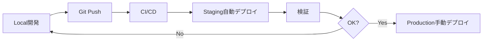

# 環境戦略ガイド - 個人開発向け最適化

## 🎯 なぜdev環境を作らなかったか

### 個人開発での環境構成理由

1. **個人開発の特性**
   - 開発者が1人 = localとdevの区別が不要
   - リソースコスト最小化が重要
   - 管理複雑性を避ける

2. **推奨する3環境構成**
   ```
   local → staging → production
   ```
   - **local**: 開発・テスト（コスト0円）
   - **staging**: PRプレビュー・最終確認
   - **production**: 本番運用

3. **dev環境が必要になる条件**
   - チーム開発開始時
   - 外部APIの共有テスト環境が必要時
   - 複数人での統合テストが必要時

## 📊 環境別の役割と用途

### 🔧 Local環境（.env.local）
**用途**: 日常の開発作業
- モックAPI使用でコスト削減
- 高速イテレーション
- デバッグツール全開放
- **コスト**: 0円

### 🚀 Staging環境（.env.staging）
**用途**: リリース前検証
- Cloudflare Pages/Workers Preview
- 実APIの限定使用
- パフォーマンステスト
- **コスト**: 最小限（プレビュー環境は無料枠内）

### 🏭 Production環境（.env.production）
**用途**: 実運用
- 完全な本番設定
- セキュリティ最大化
- 監視・アラート有効
- **コスト**: 従量課金

## 🔄 環境昇格フロー



## 💰 コスト最適化戦略

### 個人開発でのコスト削減

| 環境 | LLM API | Database | Cache | 月額コスト目安 |
|------|---------|----------|-------|--------------|
| Local | Mock/無料枠 | SQLite | Local Redis | 0円 |
| Staging | 無料枠/最小 | Turso Free | Upstash Free | 0-10ドル |
| Production | 従量課金 | Turso Pro | Upstash Pay-as-go | 10-50ドル |

### API使用量制限設定

```python
# Local: 無制限（モック）
RATE_LIMIT = float('inf')

# Staging: 適度な制限
RATE_LIMIT = 1000  # requests/day

# Production: ユーザー別制限
RATE_LIMIT = {
    'free': 100,
    'pro': 1000,
    'enterprise': 10000
}
```

## 🚦 環境別の feature flags

```javascript
// Local環境
{
  enableDebugToolbar: true,
  enableMockData: true,
  enableHotReload: true,
  skipAuth: true,  // 開発効率化
}

// Staging環境
{
  enableDebugToolbar: true,
  enableMockData: false,
  enableHotReload: false,
  skipAuth: false,
  enablePreviewFeatures: true,
}

// Production環境
{
  enableDebugToolbar: false,
  enableMockData: false,
  enableHotReload: false,
  skipAuth: false,
  enablePreviewFeatures: false,
}
```

## 📈 スケールアップ時の移行パス

### Phase 1: 個人開発（現在）
```
local → staging → production
```

### Phase 2: 小規模チーム（2-5人）
```
local → dev → staging → production
```
- dev環境追加で共同開発対応

### Phase 3: 中規模チーム（5人以上）
```
local → dev → qa → staging → production
```
- QA環境追加で品質保証強化

## 🔧 環境設定の実装

### 1. 環境検出ロジック

```python
# backend/src/core/config/environment.py
from enum import Enum
import os

class Environment(Enum):
    LOCAL = "local"
    STAGING = "staging"
    PRODUCTION = "production"
    # DEV = "dev"  # 将来の拡張用

def get_environment() -> Environment:
    """環境を自動検出"""
    env = os.getenv("APP_ENV", "local").lower()

    # Cloudflare Workers環境変数で判定
    if os.getenv("CF_PAGES_BRANCH") == "main":
        return Environment.PRODUCTION
    elif os.getenv("CF_PAGES_BRANCH"):
        return Environment.STAGING

    return Environment[env.upper()]

# 使用例
current_env = get_environment()
if current_env == Environment.LOCAL:
    # モックサービス使用
    llm_service = MockLLMService()
elif current_env == Environment.STAGING:
    # 制限付き実サービス
    llm_service = LimitedLLMService(quota=1000)
else:
    # フル機能
    llm_service = ProductionLLMService()
```

### 2. Docker Compose統合

```yaml
# docker-compose.yml
version: '3.8'

services:
  backend:
    build: ./backend
    env_file:
      - .env.common
      - backend/.env.${APP_ENV:-local}
    environment:
      - APP_ENV=${APP_ENV:-local}
```

### 3. 環境別起動スクリプト

```bash
#!/bin/bash
# scripts/start.sh

ENV=${1:-local}

case $ENV in
  local)
    echo "🔧 Starting local development..."
    docker-compose -f docker-compose.yml up
    ;;
  staging)
    echo "🚀 Starting staging environment..."
    APP_ENV=staging docker-compose -f docker-compose.staging.yml up
    ;;
  production)
    echo "🏭 Starting production environment..."
    echo "⚠️  Warning: This should only be used for local production testing!"
    APP_ENV=production docker-compose -f docker-compose.prod.yml up
    ;;
  *)
    echo "❌ Unknown environment: $ENV"
    echo "Usage: ./scripts/start.sh [local|staging|production]"
    exit 1
    ;;
esac
```

## 📝 移行チェックリスト

### 個人開発を継続する場合
- [x] local環境のみ使用
- [x] staging環境はPRレビュー時のみ
- [x] production環境は慎重にデプロイ
- [ ] dev環境は作成不要

### チーム開発に移行する場合
- [ ] dev環境の追加
- [ ] 共有データベースの設定
- [ ] チーム用APIキーの発行
- [ ] アクセス制御の実装

## 🎯 結論

個人開発では：
- **local + staging + production**の3環境で十分
- dev環境はチーム開発まで不要
- コスト最適化を最優先
- 必要に応じて段階的に拡張

この構成により、月額0-50ドルで本格的なAIアプリケーションの開発・運用が可能です。